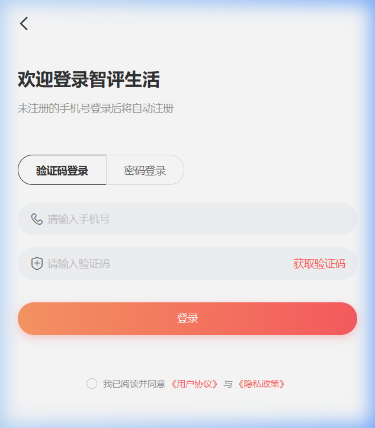
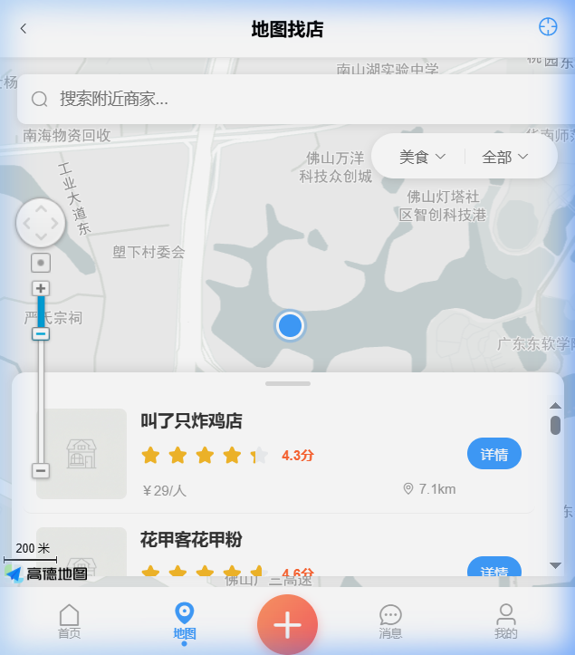
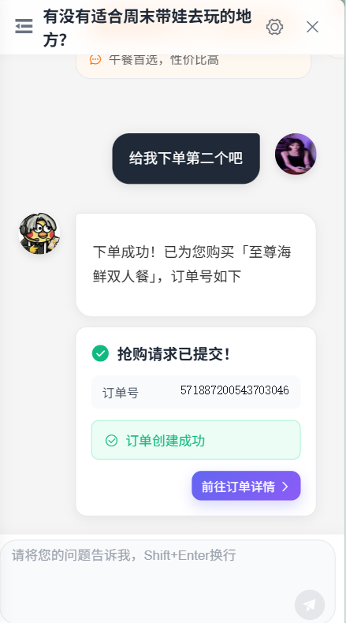
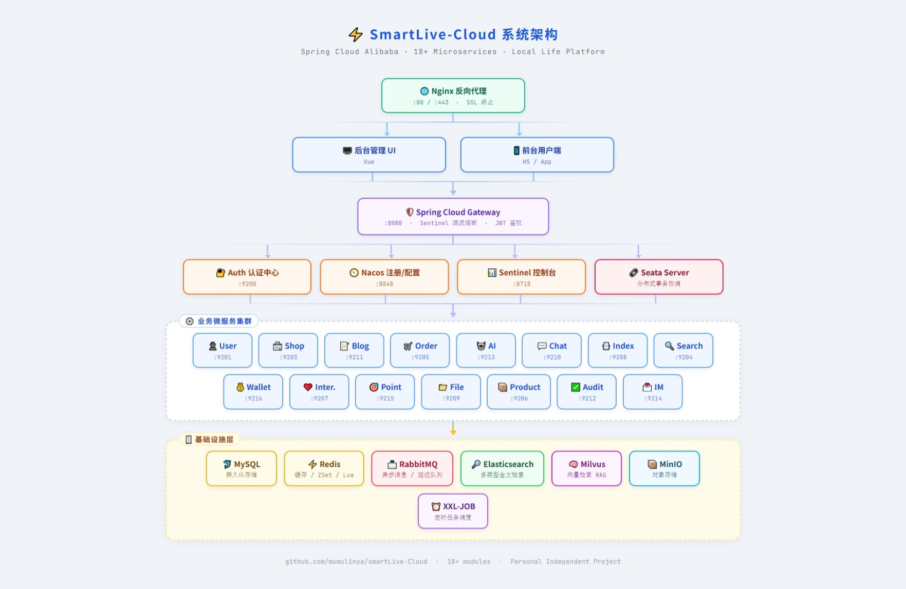
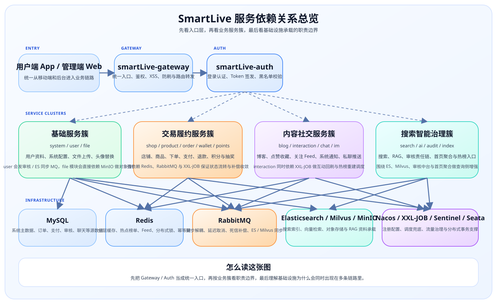

<div align="center">

# 🏙️ SmartLive 智评生活

**基于 Spring Cloud Alibaba 的本地生活微服务平台，覆盖发现、交易、社交、热榜与 AI/RAG**

围绕“用户发现 -> 决策下单 -> 履约评价 -> 社交互动 -> 商家经营 -> 平台治理”构建完整业务闭环，重点展示复杂业务如何被微服务与中间件工程化落地

[](https://spring.io/projects/spring-boot)
[](https://spring.io/projects/spring-cloud)
[](https://github.com/alibaba/spring-cloud-alibaba)
[](https://www.oracle.com/java/technologies/javase/jdk17-archive-downloads.html)
[](LICENSE)
[](https://gitee.com/mumulinya/smart-live/stargazers)


### 📚 **[项目在线文档网站（完整排版版）](https://mumulinya.github.io/smartLive-Cloud/)**

**文档导航：** [在线文档](https://mumulinya.github.io/smartLive-Cloud/) · [视觉导览](docs/SHOWCASE.md) · [页面导览](docs/PAGE_GALLERY.md) · [开源接入](docs/OPEN_SOURCE.md) · [提交 Issue](https://gitee.com/mumulinya/smart-live/issues)

---

</div>

## 📋 目录

- [📖 项目简介](#项目简介)
- [🧭 5 分钟读懂项目](#5分钟读懂项目)
- [🎨 效果预览](#效果预览)
- [🚀 快速开始](#快速开始)
- [📄 项目文档](#项目文档)
- [✨ 功能特性](#功能特性)
- [🔧 技术栈](#技术栈)
- [🏗️ 系统架构](#系统架构)
- [📁 项目结构](#项目结构)
- [🤔 技术选型理由](#技术选型理由)
- [🌊 核心业务链路](#核心业务链路)
- [🔥 核心链路与面经](#核心链路与面经)
- [📌 开源使用提示](#开源使用提示)
- [📈 性能压测报告](#性能压测报告)
- [🚧 难点踩坑与解决方案](#难点踩坑与解决方案)
- [🧠 项目沉淀](#项目沉淀)
- [❓ 常见问题 FAQ](#常见问题)
- [🚧 未来规划 Roadmap](#未来规划)
- [📦 项目仓库](#项目仓库)
- [🤝 参与贡献](#参与贡献)
- [📄 开源协议](#开源协议)
- [📞 联系我](#联系我)

---

## <a id="项目简介"></a>📖 项目简介

> 🙋 **个人独立项目声明**：本项目由作者从零开始独立设计、编码并持续维护，
> 非培训项目或拼接式 Demo，仓库内保留了完整的开发与演进记录。

### 🎯 项目定位

**SmartLive（智评生活）** 是一个面向**本地生活服务场景**的微服务平台，覆盖用户发现、交易履约、内容互动、商家经营与平台治理。  
它不是单一业务 Demo，而是把**交易、搜索、社交、审核、IM、支付、积分、热榜、AI/RAG** 等能力放进同一套可运行、可追踪、可继续扩展的系统里。

### 🧩 这个仓库覆盖什么

- **后端微服务主仓库**：包含 `16` 个核心业务模块，并连同 `auth / gateway / monitor` 组成 `19` 个可运行服务应用。
- **B/C 双端业务闭环**：既覆盖用户侧的找店、下单、评价、博客、聊天与 AI 问答，也覆盖商家侧的商品管理、经营分析、差评回复与内容治理。
- **多中间件协同**：Redis、RabbitMQ、Elasticsearch、Milvus、MinIO、XXL-JOB、Nacos、Gateway、Sentinel、Seata 等共同支撑核心链路。
- **仓库边界清晰**：当前仓库聚焦后端与基础设施编排，前端管理端和用户端仓库入口见后文“项目仓库”。

### 🔍 为什么值得开源阅读

| 维度 | 内容 |
|------|------|
| 业务范围 | 覆盖本地生活场景中的发现、交易、履约、评价、社交、经营分析与平台治理 |
| 技术主题 | 微服务拆分、Redis 分层缓存、消息可靠投递、秒杀与订单补偿、热榜计算、AI/RAG 集成 |
| 文档资产 | 首页导览图、业务链路图、Redis 设计图、XXL-JOB 调度图、真实页面截图 |
| 适合人群 | 想看完整 Java 微服务项目、准备面试复盘、或想学习“业务闭环 + 工程化设计”落地方式的人 |

### 📏 项目规模

| 维度 | 数值 | 说明 |
|------|------|------|
<!-- AUTO_SYNC:README_PROJECT_SCALE:START -->
| 核心业务模块 | **16 个** | 用户、店铺、商品、订单、博客、互动、搜索、AI、IM 等核心业务模块 |
| 可运行服务应用 | **19 个** | 16 个业务模块 + `auth` + `gateway` + `monitor` |
| 核心能力域 | **6 大类** | 发现推荐、交易履约、社交互动、内容治理、经营分析、基础设施 |
| 端侧覆盖 | **2 端** | B 端商家管理 + C 端消费者体验 |
| 核心业务代码 | **30,000+ 行** | 以服务端业务逻辑为主 |
| 文档与图示资产 | **完整导览** | 展示版/详细版链路图、页面截图、在线文档与开源接入指南 |
| Git 提交记录 | **200+** | 可回溯完整开发过程 |
<!-- AUTO_SYNC:README_PROJECT_SCALE:END -->

### 🔢 统计口径说明

<!-- AUTO_SYNC:README_STATS_SCOPE:START -->
| 指标 | 统计口径 |
|------|----------|
| 业务模块 | 统计 `smartLive-modules` 下的实际业务服务，不包含 `api / common / visual / sentinel / seata-server` 等支撑工程 |
| 服务应用 | 业务模块 + `smartLive-auth` + `smartLive-gateway` + `smartLive-monitor`，按可独立运行的服务口径计算 |
| 代码量 | README 保留“核心业务代码 3万+”口径；网站首页卡片展示仓库当前 Java 总量 `7万+`，两者分别用于强调业务密度与工程总体量 |
| 页面截图 | 统计 `docs/screenshots` 中当前被在线文档实际引用的截图，不包含 `legacy` 归档图 |
| 链路图 | 分开展示版 `SVG` 与详细版 `SVG` 两套数量，均以 `docs/diagrams` 当前可访问文件为准 |
| XXL-JOB 任务 | 以调度后台当前可见任务数为准，和文档中的后台截图口径保持一致 |
<!-- AUTO_SYNC:README_STATS_SCOPE:END -->

### ✨ 为什么值得继续往下看

- 不是只做“登录 + CRUD”的展示型项目，而是真正把多业务域和多中间件串成闭环。
- 同时覆盖 **ToC 用户体验、ToB 商家经营、平台审核治理** 三条线，项目视角更完整。
- 文档里已经补齐 **业务链路、缓存设计、调度体系、页面导览**，第一次阅读也能快速建立全局认知。

### 👨‍💻 个人贡献亮点（本项目核心设计与实现）

这里只保留首页版摘要，完整展开建议直接看：

- [我的核心设计与实现](docs/site-pages/CONTRIBUTIONS.md)

先看交付密度与 6 条最强个人贡献：

**交付规模：**
<!-- AUTO_SYNC:README_CONTRIBUTION_SCALE:START -->
- 🔸 核心业务代码：**30,000+ 行**（覆盖 16 个业务模块与完整服务应用骨架）
- 🔸 文档与图示资产：**完整在线文档 + 业务链路图 + 真实页面截图**（便于讲解、复盘与源码阅读）
- 🔸 项目周期：**8+ 个月**（从零开始独立完成全栈设计与开发）
- 🔸 Git 提交记录：**200+** 条（完整的开发足迹可追溯）
<!-- AUTO_SYNC:README_CONTRIBUTION_SCALE:END -->

- **Redis 分层缓存架构**：把列表、详情、计数三类读链拆成不同缓存结构，首页、博客、商品、店铺等高频场景整体提速约 `20-40 倍`。
- **微服务拆分与跨服务协同**：独立完成 `16` 个业务模块与 `19` 个服务应用的边界设计，落地 Feign、RabbitMQ、Seata 的协同闭环。
- **高并发交易链路优化**：秒杀链路采用 `Lua + MQ + 延迟补偿`，在 `5000` 并发线程下把 QPS 稳定在 `3200+`。
- **热榜评分与异步洗牌**：抽象 5 类业务热榜策略，结合时间衰减、互动权重、增量重算与凌晨全量重建解决冷启动和长期霸榜。
- **消息可靠投递与幂等消费**：统一封装发送端 Confirm / Return、消费端 Redis 幂等和手动 ACK/NACK，把重复消费和补偿边界收口。
- **用户端 AI 与 AIGC 闭环**：打通 SSE 对话、RAG 检索、推荐卡片、博客生成、评价生成等用户侧可感知能力。

### 🎯 核心亮点

这里只保留项目级能力摘要，完整版本建议直接看：

- [项目级能力亮点](docs/site-pages/CORE_HIGHLIGHTS.md)

首页先看这 3 组项目卖点：

- **AI 增强与智能中枢**：用户端 AI 对话、RAG 检索、推荐卡片、博客/评价生成与商家经营分析落在同一套 Spring AI + Milvus 底座上。
- **高性能交易与推荐闭环**：秒杀、订单、支付、热榜、Feed、搜索读链路都围绕 `Redis + MQ + 调度补偿` 做了工程化优化。
- **企业级治理与边界防护**：Gateway 鉴权与过滤、Netty IM、责任链审核、分布式锁、跨库副本收敛共同构成完整的基础设施能力。

## <a id="5分钟读懂项目"></a>🧭 5 分钟读懂项目

第一次进入这个仓库，建议先按下面这条路径阅读，不要一上来就尝试把全部模块和中间件一次性跑齐。

<div align="center">
  
</div>

| 你的目标 | 先看什么 | 再看什么 | 结果 |
|:---|:---|:---|:---|
| 快速判断项目值不值得继续看 | [README.md](README.md) | [docs/SHOWCASE.md](docs/SHOWCASE.md) | 先看清业务范围、系统架构、真实页面和核心链路 |
| 想先理解模块拆分和代码边界 | [系统架构](#系统架构) | [项目结构](#项目结构) | 先建立全局心智模型，再回头读具体业务模块 |
| 第一次把服务跑起来 | [docs/OPEN_SOURCE.md](docs/OPEN_SOURCE.md) | [README.md 的快速开始](#快速开始) | 先跑最小可运行链路，避免一次性踩完全部依赖坑 |
| 体验 AI / 搜索 / 审核 / 积分全链路 | [docs/OPEN_SOURCE.md](docs/OPEN_SOURCE.md) | [docs/SHOWCASE.md](docs/SHOWCASE.md) | 先补齐依赖矩阵，再对照截图和业务链路逐项验证 |
| 准备本地部署或服务器演示 | [docs/DEPLOYMENT_GUIDE.md](docs/DEPLOYMENT_GUIDE.md) | [SECURITY.md](SECURITY.md) | 明确 Docker、构建产物、配置注入与部署排错边界 |

> 推荐起步顺序：`smartLive-auth -> smartLive-gateway -> smartLive-system -> smartLive-user -> smartLive-shop -> smartLive-search`。先验证登录、店铺、搜索和后台管理，再补 AI、IM、积分、支付等进阶能力。


## <a id="效果预览"></a>🎨 效果预览

README 这里只保留最主要的 App 端核心页面，用更接近手机竖屏的方式快速建立第一印象；想继续按 App / 管理端 Web 看完整页面和源码位置，可以直接跳到 [docs/PAGE_GALLERY.md](docs/PAGE_GALLERY.md)。

### 1. 登录与身份进入

<p align="center">
  <a href="docs/PAGE_GALLERY.md#app-login-entry"></a>
</p>

登录页负责建立账号入口和用户身份，是第一次进入 App 的起点。  
[查看登录页与账号入口](docs/PAGE_GALLERY.md#app-login-entry)

### 2. 首页入口与热榜榜单

<p align="center">
  <a href="docs/PAGE_GALLERY.md#app-discovery"></a>
</p>

首页承接分类入口、热门内容流和榜单跳转，是用户发现内容和店铺的主入口。  
[查看首页入口、热门内容与热榜榜单](docs/PAGE_GALLERY.md#app-discovery)

### 3. 搜索与地图找店

<p align="center">
  <a href="docs/PAGE_GALLERY.md#app-search-map"></a>
</p>

搜索页支持关键词、热词和位置感知，地图模式进一步放大了附近找店体验。  
[查看搜索结果与 LBS 找店](docs/PAGE_GALLERY.md#app-search-map)

### 4. 店铺与商品详情

<p align="center">
  <a href="docs/PAGE_GALLERY.md#app-shop-product"></a>
</p>

详情页承接店铺介绍、商品购买、评价查看和内容互动，是下单前的核心决策页。  
[查看店铺页、商品页与内容发布](docs/PAGE_GALLERY.md#app-shop-product)

### 5. 社交消息与即时通讯

<p align="center">
  <a href="docs/PAGE_GALLERY.md#app-social-message"></a>
</p>

这里集中展示了会话列表、系统通知和私聊消息，是社交互动与消息流转的主要承接页。  
[查看动态、消息中心与 IM](docs/PAGE_GALLERY.md#app-social-message)

### 6. AI 与订单资产

<p align="center">
  <a href="docs/PAGE_GALLERY.md#app-ai-capability"></a>
</p>

AI 页不只负责对话，还能返回推荐卡片、生成内容，并直接承接下单结果和订单跳转。  
[查看 AI 对话、会话与 AIGC](docs/PAGE_GALLERY.md#app-ai-capability)

### 🧩 更多页面入口

- 想看用户端 App 的详细页面导览：看 [docs/PAGE_GALLERY.md - 用户端 App](docs/PAGE_GALLERY.md#app-pages)
- 想看管理端 Web 的详细页面导览：看 [docs/PAGE_GALLERY.md - 管理端 Web](docs/PAGE_GALLERY.md#admin-pages)
- 想看我的发布、草稿箱：看 [docs/PAGE_GALLERY.md - 内容创作与评价互动](docs/PAGE_GALLERY.md#app-content-creation)
- 想看我的关注、粉丝明细、聊天与系统通知：看 [docs/PAGE_GALLERY.md - 社交关系与消息](docs/PAGE_GALLERY.md#app-social-message)
- 想看我的收藏页、个人中心和安全设置：看 [docs/PAGE_GALLERY.md - 个人中心、收藏与安全设置](docs/PAGE_GALLERY.md#app-profile-assets)
- 想看 XXL-JOB 调度后台、任务列表和执行器管理：看 [docs/PAGE_GALLERY.md - XXL-JOB 调度后台](docs/PAGE_GALLERY.md#admin-scheduler)
- 想按业务链路看截图、架构图和核心时序图：看 [docs/SHOWCASE.md](docs/SHOWCASE.md)


## <a id="快速开始"></a>🚀 快速开始

### 使用建议

- 首次接入建议优先使用“本地开发模式”，这样更容易核对模块、Nacos 配置和数据库脚本。
- 如果只想快速了解仓库结构、模块依赖、端口和配置来源，先看 [docs/OPEN_SOURCE.md](docs/OPEN_SOURCE.md)。
- docker 目录保留了一套编排资产，但其中仍有历史模块命名和脚本残留，使用前请先校对实际 Maven 模块。

### 环境要求

| 组件 | 版本要求 | 说明 |
|:---|:---|:---|
| JDK | 17+ | 后端运行环境 |
| Maven | 3.8+ | Java 构建 |
| MySQL | 8.0+ | 核心业务数据 |
| Redis | 6.0+ | 缓存、分布式锁、Feed |
| Nacos | 2.x | 注册中心与配置中心 |
| RabbitMQ | 3.12+ | 异步消息与延迟队列 |
| Elasticsearch | 7.17+ | 搜索与索引 |
| Milvus | 2.3+ | 向量检索与 RAG |
| MinIO | 稳定版 | 文件服务与 Milvus 依赖 |
| XXL-JOB | 2.4+ | 定时任务调度 |
| Sentinel | 1.8+ | 流量治理，可按需启用 |
| Node.js | 16+ | 前端构建，可选 |
| Docker / Compose | 24+ / v2+ | 容器化启动，可选 |

### 🧪 按能力体验的最小依赖矩阵

| 想体验的能力 | 推荐启动模块 | 最少中间件 | 说明 |
|:---|:---|:---|:---|
| 登录与个人中心 | `smartLive-auth`、`smartLive-gateway`、`smartLive-system`、`smartLive-user` | MySQL、Redis、Nacos | 能先验证登录、用户资料、基础鉴权与后台菜单 |
| 商家后台与店铺基础能力 | `smartLive-auth`、`smartLive-gateway`、`smartLive-system`、`smartLive-user`、`smartLive-shop` | MySQL、Redis、Nacos | 可先看后台登录、店铺列表、店铺详情与基础经营页 |
| 搜索与附近找店 | 在上一条基础上加 `smartLive-search` | MySQL、Redis、Nacos、Elasticsearch | 关键词搜索、热词、LBS 找店需要 ES 检索链路 |
| 下单、支付与积分 | `smartLive-product`、`smartLive-order`、`smartLive-wallet`、`smartLive-points` | MySQL、Redis、Nacos、RabbitMQ | 涉及订单状态流转、支付记录、积分变动与异步消息 |
| AI 对话与 RAG | `smartLive-ai`、`smartLive-search`、`smartLive-shop`、`smartLive-product`、`smartLive-blog`、`smartLive-interaction` | MySQL、Redis、Nacos、RabbitMQ、Elasticsearch、Milvus、MinIO | 还需要模型 API Key、向量库和对象存储配置完整可用 |

### 方式一：本地开发模式（推荐）

~~~bash
# 1. 克隆项目
git clone https://gitee.com/mumulinya/smart-live.git
cd smart-live

# 2. 初始化数据库
#    按顺序导入 sql/ 目录下的脚本：
#    ① ry_20250523.sql                 → 核心系统表（用户/角色/菜单等）
#    ② ry_config_20250902.sql          → Nacos 配置表
#    ③ ry_seata_20210128.sql           → Seata 分布式事务表
#    ④ quartz.sql                      → Quartz 定时任务表
#    ⑤ product.sql                     → 商品模块表
#    ⑥ payment.sql                     → 支付记录表
#    ⑦ wallet.sql                      → 钱包模块表
#    ⑧ points.sql                      → 积分模块表
#    ⑨ chat_system_notice_20260212.sql → 系统通知表

# 3. 启动中间件
#    基础必需：Nacos、MySQL、Redis、RabbitMQ
#    按功能启用：Elasticsearch、Milvus、MinIO、XXL-JOB、Sentinel

# 4. 初始化 Nacos 配置
#    导入 ry_config_20250902.sql 后，至少检查以下 dataId：
#    - application-dev.yml
#    - smartLive-*-dev.yml
#    - xxl-job-common.yml（如需运行定时任务）

# 5. 构建项目
mvn clean install -DskipTests

# 6. 按顺序启动服务
#    ① 认证中心
mvn spring-boot:run -pl smartLive-auth
#    ② 网关服务
mvn spring-boot:run -pl smartLive-gateway
#    ③ 基础业务模块（按需启动）
mvn spring-boot:run -pl smartLive-modules/smartLive-system
mvn spring-boot:run -pl smartLive-modules/smartLive-user
mvn spring-boot:run -pl smartLive-modules/smartLive-shop
mvn spring-boot:run -pl smartLive-modules/smartLive-search
#    ④ 进阶模块（按需启动）
mvn spring-boot:run -pl smartLive-modules/smartLive-product
mvn spring-boot:run -pl smartLive-modules/smartLive-order
mvn spring-boot:run -pl smartLive-modules/smartLive-interaction
mvn spring-boot:run -pl smartLive-modules/smartLive-chat
mvn spring-boot:run -pl smartLive-modules/smartLive-im
mvn spring-boot:run -pl smartLive-modules/smartLive-ai
mvn spring-boot:run -pl smartLive-modules/smartLive-wallet
mvn spring-boot:run -pl smartLive-modules/smartLive-points
~~~

### 方式二：增量部署脚本（生产推荐）

~~~bash
# 快速部署单个修改的模块（性能提升 10-15 倍）
chmod +x deploy.sh
./deploy.sh HEAD~1              # 只编译并上传修改的模块

# 典型场景：修改了 smartLive-blog 和 smartLive-interaction 模块
# 不需要：把全部 19 个服务应用都重新编译一遍（耗时 30 分钟）
# 只需要：编译 smartLive-blog + smartLive-interaction（耗时 1-2 分钟）
#        上传 2 个 jar（耗时 10 秒）
#        重启 2 个服务（耗时 2 分钟）
# 总耗时：3 分钟 vs 45 分钟（原来的方式）

# 部署统计
# - 编译时间：30 分钟 → 1-2 分钟（快 20 倍）
# - 上传时间：10 分钟 → 10 秒（快 60 倍）
# - 重启时间：5 分钟 → 2 分钟
# - 总部署时间：45 分钟 → 3 分钟（快 15 倍！）
~~~

**使用建议：**
- 本地开发频繁迭代时，使用增量部署脚本
- CI/CD 流水线中可集成此脚本实现自动化快速部署
- 脚本内置 SSH 连接和自动备份机制，首次使用请修改 deploy.sh 中的服务器配置
- 支持指定对比分支：`./deploy.sh origin/dev` 与上游分支对比后部署

### 方式三：Docker Compose（进阶）

~~~bash
# 1. 构建项目产物
mvn clean install -DskipTests

# 2. 进入 docker 目录
cd docker

# 3. 启动前先核对 docker/ 下模块映射是否与当前 Maven 模块一致
docker compose up -d
~~~

> 当前 docker 目录仍保留历史模块命名与复制脚本，请将其视为"需要校对后再用"的编排样例，而不是无条件可用的唯一事实来源。

### 方式四：Windows 启动脚本（暂不推荐）

bin/ 目录下的 .bat 脚本仍有旧项目路径残留，未完全与当前 smartLive-* 模块目录对齐。除非你已经自行校正这些脚本，否则建议直接使用上面的 Maven 命令启动服务。

~~~bash
bin/package.bat            # 打包全部模块
bin/clean.bat              # 清理构建产物
# 其余 run-*.bat 在使用前请先校对目标目录
~~~

## <a id="项目文档"></a>📚 项目文档

- 📘 [在线文档网站](https://mumulinya.github.io/smartLive-Cloud/) — 面向阅读和分享的完整排版版本
- 📘 [README 首页](README.md) — 项目定位、系统架构、核心亮点与快速开始
- 🖼️ [视觉导览](docs/SHOWCASE.md) — 按用户链路整理页面截图、系统总览图与核心时序图
- 📱 [页面导览](docs/PAGE_GALLERY.md) — 按真实使用路径展开 App 与管理端 Web 页面
- 📌 [开源使用说明](docs/OPEN_SOURCE.md) — 依赖矩阵、端口表、配置来源与启动建议
- 🚀 [部署说明](docs/DEPLOYMENT_GUIDE.md) — Docker Compose、镜像重建、JAR 校验与部署排错
- 🤝 [贡献指南](CONTRIBUTING.md)
- 🔐 [安全说明](SECURITY.md)

## <a id="功能特性"></a>✨ 功能特性

这里保留首页版摘要，完整功能矩阵和技术列表已独立到网站页，适合继续深入看：

- [功能特性与技术栈](docs/site-pages/FEATURES_STACK.md)
- [页面效果图导览](docs/PAGE_GALLERY.md)
- [业务链路视觉走查](docs/SHOWCASE.md)

当前项目可以先概括成 4 组能力：

- 交易闭环：商品、订单、支付、退款、积分、钱包、秒杀
- 内容社交：博客、评论、评价、关注、Feed、IM、系统通知
- 搜索推荐：LBS 搜索、热词、热榜、ES / Milvus 双副本收敛
- 平台治理：审核中心、认证网关、监控中心、XXL-JOB 调度

## <a id="技术栈"></a>🔧 技术栈

这里保留首页版摘要，完整技术清单和选型说明建议直接看：

- [功能特性与技术栈](docs/site-pages/FEATURES_STACK.md)
- [技术选型理由](docs/site-pages/TECH_SELECTION.md)

当前这套工程的核心技术组合可以先记住这 5 组：

- 服务基础：Spring Boot 3.2.2 + Spring Cloud 2023 + Spring Cloud Alibaba 2023.0.1.0
- 治理组件：Nacos、Gateway、Sentinel、Seata、XXL-JOB
- 数据与缓存：MySQL、Redis、Elasticsearch、Milvus、MinIO
- 异步与实时：RabbitMQ、Netty + WebSocket
- AI 与文档：Spring AI、SpringDoc OpenAPI、UniApp、Vue

## <a id="系统架构"></a>🏗️ 系统架构

下面这张图适合先建立全局心智模型，再继续往下看模块拆分和技术选型。

<div align="center">
  
</div>

### 🔗 服务依赖关系总览

这张图不是时序图，而是把入口层、业务服务簇和基础设施依赖放在同一张图里，方便先理解“谁依赖谁”，再去看具体链路。

<div align="center">
  
</div>

**建议阅读方式：**

- 先看 `用户端 App / 管理端 Web -> Gateway -> Auth` 的统一入口。
- 再看四个业务服务簇：基础服务、交易履约、内容社交、搜索智能治理。
- 最后看底部基础设施：`MySQL / Redis / RabbitMQ / Elasticsearch / Milvus / MinIO / Nacos / XXL-JOB`，理解它们分别承接什么职责。


## <a id="项目结构"></a>📁 项目结构

下面只展示与阅读项目最相关的目录，省略 `.idea`、`logs`、`arthas-output` 等环境或运行时目录。

```text
smart-live-Cloud
├── .github                        // Issue / PR 模板与 Actions 配置
├── docs                           // 开源文档、链路图、截图导览
│   ├── diagrams                                   // SVG / PNG 业务链路图
│   └── screenshots                                // 页面截图与架构图
├── smartLive-gateway              // API 网关 [8080]
├── smartLive-auth                 // 认证中心 [9200]
├── smartLive-api                  // Feign 接口、DTO、VO 定义
│   ├── smartLive-api-ai                           // AI 接口
│   ├── smartLive-api-blog                         // 博客接口
│   ├── smartLive-api-chat                         // 聊天接口
│   ├── smartLive-api-interaction                  // 互动接口
│   ├── smartLive-api-order                        // 订单接口
│   ├── smartLive-api-points                       // 积分接口
│   ├── smartLive-api-product                      // 商品接口
│   ├── smartLive-api-shop                         // 店铺接口
│   ├── smartLive-api-system                       // 系统接口
│   └── smartLive-api-user                         // 用户接口
├── smartLive-common               // 通用基础设施
│   ├── smartLive-common-core                      // 核心工具与公共配置
│   ├── smartLive-common-datascope                 // 数据权限
│   ├── smartLive-common-datasource                // 多数据源
│   ├── smartLive-common-log                       // 日志记录
│   ├── smartLive-common-rabbitmq                  // MQ 封装
│   ├── smartLive-common-redis                     // Redis 封装
│   ├── smartLive-common-seata                     // 分布式事务
│   ├── smartLive-common-security                  // 安全认证
│   ├── smartLive-common-sensitive                 // 敏感词 / 脱敏能力
│   ├── smartLive-common-swagger                   // API 文档
│   └── smartLive-common-xxl                       // XXL-JOB 定时任务基座
├── smartLive-modules              // 核心业务模块
│   ├── smartLive-ai                               // AI 智能 [9213]
│   ├── smartLive-audit                            // 审核中心 [9212]
│   ├── smartLive-blog                             // 博客笔记 [9211]
│   ├── smartLive-chat                             // 聊天会话 [9210]
│   ├── smartLive-file                             // 文件服务 [9209]
│   ├── smartLive-im                               // IM 推送 [9214]
│   ├── smartLive-index                            // 首页聚合 [9208]
│   ├── smartLive-interaction                      // 互动中心 [9207]
│   ├── smartLive-order                            // 订单管理 [9205]
│   ├── smartLive-points                           // 积分管理 [9215]
│   ├── smartLive-product                          // 商品管理 [9206]
│   ├── smartLive-search                           // 搜索引擎 [9204]
│   ├── smartLive-shop                             // 店铺管理 [9203]
│   ├── smartLive-system                           // 系统管理 [9202]
│   ├── smartLive-user                             // 用户中心 [9201]
│   └── smartLive-wallet                           // 钱包支付 [9216]
├── smartLive-visual               // 图形化管理
│   └── smartLive-monitor                          // 监控中心目录（artifact: smartLive-visual-monitor）[9100]
├── smartLive-sentinel             // Sentinel 控制台 [8718]
├── smartLive-seata-server         // Seata Server [7091]
├── arthas                         // Arthas 诊断工具与脚本
├── bin                            // 本地启动 / 部署脚本
├── docker                         // Docker 编排与镜像脚本
├── seata                          // Seata 本地配置与运行目录
├── skywalking                     // SkyWalking 本地链路追踪环境
├── sql                            // 数据库初始化脚本
├── CONTRIBUTING.md                // 贡献约定
├── SECURITY.md                    // 安全说明
├── README.md                      // 首页文档
└── pom.xml                        // Maven 父工程
```

**推荐阅读顺序：**

- **第一次认识项目**：`smartLive-auth -> smartLive-gateway -> smartLive-system -> smartLive-user -> smartLive-shop -> smartLive-search`
- **想看交易闭环**：`smartLive-product -> smartLive-order -> smartLive-wallet -> smartLive-points`
- **想看社交与推荐**：`smartLive-blog -> smartLive-interaction -> smartLive-index -> smartLive-search`
- **想看 AI 与治理链路**：`smartLive-ai -> smartLive-audit -> smartLive-chat -> smartLive-im`

## <a id="技术选型理由"></a>🤔 技术选型理由 - 为什么选这些而不是其他？

这里保留首页版摘要，完整选型对比建议直接看：

- [技术选型理由（网站详细版）](docs/site-pages/TECH_SELECTION.md)

首页先记住这 5 个最关键的判断：

1. `Spring Boot + Spring Cloud Alibaba`：单服务开发底座和微服务治理分层清楚，适合当前 `19` 个服务应用规模。
2. `Nacos + Gateway + Sentinel + Seata`：注册、配置、统一入口、限流熔断和分布式事务一次接齐。
3. `Redis + Elasticsearch + Milvus + MinIO`：分别承接缓存、搜索、副本检索和对象存储，不强行让一种技术做所有事情。
4. `RabbitMQ + XXL-JOB`：MQ 负责事件异步，XXL-JOB 负责定时扫描、补偿兜底和批量重建。
5. `Spring AI + Netty + MyBatis Plus`：分别对应 AI 编排、IM 长连接和可控的数据访问层。


## <a id="核心业务链路"></a>🌊 核心业务链路

README 首页不再直接内嵌全文时序图，避免 GitHub / Gitee 压缩后发糊。下面统一提供双入口：`SVG` 看主链路展示，`详细版 SVG` 看更细的实现步骤；如果你想按业务分组查看，可以直接看 [docs/SHOWCASE.md](docs/SHOWCASE.md)。

### 交易与履约

这组优先回答“项目怎么完成下单、支付、退款、核销和履约闭环”。

| 链路 | 重点看什么 | 展示版 SVG | 详细版入口 |
|:---|:---|:---|:---|
| 秒杀抢购全链路 | Redis Lua 防超卖、RabbitMQ 异步落单、延迟队列兜底 | [查看 SVG](docs/diagrams/seckill-flow.svg) | [查看详细 SVG](docs/diagrams/detail-src/seckill-flow-detailed.svg) |
| 普通下单：订单创建与状态流转 | 下单创建、异步落单、支付生效后的状态流转 | [查看 SVG](docs/diagrams/normal-order-sequence.svg) | [查看详细 SVG](docs/diagrams/detail-src/normal-order-sequence-detailed.svg) |
| 统一支付：支付受理、回调与账务分发 | 支付受理、回调分发、PaymentRecord 与充值入账 / 订单记账 | [查看 SVG](docs/diagrams/unified-pay-sequence.svg) | [查看详细 SVG](docs/diagrams/detail-src/unified-pay-sequence-detailed.svg) |
| 订单超时取消与库存回滚 | 下单后发送延迟消息、超时未支付自动取消、库存与资格回滚 | [查看 SVG](docs/diagrams/order-timeout-cancel-stock-rollback-chain.svg) | [查看详细 SVG](docs/diagrams/detail-src/order-timeout-cancel-stock-rollback-chain-detailed.svg) |
| 主动取消 / 退款与钱包补偿 | 用户主动取消或退款后的库存回滚、退款 MQ 与钱包流水 | [查看 SVG](docs/diagrams/order-refund-wallet-compensation-chain.svg) | [查看详细 SVG](docs/diagrams/detail-src/order-refund-wallet-compensation-chain-detailed.svg) |
| 订单核销、店铺销量与积分奖励 | verifyShopId 校验、核销后销量增长、消费积分异步发放 | [查看 SVG](docs/diagrams/order-verification-points-reward-chain.svg) | [查看详细 SVG](docs/diagrams/detail-src/order-verification-points-reward-chain-detailed.svg) |

### 积分与用户激励

这组聚焦签到、抽奖、消费奖励这些用户增长和激励机制。

| 链路 | 重点看什么 | 展示版 SVG | 详细版入口 |
|:---|:---|:---|:---|
| 每日签到积分 | 签到、积分发放、幂等与奖励计算 | [查看 SVG](docs/diagrams/daily-signin-points-sequence.svg) | [查看详细 SVG](docs/diagrams/detail-src/daily-signin-points-sequence-detailed.svg) |
| 积分抽奖 | 扣减积分、抽奖结果、奖品发放 | [查看 SVG](docs/diagrams/points-lottery-draw-sequence.svg) | [查看详细 SVG](docs/diagrams/detail-src/points-lottery-draw-sequence-detailed.svg) |

### 账户与基础设施

这组主要看登录态、网关透传、文件上传这类基础能力怎么支撑全站业务。

| 链路 | 重点看什么 | 展示版 SVG | 详细版入口 |
|:---|:---|:---|:---|
| 登录鉴权与网关透传 | 短信/密码登录、Redis 登录态、Gateway 请求头透传 | [查看 SVG](docs/diagrams/auth-login-gateway-chain.svg) | [查看详细 SVG](docs/diagrams/detail-src/auth-login-gateway-chain-detailed.svg) |
| 头像上传与文件替换 | 文件类型校验、MinIO 上传、旧文件删除、登录缓存刷新 | [查看 SVG](docs/diagrams/file-upload-avatar-update-chain.svg) | [查看详细 SVG](docs/diagrams/detail-src/file-upload-avatar-update-chain-detailed.svg) |

### 内容审核与搜索

这组适合看“内容怎么过审、怎么进搜索、用户又是怎么搜出来的”。

| 链路 | 重点看什么 | 展示版 SVG | 详细版入口 |
|:---|:---|:---|:---|
| 发布审核与搜索 / 向量同步 | 提交待审、审核责任链、回调源服务、ES/Milvus/热榜更新 | [查看 SVG](docs/diagrams/publish-audit-search-sync-chain.svg) | [查看详细 SVG](docs/diagrams/detail-src/publish-audit-search-sync-chain-detailed.svg) |
| 审核中心责任链与业务回写 | 审核任务落库、敏感词 / AI / 人工审核、驳回通知 | [查看 SVG](docs/diagrams/audit-center-responsibility-chain.svg) | [查看详细 SVG](docs/diagrams/detail-src/audit-center-responsibility-chain-detailed.svg) |
| 搜索读链路与热词沉淀 | ES 检索、LBS 排序、搜索历史与热搜榜 | [查看 SVG](docs/diagrams/search-read-lbs-ranking-chain.svg) | [查看详细 SVG](docs/diagrams/detail-src/search-read-lbs-ranking-chain-detailed.svg) |

### 社交与消息

这组重点看 Feed、私聊、系统通知三条社交消息链如何拆分协作。

| 链路 | 重点看什么 | 展示版 SVG | 详细版入口 |
|:---|:---|:---|:---|
| 关注 Feed 推送与滚动读取 | 粉丝信箱写入、Pipeline 批量 ZSet、ScrollResult 读取聚合 | [查看 SVG](docs/diagrams/follow-feed-scroll-read-chain.svg) | [查看详细 SVG](docs/diagrams/detail-src/follow-feed-scroll-read-chain-detailed.svg) |
| IM 私聊可靠投递 | 长连接、消息持久化、ACK / 重试 | [查看 SVG](docs/diagrams/im-private-message-reliable-delivery-sequence.svg) | [查看详细 SVG](docs/diagrams/detail-src/im-private-message-reliable-delivery-sequence-detailed.svg) |
| 系统通知入库与 IM 推送 | 多业务通知汇聚、通知落库、在线实时推送 | [查看 SVG](docs/diagrams/system-notice-im-push-chain.svg) | [查看详细 SVG](docs/diagrams/detail-src/system-notice-im-push-chain-detailed.svg) |

### 排行、热度与推荐

这组更偏“首页热门内容和热榜机制”，既看榜单是怎么读出来的，也看热度是怎么持续维护的。

| 链路 | 重点看什么 | 展示版 SVG | 详细版入口 |
|:---|:---|:---|:---|
| 首页热门面板与热门博客读取链路 | 首页顶部热门面板按 activeHotTab 读取店铺榜 / 好券榜 / 团购榜，热门博客列表独立读取 | [查看 SVG](docs/diagrams/home-aggregation-recommend-recall-chain.svg) | [查看详细 SVG](docs/diagrams/detail-src/home-aggregation-recommend-recall-chain-detailed.svg) |
| 首页热门面板算分与热榜维护链路 | 店铺榜、好券榜、团购榜和热门博客内容流如何进入 calcQueue，经过增量洗牌与凌晨全量重建后持续写回 Redis 热榜 | [查看 SVG](docs/diagrams/home-hot-rank-score-maintenance-chain.svg) | [查看详细 SVG](docs/diagrams/detail-src/home-hot-rank-score-maintenance-chain-detailed.svg) |
| 互动数据回刷与双轨同步（业务视角） | Redis 热数据变化如何驱动回刷、检索同步与热度重算 | [查看 SVG](docs/diagrams/interaction-dual-track-sync-sequence.svg) | [查看详细 SVG](docs/diagrams/detail-src/interaction-dual-track-sync-sequence-detailed.svg) |
| 热榜增量维护与全量重建（业务视角） | calcQueue、Top N merge、榜单更新与凌晨全量兜底 | [查看 SVG](docs/diagrams/hot-rank-wash-rebuild-chain.svg) | [查看详细 SVG](docs/diagrams/detail-src/hot-rank-wash-rebuild-chain-detailed.svg) |

### AI 与经营

这组主要展示 AI 对话、商家经营分析和 AI 辅助建议是怎么落进真实业务里的。

| 链路 | 重点看什么 | 展示版 SVG | 详细版入口 |
|:---|:---|:---|:---|
| AI 对话链路 | SSE 流式响应、意图路由、卡片事件 | [查看 SVG](docs/diagrams/ai-chat-sse-intent-routing-sequence.svg) | [查看详细 SVG](docs/diagrams/detail-src/ai-chat-sse-intent-routing-sequence-detailed.svg) |
| 店铺经营分析与 AI 经营建议 | 订单分析、评价分析、经营建议与差评关键词抽取合在同一组看 | [分析聚合](docs/diagrams/shop-analysis-aggregation-chain.svg) / [AI 建议](docs/diagrams/shop-suggest-ai-keywords-chain.svg) | [分析详细](docs/diagrams/detail-src/shop-analysis-aggregation-chain-detailed.svg) / [AI 建议详细](docs/diagrams/detail-src/shop-suggest-ai-keywords-chain-detailed.svg) |

### 缓存与性能专题

这组不是业务流程图，而是专门解释 Redis 分层缓存和性能优化设计。

| 链路 | 重点看什么 | 展示版 SVG | 详细版入口 |
|:---|:---|:---|:---|
| Redis 缓存分层设计 | 列表、详情、计数、状态、热榜 / Feed 五层缓存拆分 | [查看 SVG](docs/diagrams/redis-layered-cache-architecture.svg) | [查看详细 SVG](docs/diagrams/detail-src/redis-layered-cache-architecture-detailed.svg) |
| Feed / 列表 ZSet 缓存链路 | ZSet 排序视图、滚动分页、批量详情回填 | [查看 SVG](docs/diagrams/redis-feed-zset-cache-chain.svg) | [查看详细 SVG](docs/diagrams/detail-src/redis-feed-zset-cache-chain-detailed.svg) |
| 详情页缓存读写链路 | 逻辑过期、空值缓存、互斥锁重建、写后删缓存 | [查看 SVG](docs/diagrams/redis-detail-cache-readwrite-chain.svg) | [查看详细 SVG](docs/diagrams/detail-src/redis-detail-cache-readwrite-chain-detailed.svg) |

### 调度与定时任务

这组不讲单次用户请求，而是把 XXL-JOB 体系单独拎出来：先看总览，再看 4 张任务域子图。

- 当前调度中心实际挂了 `28` 个任务、`6` 个执行器配置，其中 `3` 个执行器在线，统一由 [smartLive-common-xxl](smartLive-common/smartLive-common-xxl) 提供注册基座。
- 订单生命周期兜底：负责临期提醒、未支付自动关闭、已支付过期处理、库存与退款补偿收口。
- 秒杀生命周期管理：负责活动预热、库存与详情缓存预热、到期回收，以及后续销量/库存校准。
- 互动与推荐同步：负责关注、粉丝、点赞、评论、评价等热数据回刷 MySQL，并持续推进热榜计算。
- 热榜维护与重建：负责按分钟消费 `calcQueue` 做增量洗牌，并在凌晨执行全量重建兜底。
- 销量同步与批处理：负责商品、店铺销量等批量落库与跨库状态收敛，避免只靠实时消息长期漂移。
- 为什么不是只靠 MQ：MQ 负责“事件一发生就推进”，XXL-JOB 负责“定时扫描、补偿兜底、批量重建和可视化运维”；两者配合，才能同时保证实时性和最终一致性。
- 想看真实后台页、任务列表和执行器管理截图：看 [docs/PAGE_GALLERY.md - XXL-JOB 调度后台](docs/PAGE_GALLERY.md#admin-scheduler)

#### 第一层：总览图

| 链路 | 重点看什么 | 展示版 SVG | 详细版入口 |
|:---|:---|:---|:---|
| XXL-JOB 定时任务体系总览 | 28 个定时任务如何拆到订单、秒杀、互动、热榜和销量同步六大类 | [查看 SVG](docs/diagrams/xxl-job-scheduler-overview.svg) | [查看详细 SVG](docs/diagrams/detail-src/xxl-job-scheduler-overview-detailed.svg) |

#### 第二层：4 张子图

| 链路 | 重点看什么 | 展示版 SVG | 详细版入口 |
|:---|:---|:---|:---|
| 秒杀预热与库存校准链路 | 预热库存和详情缓存，后续再按订单销量校准 MySQL 与缓存 | [查看 SVG](docs/diagrams/seckill-preheat-stock-calibration-chain.svg) | [查看详细 SVG](docs/diagrams/detail-src/seckill-preheat-stock-calibration-chain-detailed.svg) |
| 热榜增量维护与全量重建链路（调度视角） | HotRankJobHandler / FullRebuildJobHandler 如何分发增量维护与全量重建 | [查看 SVG](docs/diagrams/hot-rank-wash-rebuild-chain.svg) | [查看详细 SVG](docs/diagrams/detail-src/hot-rank-wash-rebuild-chain-detailed.svg) |
| 互动数据回刷与双轨同步链路（调度视角） | InteractionSyncXxlJob / SyncDataServiceImpl 如何回刷 MySQL 并联动热榜 | [查看 SVG](docs/diagrams/interaction-dual-track-sync-sequence.svg) | [查看详细 SVG](docs/diagrams/detail-src/interaction-dual-track-sync-sequence-detailed.svg) |
| 订单生命周期兜底处理链路 | 临期提醒、过期处理、库存销量回滚与退款补偿兜底 | [查看 SVG](docs/diagrams/order-lifecycle-fallback-chain.svg) | [查看详细 SVG](docs/diagrams/detail-src/order-lifecycle-fallback-chain-detailed.svg) |

### 历史详细图补充

这组主要保留旧设计视角，方便继续深挖。

| 链路 | 重点看什么 | 展示版 SVG | 详细版入口 |
|:---|:---|:---|:---|
| UGC 异步审核与分发 | 审核消息投递、责任链处理、回调源服务 | [查看 SVG](docs/diagrams/ugc-audit-flow.svg) | [查看详细 SVG](docs/diagrams/detail-src/ugc-audit-flow-detailed.svg) |
| Feed 动态扇出 | 发布动态、粉丝分发、读扩散 / 写扩散 | [查看 SVG](docs/diagrams/feed-fanout-sequence.svg) | [查看详细 SVG](docs/diagrams/detail-src/feed-fanout-sequence-detailed.svg) |
| 搜索与向量库同步 | ES 索引同步、Milvus 向量写入、异步一致性 | [查看 SVG](docs/diagrams/search-es-milvus-sync-sequence.svg) | [查看详细 SVG](docs/diagrams/detail-src/search-es-milvus-sync-sequence-detailed.svg) |


## <a id="核心链路与面经"></a>🔥 核心链路与面经

本项目不仅提供完整源码，也配套了 **9 组核心业务全链路解析**（覆盖高并发、可靠性、AI 架构等主题），适合做项目讲解、源码阅读和面试展开。

### 📚 核心链路深度解析

| 链路领域 | 深度解析文档 | 核心看点 |
|:---|:---|:---|
| **高并发与缓存** | 🔗 [秒杀抢购全链路详解](docs/core-links/秒杀抢购全链路详解.md) | Redis Lua 原子操作、MQ 异步削峰、延迟队列补单与回滚 |
| | 🔗 [Redis分层缓存链路详解](docs/core-links/Redis分层缓存链路详解.md) | 列表/详情/计数三分层、空值穿透/逻辑过期击穿治理、ZSet 游标 |
| **交易与一致性** | 🔗 [订单、支付与退款补偿链路](docs/core-links/2.%20下单_统一支付_退款补偿链路.md) | 策略路由支付、状态校验优先边界、补偿任务闭环 |
| **高可用与可靠性** | 🔗 [RabbitMQ消息可靠性全链路详解](docs/core-links/RabbitMQ消息可靠性全链路详解.md) | 消息防丢失/防重复/防乱序、死信队列闭环、幂等消费基座 |
| **社交与数据双写** | 🔗 [Feed 推送与滚动读取 + 互动同步](docs/core-links/4.%20Feed%20推送与滚动读取%20+%20互动双轨同步链路.md) | 推拉结合模型、ZSet 滚动分页解决数据偏移、并发快照落库 |
| **内容治理** | 🔗 [审核中心责任链 + 搜索向量同步](docs/core-links/5.%20审核中心责任链%20+%20发布审核与搜索%20向量同步链路.md) | 责任链设计模式、多级审核管道、双流并行索引与向量构建 |
| **搜索与推荐** | 🔗 [搜索读链路 + 热词沉淀链路](docs/core-links/6.%20搜索读链路%20+%20热词沉淀链路.md) | 距离热度综合排序、ZINCRBY 热搜榜机制 |
| **大盘维护** | 🔗 [热榜增量洗牌与全量重建链路](docs/core-links/7.%20热榜增量洗牌与全量重建链路.md) | 应对冷启动与防霸榜、增量评分 + 凌晨全量兜底 |
| **AI 赋能** | 🔗 [AI Agent 策略路由与 RAG 生成](docs/core-links/8.%20AI%20Agent策略路由与RAG多维增强生成链路.md) | Spring AI RAG 向量检索落地、自主分类与上下文编排 |

### 👨‍💻 全链路学习与复盘总结

- 🔗 **[学习复盘与定投总结表](docs/core-links/SmartLive_Java_Internship_Review_Plan_Updated.md)**：带你全面追踪并温习本项目每一条核心架构链路的设计难点与表达重点。


## <a id="开源使用提示"></a>📌 开源使用提示

这部分只保留首页版提醒，完整说明已放进：

- [开源接入说明](docs/OPEN_SOURCE.md)
- [安全与敏感配置边界](SECURITY.md)
- [参与贡献说明](CONTRIBUTING.md)

首页先记住这 4 条：

- 先跑最小链路，不要一上来把 AI、支付、审核、IM 一次性全开。
- 先理解 `MySQL 是真实源，ES / Milvus / Redis 是查询副本`，再去看搜索、热榜和向量检索。
- 先抓住缓存分层、策略工厂、责任链、MQ + 调度补偿这几个核心设计点，再读具体模块。
- AI、对象存储、支付、向量检索都依赖外部配置，第一次阅读更适合先看链路和接口，再补齐环境。

## <a id="性能压测报告"></a>📈 性能压测报告

这里保留首页版摘要，完整压测表与工程表现已独立到网站页：

- [性能压测与工程表现](docs/site-pages/PERFORMANCE.md)

先看最关键的 4 个结论：

- 秒杀抢购链路在 `5000` 并发线程下，QPS 保底 `3200+`
- 列表类查询通过 `Redis ZSet + 批量回填`，相比直查数据库提升约 `20-40 倍`
- 详情类读链路通过 `String 缓存 + 逻辑过期`，TP99 可以压到 `< 5ms`
- 高并发写场景尽量走 `Lua + MQ + 定时补偿`，避免直接把压力打到主库

## <a id="难点踩坑与解决方案"></a>🚧 难点踩坑与解决方案

这里保留首页版摘要，完整踩坑复盘建议直接看：

- [难点踩坑与解决方案（网站详细版）](docs/site-pages/PITFALLS.md)

首页先保留 5 组最能体现工程性的难点：

1. `缓存与一致性`：高频写场景下，用 `Redis Hash 增量更新 + RENAME 快照归档 + 批量落库` 把读写路径拆开。
2. `交易与补偿`：秒杀和订单链路通过 `Lua + RabbitMQ 延迟队列 + 状态校验` 处理超卖、少卖和重复补偿。
3. `消息与最终一致性`：发送端 Confirm / Return、消费端 Redis 幂等、手动 ACK/NACK、延迟 / 死信队列一起闭环。
4. `推荐与社交`：Feed 用滚动分页解决数据偏移，热门面板用增量洗牌 + 全量重建解决冷启动和长期霸榜。
5. `内容治理`：审核中心用策略工厂 + 责任链，把博客、商品、评论、用户资料等多条线统一收口。


## <a id="项目沉淀"></a>🧠 我通过这个项目学到的东西

这里保留首页版摘要，完整复盘内容已独立到网站页：

- [项目沉淀与学习复盘](docs/site-pages/LEARNINGS.md)
- [项目驱动学习复盘指南](docs/core-links/SmartLive_Java_Internship_Review_Plan_Updated.md)

如果只看首页，我最想保留这 5 个收获：

- 微服务拆分不是越细越好，关键是边界清楚、演进成本可控
- 高并发优化本质上是数据结构与链路责任划分，不只是堆中间件
- 最终一致性要靠 `MQ + 幂等 + 调度补偿` 一起闭环
- AI 真正有价值的前提，是和真实业务场景、数据副本、工具链结合
- 好项目不仅要能跑，还要能讲清楚、能复盘、能让别人快速读懂

---

## <a id="常见问题"></a>❓ 常见问题 FAQ

这里保留首页版高频问题，完整问答建议直接看：

- [常见问题 FAQ（网站详细版）](docs/site-pages/FAQ.md)

<details>
<summary><b>1. 这个项目是你一个人做的吗？</b></summary>
是的，本项目从需求分析、架构设计、技术选型到前后端全栈开发、环境搭建与部署，均由本人独立完成。
</details>

<details>
<summary><b>2. 这个仓库包含前端吗？前后端仓库分别是什么？</b></summary>
当前仓库主要是 **后端微服务主仓库**，负责用户、店铺、商品、订单、互动、搜索、AI、IM、审核、钱包等核心服务，以及中间件编排和部署脚本。  
前端仓库已单独拆分：

- `smartLive-admin`：后台管理端（Vue + Element UI）
- `smartLive-web`：用户前台（Vue 响应式，兼容移动端）

对应仓库入口可以直接查看文档中的 [项目仓库](#项目仓库) 一节。
</details>

<details>
<summary><b>3. 第一次本地启动，最小需要哪些中间件和模块？</b></summary>
如果只是想先把系统跑起来并验证主链路，建议优先准备：

- **基础中间件**：MySQL、Redis、Nacos、RabbitMQ
- **核心服务**：Gateway、Auth、User、Shop、Product、Order、Blog、Interaction、Search
- **管理端 / 用户端前端**：按你的体验目标选择 `smartLive-admin` 或 `smartLive-web`

AI、Milvus、支付、IM、审核中心等能力可以放到第二阶段再补。更完整的接入顺序见 [docs/OPEN_SOURCE.md](docs/OPEN_SOURCE.md)。
</details>

<details>
<summary><b>4. AI 模块在这个项目里到底做了什么？</b></summary>
这个项目里的 AI 不只是“接一个聊天接口”，而是同时覆盖了 **用户端问答检索** 和 **商家端经营辅助** 两条线：

- **用户端**：支持店铺 / 商品 / 评价 / 博客问答、流式 AI 对话、探店博客生成、消费评价生成
- **商家端**：支持差评回复、经营建议、营销文案生成、经营分析
- **底层能力**：基于 Spring AI + Milvus，构建店铺、商品、评价、博客等多套向量检索能力，并支持不同 Agent 策略切换

所以它更像一个嵌入业务系统的 AI 中台，而不是单点聊天 Demo。
</details>

<details>
<summary><b>5. 为什么项目里同时用了 RabbitMQ 和 XXL-JOB？</b></summary>
两者职责不同，不是重复建设：

- **RabbitMQ**：负责异步解耦和准实时处理，例如订单创建、库存扣减、审核投递、消息推送、支付回调后的后续动作
- **XXL-JOB**：负责周期性扫描、补偿兜底和批处理，例如热榜重算、互动数据回刷、秒杀预热、订单超时处理、销量同步

可以把它理解成：MQ 解决“事件驱动”，XXL-JOB 解决“定时调度与补偿兜底”。两者配合起来，才能把实时性和最终一致性同时兼顾。
</details>

<details>
<summary><b>6. 分布式环境下的数据一致性怎么保证？</b></summary>
主思路是把“主业务事务”和“副本同步 / 补偿”拆开：数据库先保证真实源写入，后续通过 `RabbitMQ + Redis 幂等 + 手动 ACK/NACK + 延迟 / 死信队列 + XXL-JOB 补偿` 去完成最终一致性收敛。更完整的说明见网站里的 FAQ 与踩坑页。
</details>

<details>
<summary><b>7. 这个项目里最值得展开讲的 3 条链路是什么？</b></summary>
如果是做面试讲解，我最建议优先讲：

- 秒杀抢购全链路
- 订单、支付与退款补偿链路
- Redis 分层缓存链路

这三条最能体现交易正确性、高并发处理和工程化设计判断。
</details>

<br>


## <a id="未来规划"></a>🗺️ 未来规划 Roadmap

- [ ] **性能监控体系闭环**：进一步将现有的监控体系集成 `Prometheus + Grafana`，打造全视角的系统资源消耗监控大盘。
- [ ] **自动化流水线 (CI/CD)**：在项目中集成完整的 GitHub Actions 或 GitLab CI/CD 流程，覆盖全链路线上的自动化单元测试与 Docker 镜像构建推送。


## <a id="项目仓库"></a>📦 项目仓库

| 仓库 | 说明 | 链接 |
|:---:|:---:|:---:|
| **smartLive-Cloud** | 后端微服务（本仓库） | [GitHub](https://github.com/mumulinya/smart-live) |
| **smartLive-admin** | 后台管理端（Vue + Element UI） | [GitHub](https://github.com/mumulinya/smartLive-admin) |
| **smartLive-web** | 用户端前台（Vue 响应式，兼容移动端） | [GitHub](https://github.com/mumulinya/smartLive-web) |


## <a id="参与贡献"></a>🤝 参与贡献

我非常欢迎各种形式的贡献！无论是新功能、Bug 修复还是文档改进，都请随时提交。

在提交 PR 之前，建议先阅读 [CONTRIBUTING.md](CONTRIBUTING.md)。其中补充了：

- 分支与提交信息约定
- 文档与代码统一使用 UTF-8 编码的约束
- 开发前自查清单与提交流程
- 安全相关变更的报告方式

提交信息格式仍建议保持：type(scope): subject

## <a id="开源协议"></a>📄 开源协议

本项目基于 [MIT License](LICENSE) 开源。


## <a id="联系我"></a>📞 联系我 - 找我聊技术

如果你想交流项目、源码设计或招聘机会，首页保留这 3 个入口就够了：

- **邮箱**：mumulinya@foxmail.com
- **GitHub Issues**：[mumulinya/smart-live](https://github.com/mumulinya/smart-live/issues)
- **Gitee Issues**：[mumulinya/smart-live](https://gitee.com/mumulinya/smart-live/issues)

更适合交流的话题：

- 微服务拆分与跨服务一致性
- Redis / MQ / 秒杀 / 热榜 等高并发链路
- AI/RAG 在真实业务里的落地方式
- Java 后端、实习/校招/社招机会

如果这个项目对你有帮助，欢迎给仓库一个 `Star`，或者直接发邮件告诉我你用到了哪一部分。

