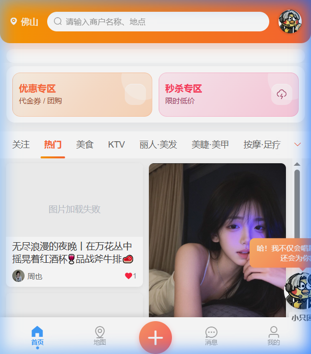
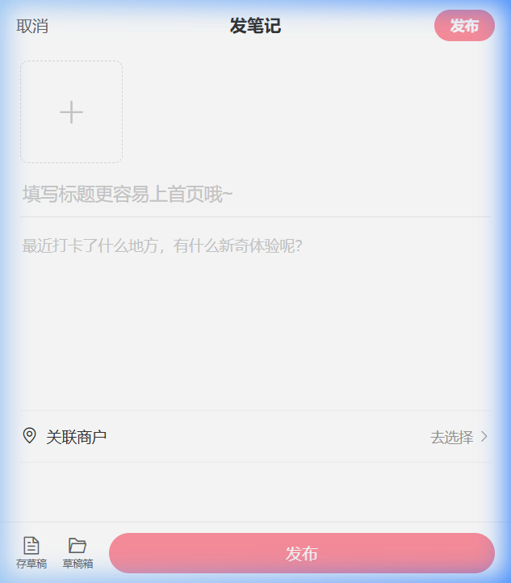
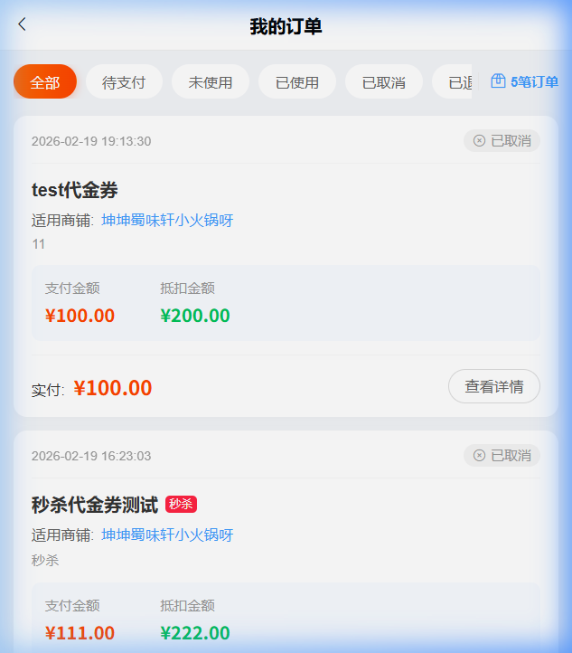
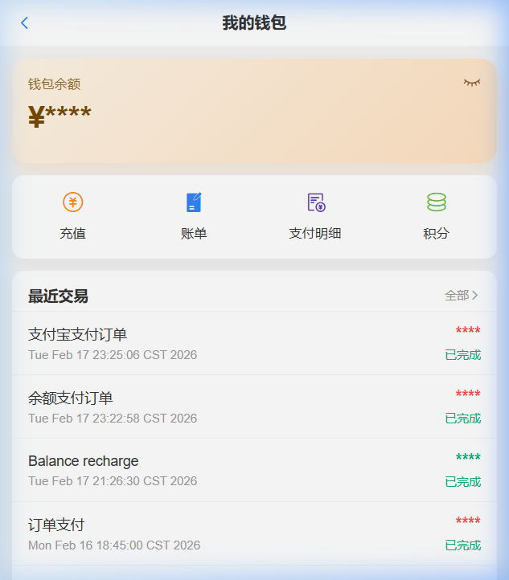

<div align="center">

# 🏙️ SmartLive 智评生活

**基于 Spring Cloud Alibaba 的智慧商户微服务平台**

帮助本地商户解决引流难题，为用户提供智能化的消费决策体验

[](https://spring.io/projects/spring-boot)
[](https://spring.io/projects/spring-cloud)
[](https://github.com/alibaba/spring-cloud-alibaba)
[](https://www.oracle.com/java/technologies/javase/jdk17-archive-downloads.html)
[](LICENSE)
[](https://gitee.com/mumulinya/smart-live/stargazers)

[在线文档](http://doc.smartLive.vip) · [演示地址](http://www.smartLive.vip) · [提交 Issue](https://gitee.com/mumulinya/smart-live/issues)

---

</div>

## 📋 目录

- [📖 项目简介](#项目简介)
- [� 效果预览](#效果预览)
- [�🏗️ 系统架构](#系统架构)
- [📦 项目仓库](#项目仓库)
- [🔧 技术栈](#技术栈)
- [📁 项目结构](#项目结构)
- [✨ 功能特性](#功能特性)
- [🚀 快速开始](#快速开始)
- [🔗 服务端口速查](#服务端口速查)
- [📚 项目文档](#项目文档)
- [🤝 参与贡献](#参与贡献)
- [📄 开源协议](#开源协议)
- [📞 联系我们](#联系我们)

---

## 📖 项目简介

**SmartLive（智评生活）** 是一个面向本地生活服务的多端智慧商户平台，旨在解决本地商户引流难、用户决策复杂等痛点。平台提供 **商户展示、AI 智能推荐、社交互动、即时通讯、营销下单、内容安全** 六大核心功能，采用微服务架构拆分 **18+ 业务模块**，支持高并发、实时通信与个性化用户体验。

### 🎯 核心亮点

- 🤖 **AI 智能助手** — Spring AI + Milvus 向量检索（RAG），意图识别路由 ChatHandler，SSE 流式响应
- 🔍 **双场景搜索** — Elasticsearch 全文检索 + 高亮 + 四种排序策略，个人中心行为数据检索
- 💬 **Netty 消息中心** — WebSocket 长连接 + 心跳保活，承载私信与系统通知实时下发
- ⚡ **秒杀抢购** — Redis Lua 原子防超卖，MQ 异步落单，延迟/死信队列保障订单可靠
- 🔥 **社交互动引擎** — 7 个策略工厂统一点赞/收藏/评论/评价/关注/热榜处理，Feed 流推拉结合
- 🛡️ **UGC 审核流水线** — MQ 异步审核 + 敏感词自动拦截 + 策略工厂回调 + 拒绝实时通知
- ⏱️ **定时任务体系** — XXL-JOB 调度多维任务（秒杀预热/回收、订单过期作废、数据增量同步等）
- 🛒 **完整商业闭环** — 店铺入驻 → 内容发布 → 营销活动 → 在线下单 → 评价互动
- 🏗️ **微服务架构** — Spring Cloud Alibaba 全家桶，Nacos + Gateway + Sentinel + Seata
- 🐳 **一键部署** — 提供完整的 Docker Compose 编排，轻松启动全部服务

## 🎨 效果预览

| 首页 | 店铺详情 | 商品详情 |
|:---:|:---:|:---:|
|  |  |  |
| **AI 智能助手** | **即时通讯/消息** | **双场景搜索** |
|  |  |  |
| **内容创作/发布** | **个人中心** | **我的订单** |
|  |  |  |
| **我的钱包** | **积分中心** | |
|  |  | |

## 🏗️ 系统架构

```
                                    ┌─────────────────┐
                                    │   Nginx 代理     │
                                    │  (80 / 443)      │
                                    └────────┬─────────┘
                                             │
                           ┌─────────────────┼─────────────────┐
                           │                 │                 │
                    ┌──────▼──────┐   ┌──────▼──────┐   ┌─────▼──────┐
                    │ 后台管理 UI  │   │ 前台用户端   │   │ 小程序端   │
                    │  (Vue)      │   │  (H5/App)   │   │ (UniApp)   │
                    └──────┬──────┘   └──────┬──────┘   └─────┬──────┘
                           │                 │                 │
                           └─────────────────┼─────────────────┘
                                             │
                                    ┌────────▼─────────┐
                                    │  Spring Cloud     │
                                    │  Gateway (8080)   │
                                    │  + Sentinel 限流  │
                                    └────────┬─────────┘
                                             │
                          ┌────────────────────┼────────────────────┐
                          │                    │                    │
                 ┌────────▼────────┐  ┌────────▼────────┐  ┌───────▼────────┐
                 │  Auth 认证中心   │  │  Nacos 注册中心  │  │  Sentinel 控制台│
                 │   (9200)        │  │ (8848)          │  │  (8718)         │
                 └─────────────────┘  └─────────────────┘  └────────────────┘
                                             │
                   ┌──────────────────── 业务微服务集群 ─────────────────────┐
                   │                                                        │
                   │  ┌─────┐ ┌─────┐ ┌─────┐ ┌─────┐ ┌─────┐ ┌─────┐    │
                   │  │User │ │Shop │ │Blog │ │Order│ │ AI  │ │Chat │    │
                   │  │9201 │ │9203 │ │9211 │ │9205 │ │9213 │ │9210 │    │
                   │  └─────┘ └─────┘ └─────┘ └─────┘ └─────┘ └─────┘    │
                   │  ┌─────┐ ┌──────┐ ┌──────┐ ┌──────┐ ┌─────┐ ┌────┐  │
                   │  │Index│ │Search│ │Wallet│ │Inter.│ │Point│ │File│  │
                   │  │9208 │ │9204  │ │9216  │ │9207  │ │9215 │ │9209│  │
                   │  └─────┘ └──────┘ └──────┘ └──────┘ └─────┘ └────┘  │
                   │  ┌───────┐ ┌───────┐ ┌──────┐                        │
                   │  │Product│ │ Audit │ │  IM  │                        │
                   │  │9206   │ │9212   │ │9214  │                        │
                   │  └───────┘ └───────┘ └──────┘                        │
                   └────────────────────────────────────────────────────────┘
                                             │
                   ┌─────────────────── 基础设施层 ─────────────────────────┐
                   │                                                        │
                   │  ┌───────┐ ┌───────┐ ┌──────────┐ ┌───────┐ ┌──────┐ │
                   │  │ MySQL │ │ Redis │ │ RabbitMQ │ │  ES   │ │MinIO │ │
                   │  │       │ │       │ │          │ │       │ │      │ │
                   │  └───────┘ └───────┘ └──────────┘ └───────┘ └──────┘ │
                   │           ┌────────┐ ┌─────────┐                     │
                   │           │ Milvus │ │ XXL-JOB │                     │
                   │           └────────┘ └─────────┘                     │
                   └────────────────────────────────────────────────────────┘
```

## 📦 项目仓库

| 仓库 | 说明 | 链接 |
|:---:|:---:|:---:|
| **smartLive-Cloud** | 后端微服务（本仓库） | [GitHub](https://github.com/mumulinya/smart-live) |
| **smartLive-admin** | 后台管理端（Vue + Element UI） | [GitHub](https://github.com/mumulinya/smartLive-admin) |
| **smartLive-web** | 用户端前台（Vue 响应式，兼容移动端） | [GitHub](https://github.com/mumulinya/smartLive-web) |

## 🔧 技术栈

### 后端技术

| 技术 | 版本 | 说明 |
|:---|:---:|:---|
| Spring Boot | 3.2.2 | 基础框架 |
| Spring Cloud | 2023.0.0 | 微服务框架 |
| Spring Cloud Alibaba | 2023.0.1.0 | 阿里巴巴微服务套件 |
| Spring AI | - | AI 能力集成 |
| Nacos | latest | 注册中心 & 配置中心 |
| Spring Cloud Gateway | - | API 网关 |
| Sentinel | - | 流量控制 & 熔断降级 |
| Seata | - | 分布式事务 |
| MyBatis Plus | 3.5.5 | ORM 框架 |
| MySQL | 8.0 | 关系型数据库 |
| Redis | latest | 缓存 & 分布式锁 |
| RabbitMQ | 3.12 | 消息队列 |
| Elasticsearch | 7.17 | 搜索引擎 |
| Milvus | 2.3.4 | 向量数据库（AI 推荐） |
| MinIO | latest | 对象存储 |
| JWT | 0.9.1 | 身份认证 |
| SpringDoc OpenAPI | 2.3.0 | 接口文档 |
| Druid | 1.2.21 | 数据库连接池 |
| XXL-JOB | 2.4.0 | 分布式任务调度 |
| Netty | 4.1 | 高性能网络框架（IM 长连接） |

### 前端技术

| 技术 | 说明 |
|:---|:---|
| Vue.js | 前端框架 |
| Element UI | 后台管理 UI 组件库 |
| UniApp | 多端前台用户端 |

## 📁 项目结构

```
com.smartLive
├── smartLive-gateway              // 网关模块 [8080]
├── smartLive-auth                 // 认证中心 [9200]
├── smartLive-api                  // 接口模块（Feign 客户端、DTO、VO）
│       ├── smartLive-api-blog                     // 博客接口
│       ├── smartLive-api-chat                     // 聊天接口
│       ├── smartLive-api-interaction              // 互动接口
│       ├── smartLive-api-order                    // 订单接口
│       ├── smartLive-api-points                   // 积分接口
│       ├── smartLive-api-product                  // 商品接口
│       ├── smartLive-api-shop                     // 店铺接口
│       ├── smartLive-api-system                   // 系统接口
│       └── smartLive-api-user                     // 用户接口
├── smartLive-common               // 通用模块
│       ├── smartLive-common-core                  // 核心工具
│       ├── smartLive-common-datascope             // 数据权限
│       ├── smartLive-common-datasource            // 多数据源
│       ├── smartLive-common-log                   // 日志记录
│       ├── smartLive-common-redis                 // 缓存服务
│       ├── smartLive-common-rabbitmq              // 消息队列
│       ├── smartLive-common-seata                 // 分布式事务
│       ├── smartLive-common-security              // 安全认证
│       ├── smartLive-common-sensitive             // 数据脱敏
│       ├── smartLive-common-swagger               // API 文档
│       └── smartLive-common-xxl                   // XXL-JOB 定时任务
├── smartLive-modules              // 业务模块
│       ├── smartLive-ai                           // AI 智能模块 [9213]
│       ├── smartLive-audit                        // 审核模块
│       ├── smartLive-blog                         // 博客笔记 [9211]
│       ├── smartLive-chat                         // 即时通讯 [9210]
│       ├── smartLive-file                         // 文件服务 [9209]
│       ├── smartLive-im                           // IM 消息 [9214]
│       ├── smartLive-index                        // 首页聚合 [9208]
│       ├── smartLive-interaction                  // 社交互动 [9207]
│       ├── smartLive-order                        // 订单管理 [9205]
│       ├── smartLive-product                      // 商品管理 [9206]
│       ├── smartLive-points                       // 积分管理 [9215]
│       ├── smartLive-search                       // 搜索引擎 [9204]
│       ├── smartLive-shop                         // 店铺管理 [9203]
│       ├── smartLive-system                       // 系统管理 [9202]
│       ├── smartLive-user                         // 用户中心 [9201]
│       └── smartLive-wallet                       // 钱包支付 [9216]
├── smartLive-visual               // 图形化管理
│       └── smartLive-visual-monitor               // 监控中心 [9100]
├── smartLive-sentinel             // 限流控制台 [8718]
├── smartLive-seata-server         // 分布式事务服务端 [7091]
├── docker                         // Docker 编排
├── sql                            // 数据库脚本
├── bin                            // 启动脚本
└── pom.xml                        // 父 POM
```

## ✨ 功能特性

### 🛍️ 业务功能

#### 👤 用户中心 (smartLive-user) [9201]
| 功能 | 说明 |
|:---|:---|
| 用户管理 | 用户 CRUD、列表查询、用户导出 |
| 个人信息 | 城市/简介/性别/生日/背景图独立更新接口 |
| 账号安全 | 密码设置与修改、账号状态管理 |
| 用户统计 | 粉丝数/关注数/博客数等统计数据聚合 |
| 数据同步 | MQ 异步同步用户数据至 ES / Milvus |

#### 🏪 店铺管理 (smartLive-shop) [9203]
| 功能 | 说明 |
|:---|:---|
| 店铺 CRUD | 店铺新增、修改、删除、查询 |
| 缓存三策略 | 空值防穿透 + 逻辑过期防击穿 + 互斥锁防缓存崩溃 |
| 热门榜单 | 基于 Redis ZSet 的热度排行 + 坐标距离排序 |
| 分层缓存 | 详情层逻辑过期 + 列表层 ZSet ID 索引批量回查 |
| 审核流程 | 店铺发布自动触发 MQ 异步审核 |
| 流量控制 | Sentinel 限流保护热点接口 |
| 数据同步 | MQ 异步同步店铺数据至 ES / Milvus |

#### � 搜索引擎 (smartLive-search) [9204]
| 功能 | 说明 |
|:---|:---|
| 全文搜索 | 基于 Elasticsearch 的 multi_match 全局检索 + 关键词高亮 |
| 多策略排序 | 距离/热度/价格/评分四种排序策略工厂 |
| 行为搜索 | 个人中心 user_resource_index 检索点赞/收藏/关注/发布数据 |
| 搜索历史 | Redis ZSet 管理用户搜索历史（保留最近 10 条） |
| 热词排行 | Redis ZSet ZINCRBY 统计热门搜索关键词 |
| 索引同步 | MQ 异步将商品/店铺/博客/用户行为变更同步至 ES |

#### �🛒 订单管理 (smartLive-order) [9205]
| 功能 | 说明 |
|:---|:---|
| 统一下单 | 普通购买 + 秒杀下单，策略模式路由 |
| 订单查询 | 我的订单列表、订单状态追踪 |
| 订单支付 | 对接钱包服务，支付回调更新状态 |
| 自动过期 | XXL-JOB 每日扫表扫描过期订单，支持临期提醒与过期自动退款/作废 |
| 超时取消 | RabbitMQ 延迟队列自动取消超时未支付订单 |
| 订单核销 | 线下消费确认、核销状态更新 |
| 退款处理 | 订单退款申请、退款状态追踪 |
| 订单导出 | 订单数据导出 Excel |

#### 📦 商品管理 (smartLive-product) [9206]
| 功能 | 说明 |
|:---|:---|
| 商品CRUD | 商品新增、修改、删除、查询 |
| 商品管理 | 商品上下架、库存管理、降价通知 |
| 秒杀抢购 | Redis Lua 原子防超卖与一人一单，独立 XXL-JOB 提供秒杀预热、临期提醒、到期自动回收全生命周期管理 |
| 热门榜单 | 基于 Redis ZSet 的代金券/团购热榜分页 |
| 分层缓存 | 逻辑过期 + 空值防穿透 + ZSet ID 索引批量回查 |
| 内容审核 | 商品发布自动触发 MQ 异步审核流程 |
| Feed 推送 | 上新/降价/补货/上下架事件推送至粉丝动态 |

#### � 社交互动 (smartLive-interaction) [9207]
| 功能 | 说明 |
|:---|:---|
| 策略工厂 | 7 个策略工厂统一点赞/收藏/评论/评价/关注/热榜/资源处理流程 |
| 点赞/收藏 | 按 sourceType 动态路由，Redis 计数 + 脏标记异步落库 |
| 评论/评价 | 多级评论、商品/店铺评价，独立策略体系 |
| 关注体系 | 用户/店铺/商品关注，Redis ZSet 管理关注/粉丝列表，共同关注交集查询 |
| Feed 流 | 推模式写入粉丝分类 Feed + 全量 Feed ZSet，ZREVRANGEBYSCORE 滚动分页 |
| 热榜排行 | 5 种业务类型（Blog/Shop/Product/Review/Comment）热度排行，增量重算 + 全量重建 |
| 数据同步 | XXL-JOB 定时任务，Redis RENAME 原子快照批量回刷计数至 MySQL |

#### 🏠 首页聚合 (smartLive-index) [9208]
| 功能 | 说明 |
|:---|:---|
| 热门推荐 | 热门内容聚合展示 |
| 资源聚合 | 热门店铺、博客、用户推荐 |
| 数据聚合 | 统一首页数据服务 |

#### 📁 文件服务 (smartLive-file) [9209]
| 功能 | 说明 |
|:---|:---|
| 文件上传 | MinIO对象存储集成 |
| 文件下载 | 文件下载与预览 |
| 头像管理 | 用户头像上传与存储 |
| 图片处理 | 图片存储与CDN分发 |

#### 💬 即时通讯 (smartLive-chat + smartLive-im) [9210 / 9214]
| 功能 | 说明 |
|:---|:---|
| Netty 长连接 | WebSocket 服务端，双线程组 + 心跳保活 |
| 身份认证 | Redis Token 校验完成 WebSocket 鉴权 |
| 私聊消息 | 用户一对一私信，Feign 持久化 + MQ 异步推送 |
| 在线状态 | Redis 管理在线标记与活跃会话 |
| 会话管理 | 聊天会话列表、双向会话同步 |
| 消息记录 | 历史消息分页查询 |
| 系统通知 | 审核结果/商品动态/关注触达等系统消息实时下发 |
| 消息可靠 | MQ 异步投递 + 死信队列兜底 |

#### 📝 博客笔记 (smartLive-blog) [9211]
| 功能 | 说明 |
|:---|:---|
| 博客发布 | 发布图文博客，自动触发 MQ 审核 + ES/Milvus 同步 |
| 分层缓存 | 详情层逻辑过期 + 空值防穿透，列表层 ZSet ID 索引批量回查 |
| 热门博客 | 基于 Redis ZSet 热度榜单分页 |
| 批量查询 | 批量查询点赞/收藏/用户信息，减少 RPC 调用次数 |
| 博客管理 | 博客 CRUD、分类筛选、置顶设置 |
| 缓存管理 | 博客详情/列表缓存刷新、批量发布 |

#### ✅ 审核中心 (smartLive-audit) [9212]
| 功能 | 说明 |
|:---|:---|
| 异步审核 | MQ 异步创建审核任务，手动 ACK + nack 拒绝 |
| 敏感词检测 | 敏感词引擎自动拦截，高风险内容标记 |
| 策略回调 | 6 种业务策略（Blog/Product/Shop/Comment/Review/User）回调源服务更新状态 |
| 拒绝通知 | 审核拒绝自动通过消息中心实时通知用户 |
| 审核管理 | 审核任务列表、详情查看、人工复核 |

#### 🤖 AI 智能 (smartLive-ai) [9213]
| 功能 | 说明 |
|:---|:---|
| 意图识别 | 关键词规则匹配路由至不同 ChatHandler |
| AI 对话 | 基于 Spring AI 的智能对话，SSE 流式响应 |
| RAG 检索 | Milvus 向量检索 + Filter Expression 来源过滤 |
| 评价生成 | AI 自动生成商品/店铺评价并以 AIGenerated 入库 |
| 附近推荐 | 基于坐标距离的附近店铺/商品查询与推荐 |
| 会话管理 | AI 对话会话创建与历史记录管理 |
| 数据同步 | MQ 异步同步业务数据至 Milvus 向量库 |

#### 🎁 积分管理 (smartLive-points) [9215]
| 功能 | 说明 |
|:---|:---|
| 积分钱包 | 用户积分余额查询、等级体系（累计积分自动升级） |
| 每日签到 | 连续签到递增奖励，Redis 防重复签到 |
| 积分抽奖 | 加权随机算法抽奖，奖品配置与概率管理 |
| 积分流水 | 收支记录分页查询，按类型过滤 |
| 管理后台 | 管理员手动调整积分（增加/扣除） |

#### 💰 钱包/支付 (smartLive-wallet) [9216]
| 功能 | 说明 |
|:---|:---|
| 支付策略 | 策略工厂模式路由微信支付/支付宝/余额三种支付方式 |
| 钱包余额 | 用户账户余额查询与充值 |
| 在线支付 | 统一下单接口 + 支付回调处理 |
| 交易流水 | 支付/充值/退款交易记录查询 |

### ⚙️ 系统功能

#### 🔧 系统管理 (smartLive-system) [9202]
| 功能 | 说明 |
|:---|:---|
| 用户管理 | 系统用户配置、角色分配、用户状态 |
| 部门管理 | 组织机构树结构、数据权限控制 |
| 菜单管理 | 系统菜单、操作权限、按钮级别权限 |
| 角色管理 | 角色权限分配、数据范围划分 |
| 岗位管理 | 岗位职级配置、人员岗位关联 |
| 字典管理 | 常用固定数据维护、数据字典 |
| 参数管理 | 系统动态配置参数 |
| 通知公告 | 系统通知公告发布与查看 |
| 操作日志 | 操作日志记录与查询追踪 |
| 登录日志 | 登录日志记录、异常登录告警 |
| 在线用户 | 当前活跃用户状态监控 |

#### 📊 监控中心 (smartLive-visual-monitor) [9100]
| 功能 | 说明 |
|:---|:---|
| 服务监控 | 微服务健康状态监控 |
| CPU监控 | 服务器CPU使用率 |
| 内存监控 | JVM内存使用情况 |
| 磁盘监控 | 磁盘空间使用 |
| 线程监控 | 线程池状态 |
| 连接池监视 | 数据库连接池状态分析 |

#### 🛡️ 认证授权 (smartLive-auth) [9200]
| 功能 | 说明 |
|:---|:---|
| 用户登录 | JWT令牌登录认证 |
| 令牌刷新 | Token自动刷新机制 |
| 权限验证 | 基于注解的权限校验 |
| 登录日志 | 登录成功/失败记录 |

#### 🚪 API 网关 (smartLive-gateway) [8080]
| 功能 | 说明 |
|:---|:---|
| 路由转发 | 请求路由与负载均衡 |
| 限流熔断 | Sentinel流量控制 |
| 统一鉴权 | 请求身份验证 |
| 跨域处理 | CORS跨域配置 |

## 🚀 快速开始

### 环境要求

| 环境 | 版本要求 |
|:---|:---|
| JDK | 17+ |
| Maven | 3.8+ |
| MySQL | 8.0+ |
| Redis | 6.0+ |
| Nacos | 2.x |
| Node.js | 16+（前端构建） |

### 方式一：Docker Compose 一键部署（推荐）

```bash
# 1. 克隆项目
git clone https://gitee.com/mumulinya/smart-live.git
cd smart-live

# 2. 构建所有服务
mvn clean install -DskipTests

# 3. 进入 docker 目录，一键启动
cd docker
docker-compose up -d

# 4. 查看服务状态
docker-compose ps
```

> **启动顺序说明**：Docker Compose 已配置依赖关系，MySQL → Nacos → 其他中间件 → 业务服务，会自动按序启动。

### 方式二：本地开发模式

```bash
# 1. 克隆项目
git clone https://gitee.com/mumulinya/smart-live.git
cd smart-live

# 2. 初始化数据库
#    按顺序导入 sql/ 目录下的脚本：
#    ① ry_20250523.sql          → 核心系统表（用户/角色/菜单等）
#    ② ry_config_20250902.sql    → Nacos 配置表
#    ③ ry_seata_20210128.sql     → Seata 分布式事务表
#    ④ quartz.sql                → Quartz 定时任务表
#    ⑤ product.sql               → 商品模块表
#    ⑥ payment.sql               → 支付记录表
#    ⑦ wallet.sql                → 钱包模块表
#    ⑧ points.sql                → 积分模块表
#    ⑨ chat_system_notice.sql    → 系统通知表

# 3. 启动中间件
#    确保 Nacos、MySQL、Redis、RabbitMQ 已启动

# 4. 修改 Nacos 配置
#    在 Nacos 控制台中配置各服务的数据库连接、Redis 等参数

# 5. 构建项目
mvn clean install -DskipTests

# 6. 按顺序启动服务
#    ① 网关服务
mvn spring-boot:run -pl smartLive-gateway
#    ② 认证中心
mvn spring-boot:run -pl smartLive-auth
#    ③ 业务模块（按需启动）
mvn spring-boot:run -pl smartLive-modules/smartLive-system
mvn spring-boot:run -pl smartLive-modules/smartLive-user
mvn spring-boot:run -pl smartLive-modules/smartLive-shop
# ... 其他模块
```

### 方式三：使用 Windows 启动脚本

项目提供了 `bin/` 目录下的 `.bat` 脚本，可快速启动核心服务：

```bash
bin/run-gateway.bat        # 启动网关
bin/run-auth.bat           # 启动认证中心
bin/run-modules-system.bat # 启动系统模块
bin/run-modules-file.bat   # 启动文件服务
# ...
```

## 🔗 服务端口速查

| 服务 | 模块 | 端口 |
|:---|:---|:---:|
| API 网关 | smartLive-gateway | 8080 |
| 前台用户端 | smartLive-html | 8081 |
| Seata 服务端 | smartLive-seata-server | 7091 |
| Nacos 注册中心 | - | 8848 |
| Sentinel 控制台 | smartLive-sentinel | 8718 |
| 监控中心 | smartLive-visual-monitor | 9100 |
| 认证中心 | smartLive-auth | 9200 |
| 用户服务 | smartLive-user | 9201 |
| 系统服务 | smartLive-system | 9202 |
| 店铺服务 | smartLive-shop | 9203 |
| 搜索服务 | smartLive-search | 9204 |
| 订单服务 | smartLive-order | 9205 |
| 商品服务 | smartLive-product | 9206 |
| 互动服务 | smartLive-interaction | 9207 |
| 首页服务 | smartLive-index | 9208 |
| 文件服务 | smartLive-file | 9209 |
| 聊天服务 | smartLive-chat | 9210 |
| 博客服务 | smartLive-blog | 9211 |
| 审核服务 | smartLive-audit | 9212 |
| AI 服务 | smartLive-ai | 9213 |
| IM 服务 | smartLive-im | 9214 / 8888 (Netty) |
| 积分服务 | smartLive-points | 9215 |
| 钱包服务 | smartLive-wallet | 9216 |

## 📚 项目文档

- 📘 [在线文档](http://doc.smartLive.vip)
- 📄 [接口文档](http://doc.smartLive.vip) — 基于 SpringDoc OpenAPI 自动生成

## 🤝 参与贡献

我们非常欢迎各种形式的贡献！无论是新功能、Bug 修复还是文档改进，都请随时提交。

### 贡献流程

1. **Fork** 本仓库
2. **创建** 你的功能分支 (`git checkout -b feature/AmazingFeature`)
3. **提交** 你的更改 (`git commit -m 'feat: 添加了一些很棒的功能'`)
4. **推送** 到远程分支 (`git push origin feature/AmazingFeature`)
5. **创建** Pull Request

### 提交规范

提交信息格式：`type(scope): subject`

| 类型 | 说明 |
|:---|:---|
| `feat` | 新功能 |
| `fix` | Bug 修复 |
| `docs` | 文档更新 |
| `style` | 代码格式调整 |
| `refactor` | 代码重构 |
| `test` | 测试用例 |
| `chore` | 构建/工具更新 |

## 📄 开源协议

本项目基于 [MIT License](LICENSE) 开源。

## 📞 联系我们

- **Issues**: [提交问题](https://gitee.com/mumulinya/smart-live/issues)
- **Gitee**: [项目主页](https://gitee.com/mumulinya/smart-live)

---

<div align="center">

**如果觉得不错，请给我们一个 ⭐ Star 吧!**

Made with ❤️ by SmartLive Team

</div>
