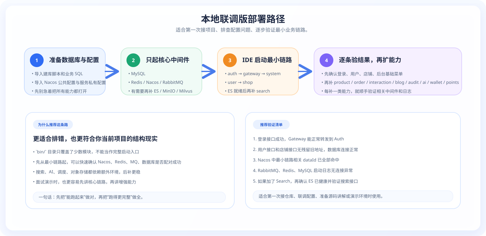
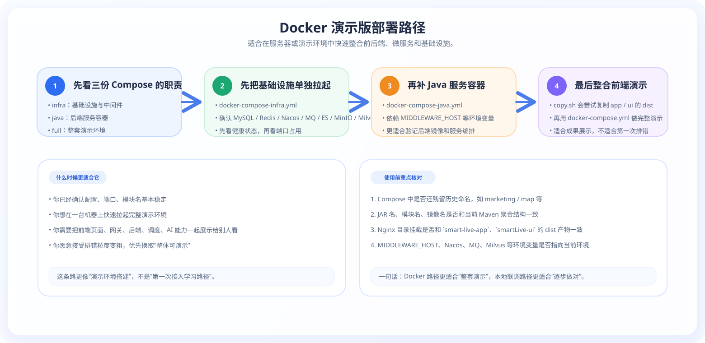

# SmartLive 部署说明

👉 **完整的图文排版版本，请访问：[SmartLive 在线文档网站](https://mumulinya.github.io/smartLive-Cloud/)**

**文档导航：** [网站首页](/) · [开源接入](./OPEN_SOURCE) · [视觉导览](./SHOWCASE) · [页面导览](./PAGE_GALLERY)

这份文档只聚焦部署相关的 4 件事：

1. 本地和服务器部署分别推荐走哪条路径。
2. Docker Compose、JAR 包部署分别需要哪些前置条件。
3. Nacos、中间件、环境变量应该怎么对齐。
4. 部署失败时优先排查哪些位置。

  

  

## 1. 推荐部署路径

### 路径一：本地开发 / 演示环境

适合先把服务跑起来，验证登录、页面、链路和后台功能。

- 优先使用本地 JAR 启动或 IDE 启动。
- 先起 `MySQL / Redis / Nacos / RabbitMQ`。
- 再按最小链路启动：`auth -> gateway -> system -> user -> shop -> search`。
- 需要 AI、文件、定时任务、支付、积分能力时，再补 `Elasticsearch / Milvus / MinIO / XXL-JOB / Sentinel`。

### 路径二：服务器部署 / 联调演示

适合快速拉起基础设施和一组完整服务做联调。

- 优先参考 `docker/` 目录里的 Compose 与部署脚本。
- 先核对镜像名、JAR 名、模块名、端口和当前仓库结构是否一致。
- `docker/` 中保留了一些历史命名，使用前一定要和当前 Maven 模块逐项对照。

## 2. Docker Compose 部署

当前仓库里和部署直接相关的文件主要有：

- `docker/docker-compose.yml`
- `docker/docker-compose-java.yml`
- `docker/docker-compose-infra.yml`
- `docker/deploy.sh`
- `docker/copy.sh`

推荐顺序：

1. 先起基础设施：`mysql / redis / nacos / rabbitmq / nginx`
2. 再按需补：`elasticsearch / milvus / minio / sentinel / seata`
3. 最后再起业务服务容器

> 注意：`docker-compose*.yml` 中仍有部分历史模块命名，例如 `marketing`、`map` 等，使用前请和当前服务实际名称逐一核对。

## 3. JAR 包部署

如不直接采用 Docker，也可以按服务单独部署 JAR。

推荐顺序：

1. 准备中间件：MySQL、Redis、Nacos、RabbitMQ
2. 导入 Nacos 配置与数据库初始化数据
3. 启动 `auth -> gateway -> system -> user -> shop -> search`
4. 再按业务需要补 `product / order / wallet / points / interaction / blog / audit / ai / file / chat / im / index`

适合单独补齐的高级依赖：

- 搜索：Elasticsearch
- AI / RAG：Milvus、MinIO、模型 API Key
- 定时任务：XXL-JOB
- 流量治理：Sentinel

## 4. 部署前先核对什么

### 4.1 Nacos 配置

部署前至少确认：

- `application-dev.yml`
- `smartLive-*-dev.yml`
- `xxl-job-common.yml`

已经导入 Nacos，且和当前环境的数据库、中间件地址一致。

### 4.2 环境变量 / 敏感配置

重点核对：

- `NACOS_HOST`
- `RABBITMQ_HOST`
- `MILVUS_HOST`
- `SMARTLIVE_ZHIPU_API_KEY`
- `SMARTLIVE_OPENAI_API_KEY`
- `SMARTLIVE_EMBEDDING_API_KEY`

不要把真实密钥直接提交到仓库。AI 相关配置建议通过环境变量或私有配置文件注入。

### 4.3 端口与服务名

当前对外最关键的服务端口：

| 服务 | 端口 |
|:---|:---:|
| smartLive-gateway | 8080 |
| smartLive-auth | 9300 |
| smartLive-system | 9202 |
| smartLive-user | 9201 |
| smartLive-shop | 9203 |
| smartLive-search | 9204 |
| smartLive-order | 9205 |
| smartLive-product | 9206 |
| smartLive-interaction | 9207 |
| smartLive-index | 9208 |
| smartLive-file | 9209 |
| smartLive-chat | 9210 |
| smartLive-blog | 9211 |
| smartLive-audit | 9212 |
| smartLive-ai | 9213 |
| smartLive-im | 9214 |
| smartLive-points | 9215 |
| smartLive-wallet | 9216 |
| smartLive-monitor | 9100 |
| smartLive-sentinel | 8718 |

> 说明：`smartLive-monitor` 是监控中心服务；`smartLive-sentinel` 主要是流量治理控制台，更多出现在部署环境与 Docker Compose 中。

## 5. 常见部署排查顺序

若部署后服务未正常启动，建议优先按以下顺序排查：

1. **先看 Nacos**：配置是否导入、dataId 是否齐全、数据库与中间件地址是否还是旧值。
2. **再看中间件连接日志**：MySQL、Redis、RabbitMQ、Elasticsearch、Milvus、MinIO 是否能连通。
3. **再看网关与认证**：先确认 `gateway` 和 `auth` 正常，再看业务服务。
4. **最后看增强能力**：AI、搜索、文件、调度、支付这类增强链路不要和最小链路混着排。

## 6. 部署演示建议

用于项目演示或联调时，建议先保证下面这 4 条链路正常：

1. 登录鉴权可用
2. 店铺 / 搜索基础链路可用
3. 管理端后台可访问
4. RabbitMQ、Redis、Nacos 没有明显配置错误

在这之后，再补：

- 订单、支付与积分
- AI / RAG
- XXL-JOB
- 文件与对象存储

## 7. 继续阅读

- 想看最小启动链路：看 [OPEN_SOURCE](./OPEN_SOURCE)
- 想看完整页面和后台：看 [PAGE_GALLERY](./PAGE_GALLERY)
- 想看业务链路与系统图：看 [SHOWCASE](./SHOWCASE)
