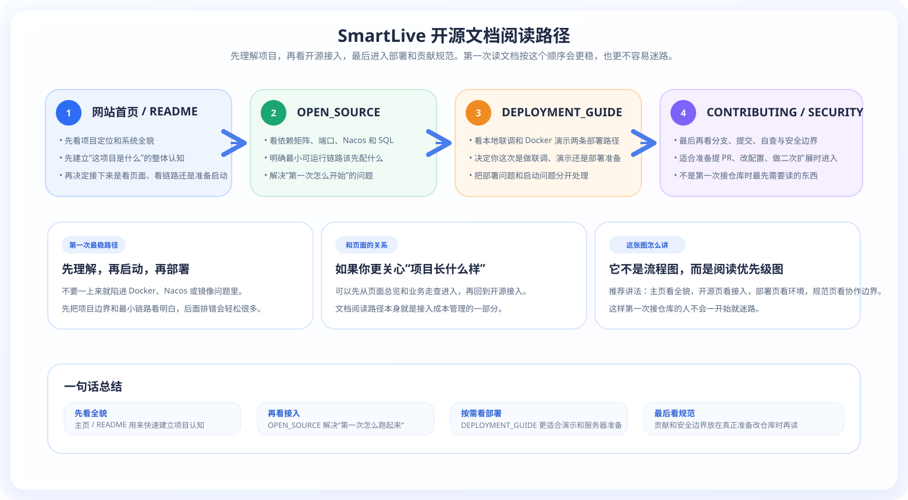

# SmartLive 开源接入说明

👉 **完整的图文排版版本，请访问：[SmartLive 在线文档网站](https://mumulinya.github.io/smartLive-Cloud/)**

**文档导航：** [网站首页](/) · [视觉导览](SHOWCASE.md) · [页面导览](PAGE_GALLERY.md)

这份文档聚焦三件事：

1. 第一次接入这个仓库，应该先看什么。
2. 想把服务跑起来，最小链路需要哪些中间件和模块。
3. 想体验完整能力或做部署演示，下一步应该补哪些依赖。

  

  

## 1. 先看哪几份文档

| 文档 | 作用 | 适合谁 |
|:---|:---|:---|
| [网站首页](/) | 了解项目定位、架构全景、业务截图、核心链路与技术亮点 | 第一次认识项目的人 |
| [SHOWCASE.md](SHOWCASE.md) | 按用户链路查看截图、架构图和关键时序图 | 想快速看“项目长什么样”的人 |
| [DEPLOYMENT_GUIDE.md](DEPLOYMENT_GUIDE.md) | 看 Docker、JAR、镜像重建、Nacos 配置和排错方式 | 准备部署或做演示的人 |
| [GitHub · CONTRIBUTING.md](https://github.com/mumulinya/smartLive-Cloud/blob/main/CONTRIBUTING.md) | 了解贡献方式、分支约定、提交格式和自查清单 | 准备提 PR 的人 |
| [GitHub · SECURITY.md](https://github.com/mumulinya/smartLive-Cloud/blob/main/SECURITY.md) | 明确敏感配置、密钥注入、账号信息的边界 | 所有会修改配置的人 |

## 2. 按目标阅读更高效

- **第一次认识项目**：先看 [网站首页](/)，再看 `smartLive-auth -> smartLive-gateway -> smartLive-system -> smartLive-user -> smartLive-shop -> smartLive-search`
- **想看交易闭环**：优先读 `smartLive-product -> smartLive-order -> smartLive-wallet -> smartLive-points`，再结合 README 里的交易链路图
- **想看社交与推荐**：优先读 `smartLive-blog -> smartLive-interaction -> smartLive-index -> smartLive-search`，再结合 `SHOWCASE.md` 的 Feed / 热榜图
- **想看 AI 与治理链路**：优先读 `smartLive-ai -> smartLive-audit -> smartLive-chat -> smartLive-im`，再补向量检索、审核责任链和通知推送链路

## 3. 第一次接入建议

- 优先走本地开发模式，不要一开始就把 `docker/` 目录当作唯一事实来源。
- 先跑“最小可运行链路”，确认登录、店铺、搜索和后台管理可用后，再补 AI、审核、积分、支付等扩展能力。
- `docker/` 下仍保留部分历史模块命名与复制脚本，使用前要和当前 Maven 模块、当前端口、当前 JAR 名称逐项核对。

## 4. 两条启动路径

### 路径一：最小可运行链路

适合先把服务跑起来，验证核心主链路是否通畅。

- 必需中间件：MySQL、Redis、Nacos、RabbitMQ
- 建议优先启动：`smartLive-auth`、`smartLive-gateway`、`smartLive-system`、`smartLive-user`、`smartLive-shop`、`smartLive-search`
- 这条路径可以先验证：登录、用户基础信息、店铺列表、店铺详情、后台管理、基础搜索

### 路径二：完整功能链路

适合验证 AI、搜索、文件、定时任务、积分和支付等完整能力。

- 额外中间件：Elasticsearch、Milvus、MinIO、XXL-JOB、Sentinel
- 额外模块：`smartLive-product`、`smartLive-order`、`smartLive-interaction`、`smartLive-chat`、`smartLive-im`、`smartLive-ai`、`smartLive-wallet`、`smartLive-points`、`smartLive-blog`、`smartLive-audit`、`smartLive-file`
- 如果要体验 RAG、向量检索、异步审核、积分抽奖、消息通知或延迟队列链路，必须补齐这些依赖

## 5. 推荐启动顺序

### 最小链路

1. `smartLive-auth`
2. `smartLive-gateway`
3. `smartLive-system`
4. `smartLive-user`
5. `smartLive-shop`
6. `smartLive-search`

### 进阶链路

在最小链路稳定后，再按需补：

1. `smartLive-product`
2. `smartLive-order`
3. `smartLive-interaction`
4. `smartLive-chat`
5. `smartLive-im`
6. `smartLive-blog`
7. `smartLive-audit`
8. `smartLive-ai`
9. `smartLive-wallet`
10. `smartLive-points`
11. `smartLive-file`
12. `smartLive-index`

## 6. 依赖矩阵

| 能力 | 必需依赖 | 备注 |
|:---|:---|:---|
| 登录鉴权 | MySQL、Redis、Nacos | auth + gateway |
| 店铺/商品/订单基础链路 | MySQL、Redis、RabbitMQ、Nacos | 常规业务必需 |
| 搜索 | Elasticsearch、Redis、RabbitMQ、Nacos | search 模块 |
| AI 对话 / RAG | Milvus、Elasticsearch、RabbitMQ、Nacos | 还需要单独配置模型 API key |
| 文件服务 | MinIO、Nacos | 本地文件路径也要配置 |
| 定时任务 | XXL-JOB、Nacos | 依赖 `xxl-job-common.yml` |
| 流量治理 | Sentinel、Nacos | 可按需启用 |

### 6.1 按能力体验的最小依赖矩阵

| 想体验的能力 | 推荐启动模块 | 最少中间件 | 说明 |
|:---|:---|:---|:---|
| 登录与个人中心 | `smartLive-auth`、`smartLive-gateway`、`smartLive-system`、`smartLive-user` | MySQL、Redis、Nacos | 先验证登录、用户信息、后台基础菜单是否可用 |
| 商家后台与店铺基础能力 | 在上一条基础上加 `smartLive-shop` | MySQL、Redis、Nacos | 可体验店铺列表、详情和后台店铺管理 |
| 搜索与附近找店 | 在上一条基础上加 `smartLive-search` | MySQL、Redis、Nacos、Elasticsearch | 热词、搜索和 LBS 找店依赖 ES |
| 下单、支付与积分 | `smartLive-product`、`smartLive-order`、`smartLive-wallet`、`smartLive-points` | MySQL、Redis、Nacos、RabbitMQ | 订单、支付、积分变动和补偿链路都依赖 MQ |
| AI 对话与 RAG | `smartLive-ai`、`smartLive-search`、`smartLive-shop`、`smartLive-product`、`smartLive-blog`、`smartLive-interaction` | MySQL、Redis、Nacos、RabbitMQ、Elasticsearch、Milvus、MinIO | 还需要模型 API Key、向量库和对象存储配置完整可用 |

## 7. 配置来源

- 本地端口、基础应用名、部分默认连接参数位于各模块的 `bootstrap.yml`。
- 共享配置和业务配置主要通过 Nacos 提供，初始化数据见 `sql/ry_config_20250902.sql`。
- `order`、`product`、`interaction` 等模块还依赖 `xxl-job-common.yml`；如果缺少这个 dataId，定时任务相关能力无法正常运行。
- Docker 相关构建与复制逻辑位于 `docker/` 目录，但其中存在历史脚本，请在使用前自行核对。

## 8. 实际服务端口

| 服务 | 端口 |
|:---|:---:|
| smartLive-gateway | 8080 |
| smartLive-auth | 9300 |
| smartLive-system | 9202 |
| smartLive-user | 9201 |
| smartLive-shop | 9203 |
| smartLive-search | 9204 |
| smartLive-order | 9205 |
| smartLive-product | 9206 |
| smartLive-interaction | 9207 |
| smartLive-index | 9208 |
| smartLive-file | 9209 |
| smartLive-chat | 9210 |
| smartLive-blog | 9211 |
| smartLive-audit | 9212 |
| smartLive-ai | 9213 |
| smartLive-im | 9214 |
| smartLive-points | 9215 |
| smartLive-wallet | 9216 |
| smartLive-monitor | 9100 |
| smartLive-sentinel | 8718 |

> 说明：监控中心的目录名是 `smartLive-monitor`，对应 Maven `artifactId` 是 `smartLive-visual-monitor`；`smartLive-sentinel` 主要作为流量治理控制台出现在部署环境中。

## 9. 第一天建议验证什么

- 网关可访问，登录鉴权可用。
- 用户、店铺、搜索三类基础接口可正常返回。
- Nacos 中 `application-dev.yml` 与 `smartLive-*-dev.yml` 已导入。
- RabbitMQ、Redis、MySQL 连接日志正常，没有残留 `127.0.0.1` 的错误配置。
- 如果补了搜索或 AI，确认 Elasticsearch、Milvus 相关连接正常。

## 10. AI 密钥与敏感配置

不要把真实 API key、数据库密码或外网可用的测试账号直接提交到仓库。

本地开发也可以直接使用 `config/smartlive-ai-secrets.yml`；仓库内提供了 `config/smartlive-ai-secrets.example.yml` 作为示例。

建议至少使用以下环境变量：

- `SMARTLIVE_ZHIPU_API_KEY`
- `SMARTLIVE_OPENAI_API_KEY`
- `SMARTLIVE_OPENAI_CHAT_API_KEY`
- `SMARTLIVE_EMBEDDING_API_KEY`
- `MILVUS_HOST`
- `RABBITMQ_HOST`
- `NACOS_HOST`

## 11. 已知注意事项

- `bin/run-*.bat` 仍保留旧的 `ruoyi-*` 路径，当前不应作为对外主推荐启动方式。
- `docker/copy.sh`、`docker/deploy.sh` 和 `docker-compose.yml` 中仍有 `marketing`、`map` 等历史命名，使用前请先校对。
- 如果你修改了端口、模块名、依赖或启动顺序，请同时更新 `README.md`、`docs/OPEN_SOURCE.md` 和 `docs/SHOWCASE.md`。
