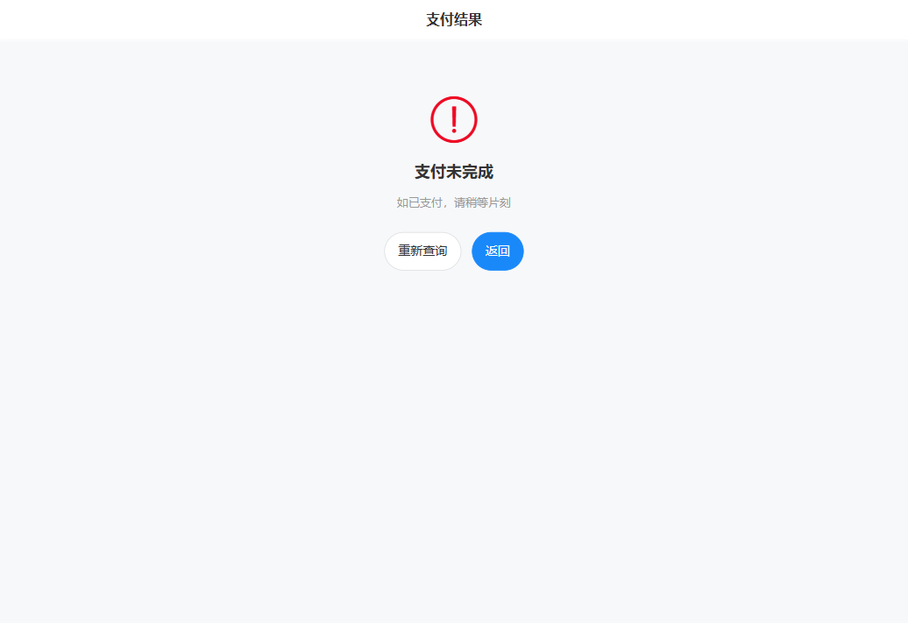
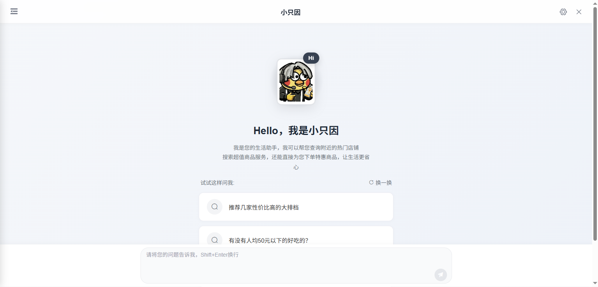
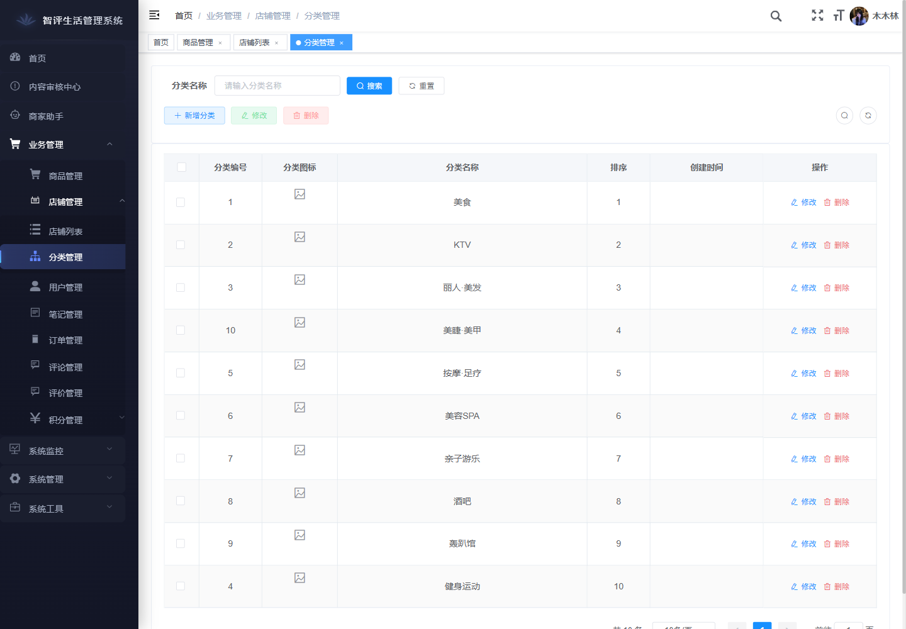
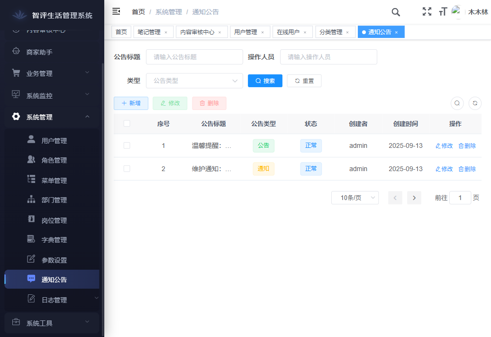

# SmartLive 页面导览

这份文档专门承接 [README.md](../README.md) 里的“效果预览”，按真实使用路径把用户端 App 和管理端 Web 的页面一次看顺。

**文档导航：** [README 首页](../README.md) · [视觉导览](SHOWCASE.md) · [开源接入](OPEN_SOURCE.md)

- README 只保留最主要的页面入口，方便第一次进仓库的人快速扫一遍。
- 这里继续展开完整页面，按“进入 -> 发现 -> 决策 -> 交易 -> 内容 -> 社交 -> AI -> 个人资产”的顺序往下看。

## 快速跳转

- [用户端 App：登录与进入](#app-login-entry)
- [用户端 App：发现入口与热榜](#app-discovery)
- [用户端 App：搜索与 LBS 找店](#app-search-map)
- [用户端 App：店铺决策与商品详情](#app-shop-product)
- [用户端 App：支付、订单、钱包与积分](#app-trade-assets)
- [用户端 App：内容创作与评价互动](#app-content-creation)
- [用户端 App：社交关系与消息](#app-social-message)
- [用户端 App：AI 智能助手与 AIGC](#app-ai-capability)
- [用户端 App：个人中心、收藏与安全设置](#app-profile-assets)
- [管理端 Web：经营总览](#admin-dashboard)
- [管理端 Web：业务与履约后台](#admin-business)
- [管理端 Web：内容治理与运营后台](#admin-governance)
- [管理端 Web：AI 经营与系统后台](#admin-system)
- [XXL-JOB 调度后台](#admin-scheduler)

## 1. 用户端 App 全链路展示

### 1.1 登录与进入

  

登录页负责建立账号入口和用户登录态，是第一次进入 App 的起点。

### 1.2 发现入口与热榜

| 首页入口 | 热门内容流 |
|:---:|:---:|
|  |  |
| 分类入口、优惠专区和秒杀入口 | 热门页与内容分区切换 |

| 热门店铺榜 | 热门商品榜 |
|:---:|:---:|
|  |  |
| 独立店铺热榜页 | 独立商品热榜页 |

| 店铺分类列表 |
|:---:|
|  |
| 分类找店与按类浏览入口 |

### 1.3 搜索与 LBS 找店

| 搜索入口页 | 搜索结果页 |
|:---:|:---:|
|  |  |
| 搜索输入与热词入口 | 全文检索与排序筛选 |

| 地图找店 |
|:---:|
|  |
| 地图模式承接附近找店和 LBS 分布查看 |

### 1.4 店铺决策与商品详情

| 店铺详情页 | 商品详情页 |
|:---:|:---:|
|  |  |
| 店铺介绍、评价与商品入口 | 商品详情与购买入口 |

| 限时秒杀专区 |
|:---:|
|  |
| 秒杀活动入口与限时抢购承接页 |

### 1.5 支付、订单、钱包与积分

| 支付收银台 | 支付结果页 |
|:---:|:---:|
|  |  |
| 支付收银与确认 | 支付成功与失败反馈 |

| 我的订单 | 订单详情页 |
|:---:|:---:|
|  |  |
| 订单列表与履约状态 | 订单履约详情与支付入口 |

| 我的钱包 | 钱包充值页 |
|:---:|:---:|
|  |  |
| 钱包余额与资产入口 | 充值与扫码支付 |

| 支付明细页 | 钱包账单页 |
|:---:|:---:|
|  |  |
| 支付流水筛选 | 钱包收支流水 |

| 积分中心 | 积分明细 |
|:---:|:---:|
|  |  |
| 积分资产与成长入口 | 积分收支明细 |

| 签到与抽奖 |
|:---:|
|  |
| 连续签到、抽奖玩法与积分增长入口 |

### 1.6 内容创作与评价互动

| 内容创作发布 | 博客详情页 |
|:---:|:---:|
|  |  |
| 图文发布与草稿承接 | 内容详情与互动 |

| 评论区 | 我的评价页 |
|:---:|:---:|
|  |  |
| 评论与评价互动 | 评价状态筛选 |

| 待评价页 | 评价草稿页 |
|:---:|:---:|
|  |  |
| 履约后去评价 | 评价草稿管理 |

| 评价发布页 | 我的发布/笔记 |
|:---:|:---:|
|  |  |
| 星级、文案与媒体发布入口 | 已发布内容沉淀 |

| 草稿箱 | 博客编辑页 |
|:---:|:---:|
|  |  |
| 未发布内容管理 | 图文编辑与 AI 写作入口 |

### 1.7 社交关系与消息

| 动态关注流 | 我的关注页 |
|:---:|:---:|
|  |  |
| 关注内容流 | 用户 / 店铺 / 商品关注三标签 |

| 粉丝明细页 | 用户搜索 |
|:---:|:---:|
|  |  |
| 个人主页下钻后的粉丝关系明细 | 找人入口与用户搜索 |

| 他人主页 | 添加朋友页 |
|:---:|:---:|
|  |  |
| 用户访问他人主页视角 | 站内找人和加好友入口 |

| 消息会话列表 | 即时通讯聊天 |
|:---:|:---:|
|  |  |
| 私聊会话入口 | 实时聊天详情 |

| 聊天信息页 | 聊天历史日历 |
|:---:|:---:|
|  |  |
| 会话设置与免打扰入口 | 按日期查找聊天记录 |

| 系统消息页 | 我的互动 |
|:---:|:---:|
|  |  |
| 审核、系统与业务提醒 | 被赞、被评和互动消息汇总 |

### 1.8 AI 智能助手与 AIGC

| AI 智能助手 | AI 会话列表 |
|:---:|:---:|
|  |  |
| AI 问答主界面 | 历史会话恢复 |

| AI 快捷提问 | AI 推荐结果卡片 |
|:---:|:---:|
|  |  |
| 首次进入时的推荐问题与快捷引导 | 商品与团购推荐卡片 |

| AI 下单结果与订单卡片 | AI 博客生成 |
|:---:|:---:|
|  |  |
| 下单成功后的订单状态卡片 | AIGC 探店内容 |

| AI 评价生成 |
|:---:|
|  |
| AIGC 消费评价生成 |

### 1.9 个人中心、收藏与安全设置

| 个人中心（含顶部搜索按钮） | 资料编辑页 |
|:---:|:---:|
|  |  |
| 个人中心与顶部搜索入口 | 昵称、头像和简介编辑 |

| 我的收藏页 | 账号安全页 |
|:---:|:---:|
|  |  |
| 店铺 / 笔记 / 商品收藏三标签 | 密码修改与账号安全设置 |

| 设置密码页 | 修改密码页 |
|:---:|:---:|
|  |  |
| 首次设置登录密码 | 旧密码校验后的账号安全修改 |

## 2. 管理端 Web 核心入口

### 2.1 登录与经营总览

| 管理端登录页 | 经营总览仪表盘 |
|:---:|:---:|
|  |  |
| 后台登录入口 | 商家经营总览与数据面板 |

### 2.2 业务与履约后台

| 店铺管理 | 商品管理 |
|:---:|:---:|
|  |  |
| 店铺列表与审核状态 | 商品与营销商品统一管理 |

| 店铺分类管理 | 订单管理 |
|:---:|:---:|
|  |  |
| 店铺分类与业务归类 | 履约状态与订单筛选 |

| 抽奖配置 | 积分记录 |
|:---:|:---:|
|  |  |
| 奖品配置与库存概览 | 积分记录与发放流水 |

### 2.3 内容治理与运营后台

| 审核中心 | 博客管理 |
|:---:|:---:|
|  |  |
| 审核流与驳回回写 | 博客内容治理与运营维护 |

| 评价管理 | 评论管理 |
|:---:|:---:|
|  |  |
| 评价治理与状态回写 | 评论治理与清理 |

| 公告通知管理 | 业务用户 |
|:---:|:---:|
|  |  |
| 公告与通知运营 | 商家侧用户运营列表 |

### 2.4 AI 经营与系统后台

| AI 经营助手 | 用户管理 |
|:---:|:---:|
|  |  |
| 商家侧 AI 建议 | 系统账号与权限管理 |

| 菜单权限 | 参数设置 |
|:---:|:---:|
|  |  |
| 菜单树与按钮权限配置 | 系统参数与开关配置 |

| 在线监控 | 角色管理 |
|:---:|:---:|
|  |  |
| 在线用户与强退 | 角色与权限字符维护 |

| 登录日志 | 操作日志 |
|:---:|:---:|
|  |  |
| 登录审计与状态追踪 | 后台操作留痕与行为审计 |

### 2.5 XXL-JOB 调度后台

| 调度总览 | 任务管理 |
|:---:|:---:|
|  |  |
| 28 个任务、3 个在线执行器的运行总览 | 按执行器查看 JobHandler、CRON 和状态 |

| 执行器管理 |
|:---:|
|  |
| 6 个执行器配置与在线节点查看 |
