# SmartLive 视觉导览

这份文档只做一件事：让第一次看到 SmartLive 的人，在几分钟内看清项目全景、核心页面和关键链路。

**文档导航：** [网站首页](/) · [页面导览](PAGE_GALLERY.md) · [开源接入](OPEN_SOURCE.md)

**第一次建议先看：** [项目全景](#showcase-overview) -> [用户进入、发现与找店](#showcase-discovery) -> [决策、交易与增长](#showcase-trade)

**按目标看图：**

- **第一次认识项目**：[项目全景](#showcase-overview) -> [用户进入、发现与找店](#showcase-discovery) -> [决策、交易与增长](#showcase-trade)
- **想看交易闭环**：[决策、交易与增长](#showcase-trade) -> [交易与履约图组](#chains-trade)
- **想看内容与社交**：[内容创作、社交与消息](#showcase-social) -> [社交与消息图组](#chains-social) -> [排行、热度与推荐图组](#chains-rank)
- **想看 AI 与个人资产**：[AI 与个人资产](#showcase-ai) -> [内容审核与搜索图组](#chains-search) -> [AI 与经营图组](#chains-ai)
- **想看 Redis / 调度设计**：[缓存与性能专题](#chains-cache) -> [调度与定时任务](#chains-schedule)

## 1. 项目全景

  

- 前台用户端 App、后台管理端 Web 通过网关统一进入微服务体系。
- 中间层覆盖用户、店铺、商品、订单、互动、AI、IM、审核、积分、钱包等业务域。
- 基础设施层包含 Redis、RabbitMQ、Elasticsearch、Milvus、MinIO、XXL-JOB 等中间件。

## 2. 用户进入、发现与找店

### 登录入口

  

统一登录入口，负责建立移动端用户身份。

### 首页入口

  

首页承接分类、优惠专区、秒杀和后续榜单跳转。

### 热门内容流

  

热门页集中展示内容流与分区切换。

### 本地必吃榜（店铺热榜）

  

独立店铺热榜页展示本地必吃商户。

### 抢手好券榜

  

独立好券热榜页展示热门优惠商品。

### 搜索结果

  

搜索结果承接全文检索、热词和排序策略。

### 搜索与地图

  

地图模式把关键词搜索延伸到附近找店和位置分布。

## 3. 决策、交易与增长

### 店铺详情

  

店铺详情承接介绍、商品、评价和互动信息。

### 商品详情

  

商品详情承接下单、收藏和评价入口。

### 秒杀专区

  

秒杀专区对应 Redis Lua 和 MQ 异步削峰链路。

### 订单中心

  

订单中心展示待支付、进行中和已完成订单。

### 钱包中心

  

钱包中心承接余额、支付记录和资产入口。

### 积分中心

  

积分中心承接签到、抽奖和成长体系。

### 签到抽奖

  

连续签到与抽奖是增长玩法入口。

## 4. 内容创作、社交与消息

### 发布页

  

发布页承接图文创作与草稿管理。

### 评论区

  

评论和评价承接互动计数与审核链路。

### 我的发布

  

个人主页可查看已发布内容。

### 草稿箱

  

草稿箱承接未发布内容和二次编辑。

### 评价草稿页

  

评价草稿页用于继续编辑和清理待发布评价。

### 评价发布页

  

评价发布页承接评分、文案、媒体上传和 AI 辅助生成。

### 动态流

  

动态流展示关注内容与推荐内容混合分发。

### 我的关注

  

独立关注页按用户、店铺、商品三类关系组织关注资产。

### 我的收藏

  

独立收藏页承接店铺、笔记和商品三类收藏资产。

### 粉丝明细页

  

粉丝明细页承接个人主页下钻后的社交关系查看。

### 会话列表

  

会话列表承接私聊入口与未读状态。

### 系统通知

  

审核结果和系统提醒会通过站内通知下发。

### IM 私聊

  

私聊详情展示实时聊天与消息流转。

## 5. AI 与个人资产

### AI 推荐结果卡片

  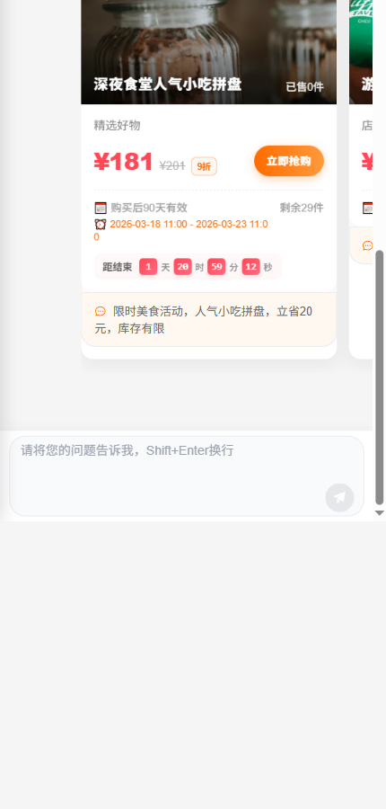

AI 推荐卡片承接商品与团购推荐结果。

### AI 下单结果与订单卡片

  

下单结果会直接展示订单号、状态轮询和跳转入口。

### AI 会话列表

  

会话列表承接历史会话和快速恢复。

### 个人中心

  

个人中心聚合资料、内容和资产入口。

### 设置密码页

  

首次设置密码页用于补齐密码登录能力。

### 修改密码页

  

修改密码页承接旧密码校验和账号安全修改。

## 6. 核心链路图集

这里直接展示主链路预览图，详细实现继续保留 `详细版 SVG` 入口。

### 交易与履约

| 链路 | 重点看什么 | 展示图 | 详细版入口 |
|:---|:---|:---|:---|
| 秒杀抢购全链路 | Redis Lua 防超卖、RabbitMQ 异步落单、延迟队列兜底 | <a href="./diagrams/seckill-flow.svg" target="_blank" rel="noreferrer">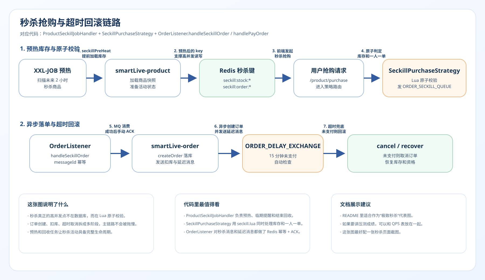</a> | [查看详细 SVG](./diagrams/detail-src/seckill-flow-detailed.svg) |
| 普通下单：订单创建与状态流转 | 下单创建、异步落单、支付生效后的状态流转 | <a href="./diagrams/normal-order-sequence.svg" target="_blank" rel="noreferrer">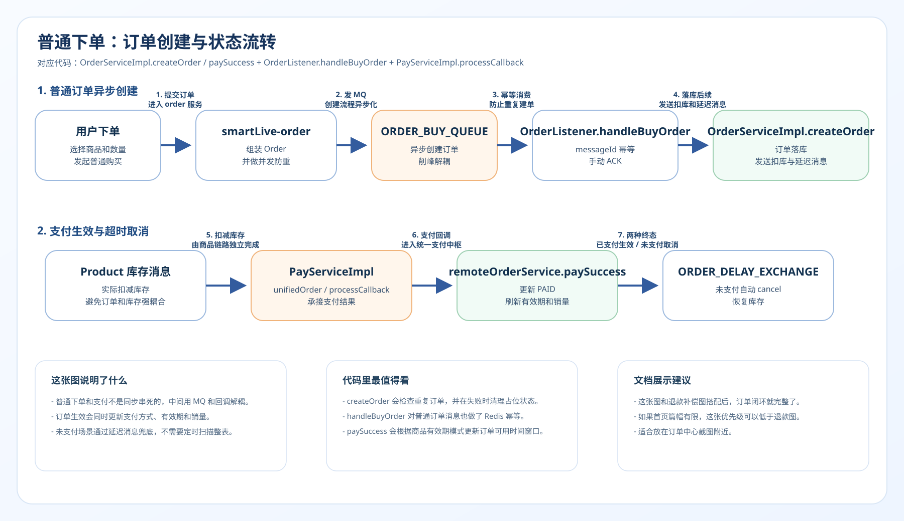</a> | [查看详细 SVG](./diagrams/detail-src/normal-order-sequence-detailed.svg) |
| 统一支付：支付受理、回调与账务分发 | 支付受理、回调分发、PaymentRecord 与充值入账 / 订单记账 | <a href="./diagrams/unified-pay-sequence.svg" target="_blank" rel="noreferrer">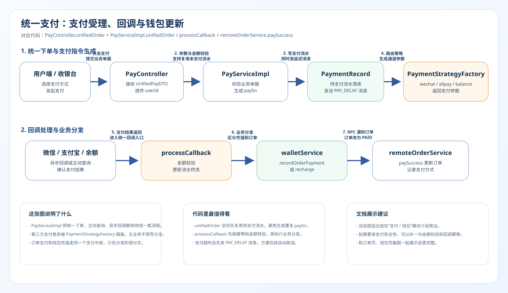</a> | [查看详细 SVG](./diagrams/detail-src/unified-pay-sequence-detailed.svg) |
| 订单超时取消与库存回滚 | 下单后发送延迟消息、超时未支付自动取消、库存与资格回滚 |  | [查看详细 SVG](./diagrams/detail-src/order-timeout-cancel-stock-rollback-chain-detailed.svg) |
| 主动取消 / 退款与钱包补偿 | 用户主动取消或退款后的库存回滚、退款 MQ 与钱包流水 | <a href="./diagrams/order-refund-wallet-compensation-chain.svg" target="_blank" rel="noreferrer">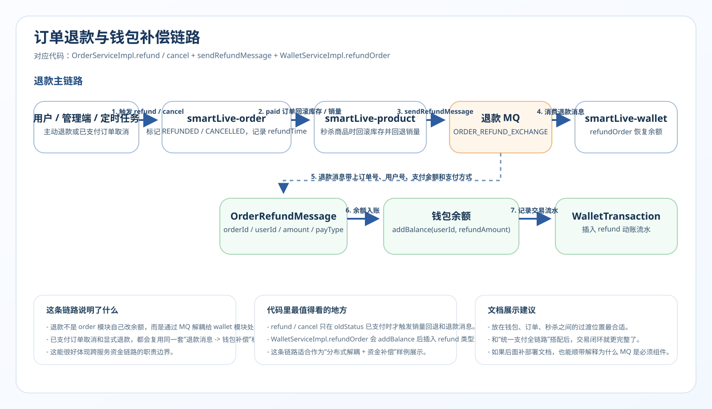</a> | [查看详细 SVG](./diagrams/detail-src/order-refund-wallet-compensation-chain-detailed.svg) |
| 订单核销、店铺销量与积分奖励 | verifyShopId 校验、核销后销量增长、消费积分异步发放 | <a href="./diagrams/order-verification-points-reward-chain.svg" target="_blank" rel="noreferrer">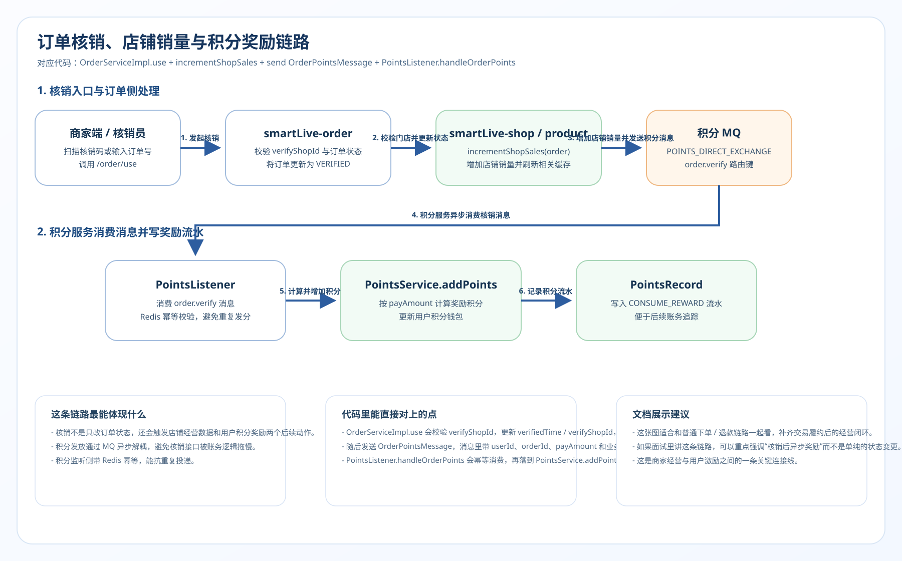</a> | [查看详细 SVG](./diagrams/detail-src/order-verification-points-reward-chain-detailed.svg) |

### 积分与用户激励

| 链路 | 重点看什么 | 展示图 | 详细版入口 |
|:---|:---|:---|:---|
| 每日签到积分 | 签到、积分发放、幂等与奖励计算 | <a href="./diagrams/daily-signin-points-sequence.svg" target="_blank" rel="noreferrer">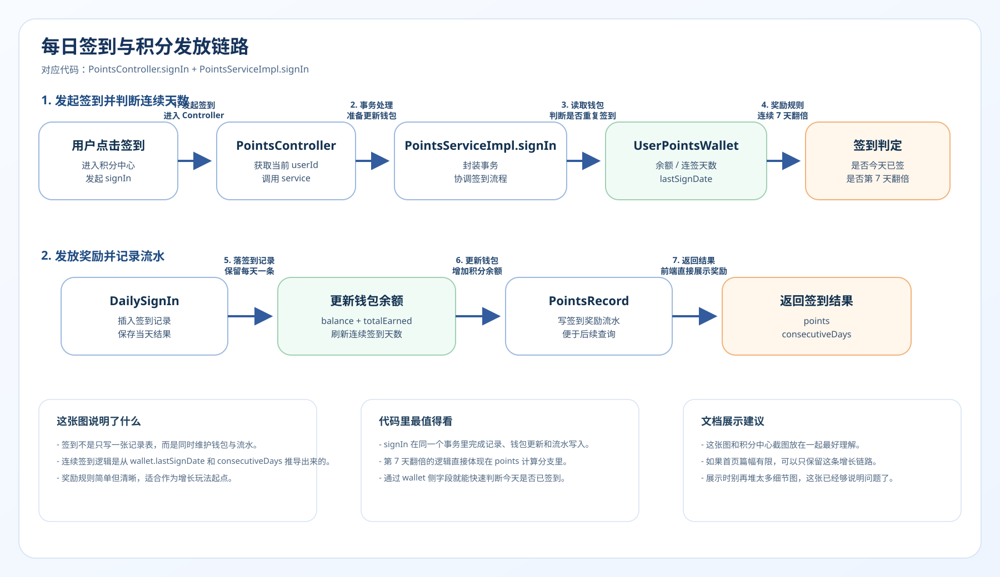</a> | [查看详细 SVG](./diagrams/detail-src/daily-signin-points-sequence-detailed.svg) |
| 积分抽奖 | 扣减积分、抽奖结果、奖品发放 | <a href="./diagrams/points-lottery-draw-sequence.svg" target="_blank" rel="noreferrer">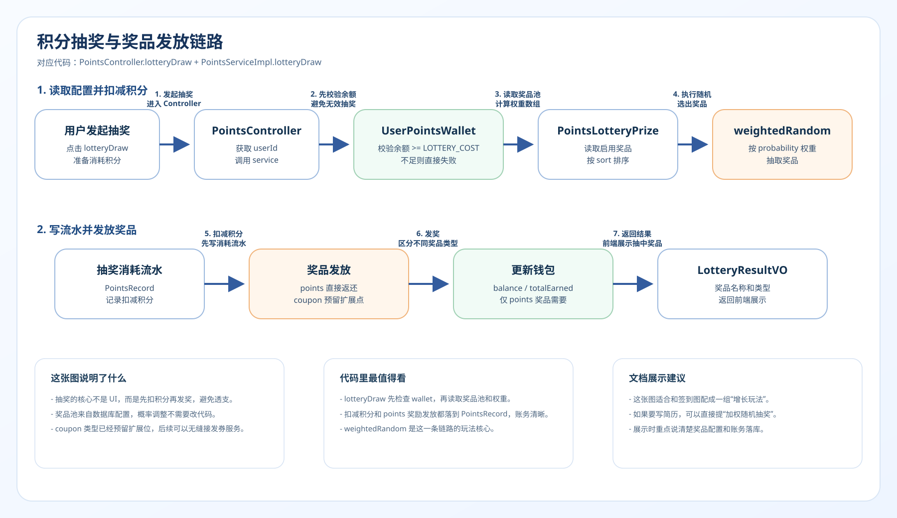</a> | [查看详细 SVG](./diagrams/detail-src/points-lottery-draw-sequence-detailed.svg) |

### 账户与基础设施

| 链路 | 重点看什么 | 展示图 | 详细版入口 |
|:---|:---|:---|:---|
| 登录鉴权与网关透传 | 短信/密码登录、Redis 登录态、Gateway 请求头透传 | <a href="./diagrams/auth-login-gateway-chain.svg" target="_blank" rel="noreferrer">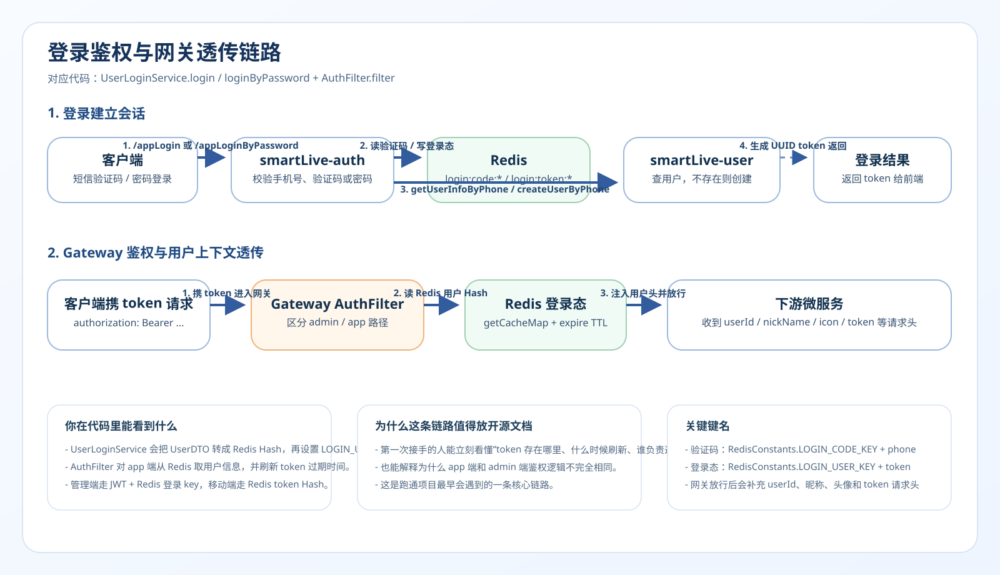</a> | [查看详细 SVG](./diagrams/detail-src/auth-login-gateway-chain-detailed.svg) |
| 头像上传与文件替换 | 文件类型校验、MinIO 上传、旧文件删除、登录缓存刷新 | <a href="./diagrams/file-upload-avatar-update-chain.svg" target="_blank" rel="noreferrer">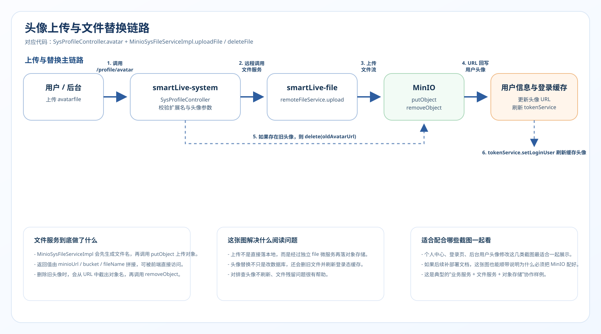</a> | [查看详细 SVG](./diagrams/detail-src/file-upload-avatar-update-chain-detailed.svg) |

### 内容审核与搜索

| 链路 | 重点看什么 | 展示图 | 详细版入口 |
|:---|:---|:---|:---|
| 发布审核与搜索 / 向量同步 | 提交待审、审核责任链、回调源服务、ES/Milvus/热榜更新 | <a href="./diagrams/publish-audit-search-sync-chain.svg" target="_blank" rel="noreferrer">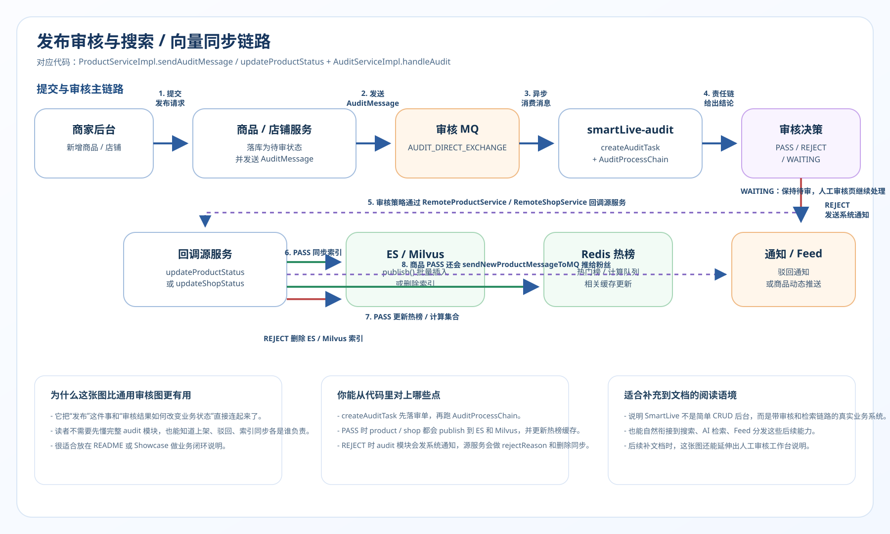</a> | [查看详细 SVG](./diagrams/detail-src/publish-audit-search-sync-chain-detailed.svg) |
| 审核中心责任链与业务回写 | 审核任务落库、敏感词 / AI / 人工审核、驳回通知 | <a href="./diagrams/audit-center-responsibility-chain.svg" target="_blank" rel="noreferrer">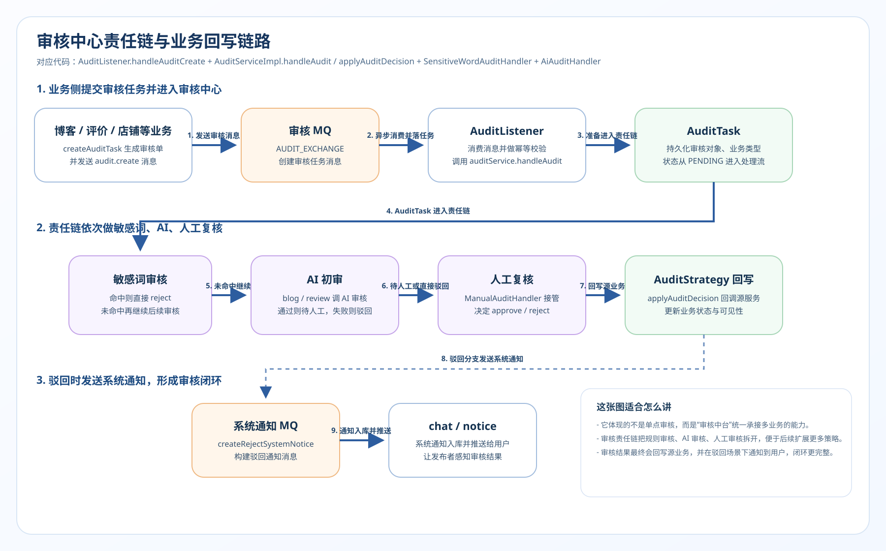</a> | [查看详细 SVG](./diagrams/detail-src/audit-center-responsibility-chain-detailed.svg) |
| 搜索读链路与热词沉淀 | ES 检索、LBS 排序、搜索历史与热搜榜 | <a href="./diagrams/search-read-lbs-ranking-chain.svg" target="_blank" rel="noreferrer">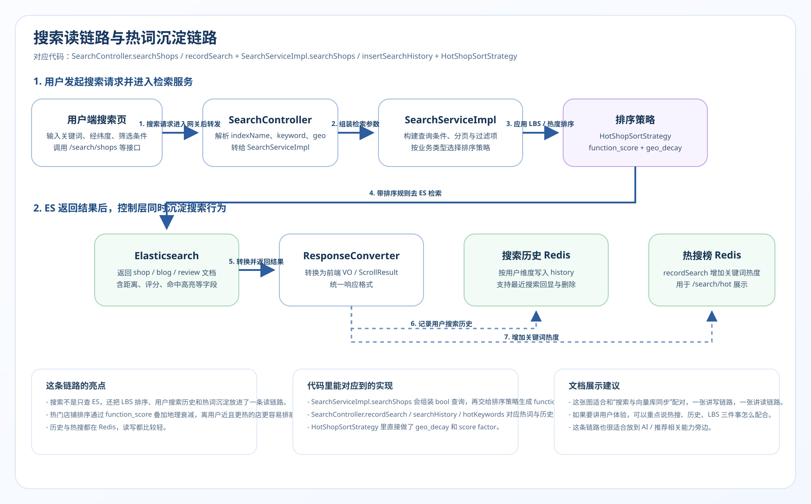</a> | [查看详细 SVG](./diagrams/detail-src/search-read-lbs-ranking-chain-detailed.svg) |

### 社交与消息

| 链路 | 重点看什么 | 展示图 | 详细版入口 |
|:---|:---|:---|:---|
| 关注 Feed 推送与滚动读取 | 粉丝信箱写入、Pipeline 批量 ZSet、ScrollResult 读取聚合 | <a href="./diagrams/follow-feed-scroll-read-chain.svg" target="_blank" rel="noreferrer">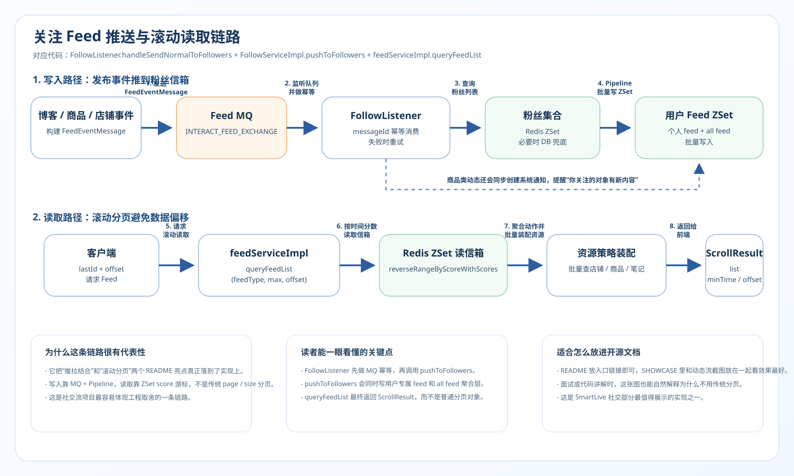</a> | [查看详细 SVG](./diagrams/detail-src/follow-feed-scroll-read-chain-detailed.svg) |
| IM 私聊可靠投递 | 长连接、消息持久化、ACK / 重试 | <a href="./diagrams/im-private-message-reliable-delivery-sequence.svg" target="_blank" rel="noreferrer">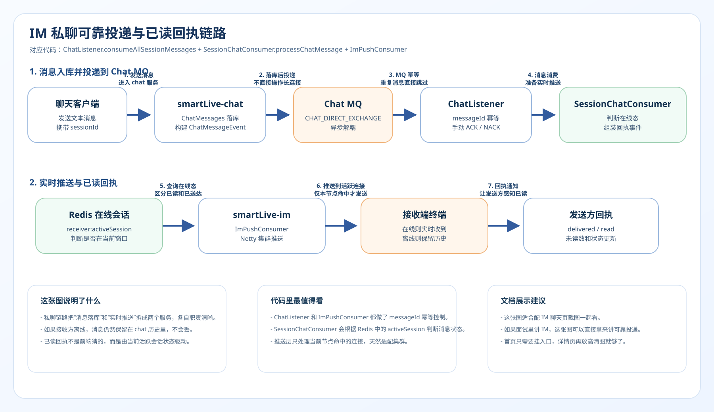</a> | [查看详细 SVG](./diagrams/detail-src/im-private-message-reliable-delivery-sequence-detailed.svg) |
| 系统通知入库与 IM 推送 | 多业务通知汇聚、通知落库、在线实时推送 | <a href="./diagrams/system-notice-im-push-chain.svg" target="_blank" rel="noreferrer">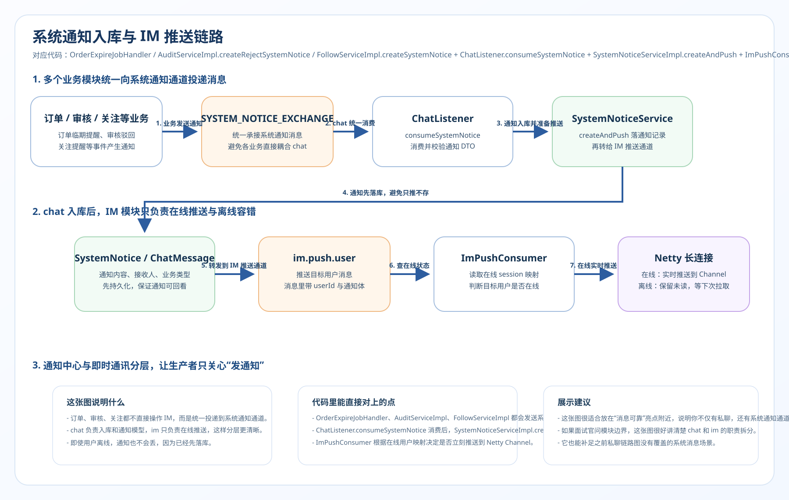</a> | [查看详细 SVG](./diagrams/detail-src/system-notice-im-push-chain-detailed.svg) |

### 排行、热度与推荐

| 链路 | 重点看什么 | 展示图 | 详细版入口 |
|:---|:---|:---|:---|
| 首页热门面板与热门博客读取链路 | 首页顶部热门面板按 activeHotTab 读取店铺榜 / 好券榜 / 团购榜，热门博客列表独立读取 | <a href="./diagrams/home-aggregation-recommend-recall-chain.svg" target="_blank" rel="noreferrer">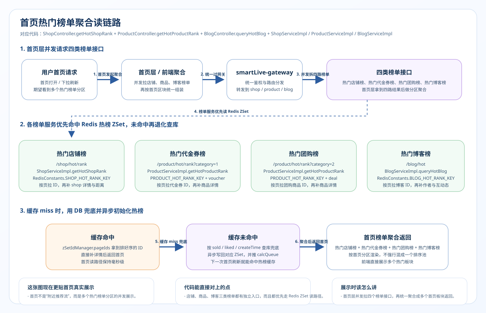</a> | [查看详细 SVG](./diagrams/detail-src/home-aggregation-recommend-recall-chain-detailed.svg) |
| 首页热门面板算分与热榜维护链路 | 店铺榜、好券榜、团购榜和热门博客内容流如何进入 calcQueue，经过增量洗牌与凌晨全量重建后持续写回 Redis 热榜 |  | [查看详细 SVG](./diagrams/detail-src/home-hot-rank-score-maintenance-chain-detailed.svg) |
| 互动数据回刷与双轨同步（业务视角） | Redis 热数据变化如何驱动回刷、检索同步与热度重算 | <a href="./diagrams/interaction-dual-track-sync-sequence.svg" target="_blank" rel="noreferrer">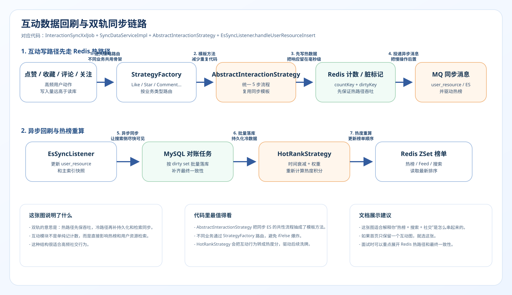</a> | [查看详细 SVG](./diagrams/detail-src/interaction-dual-track-sync-sequence-detailed.svg) |
| 热榜增量维护与全量重建（业务视角） | calcQueue、Top N merge、榜单更新与凌晨全量兜底 |  | [查看详细 SVG](./diagrams/detail-src/hot-rank-wash-rebuild-chain-detailed.svg) |

### AI 与经营

| 链路 | 重点看什么 | 展示图 | 详细版入口 |
|:---|:---|:---|:---|
| AI 对话链路 | SSE 流式响应、意图路由、卡片事件 |  | [查看详细 SVG](./diagrams/detail-src/ai-chat-sse-intent-routing-sequence-detailed.svg) |
| 店铺经营分析与 AI 经营建议 | 订单分析、评价分析、经营建议与差评关键词抽取合在同一组看 | <a href="./diagrams/shop-analysis-aggregation-chain.svg" target="_blank" rel="noreferrer">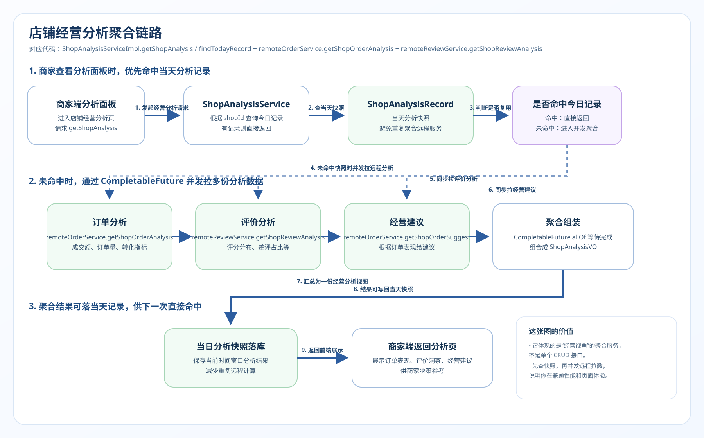</a> <a href="./diagrams/shop-suggest-ai-keywords-chain.svg" target="_blank" rel="noreferrer">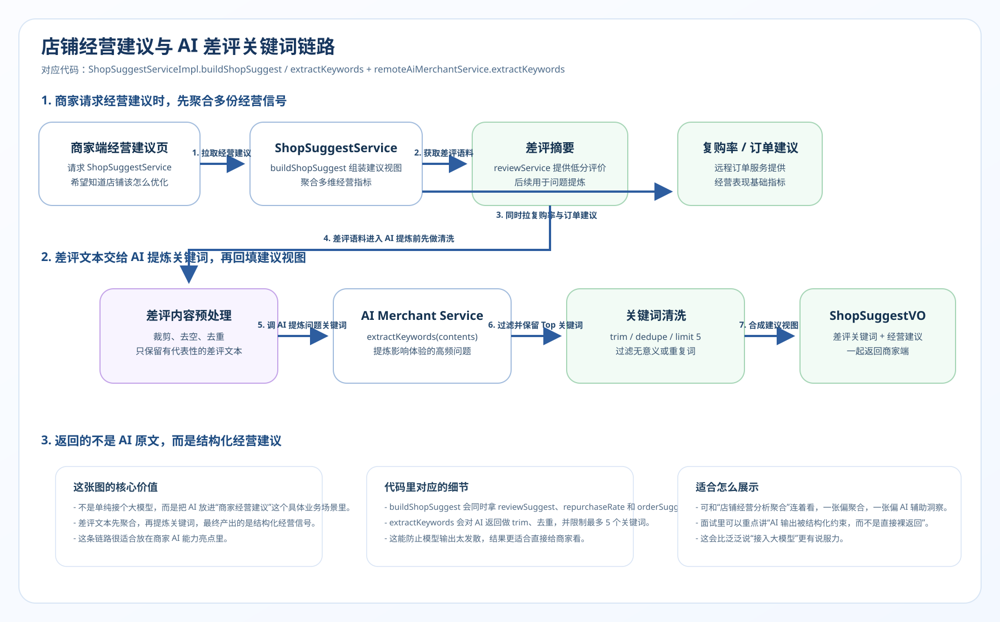</a> | [分析详细](./diagrams/detail-src/shop-analysis-aggregation-chain-detailed.svg) / [AI 建议详细](./diagrams/detail-src/shop-suggest-ai-keywords-chain-detailed.svg) |

### 缓存与性能专题

| 链路 | 重点看什么 | 展示图 | 详细版入口 |
|:---|:---|:---|:---|
| Redis 缓存分层设计 | 列表、详情、计数、状态、热榜 / Feed 五层缓存拆分 | <a href="./diagrams/redis-layered-cache-architecture.svg" target="_blank" rel="noreferrer">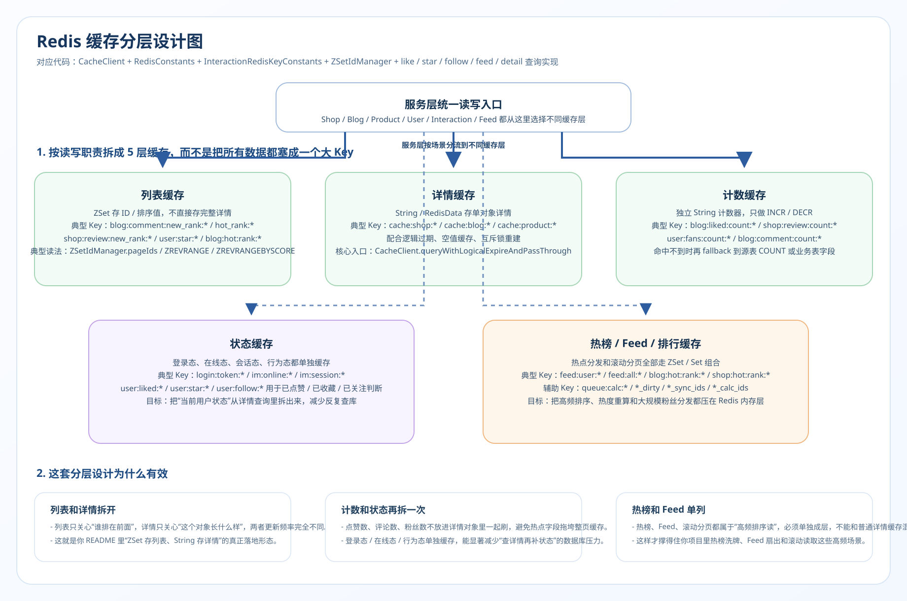</a> | [查看详细 SVG](./diagrams/detail-src/redis-layered-cache-architecture-detailed.svg) |
| Feed / 列表 ZSet 缓存链路 | ZSet 排序视图、滚动分页、批量详情回填 | <a href="./diagrams/redis-feed-zset-cache-chain.svg" target="_blank" rel="noreferrer">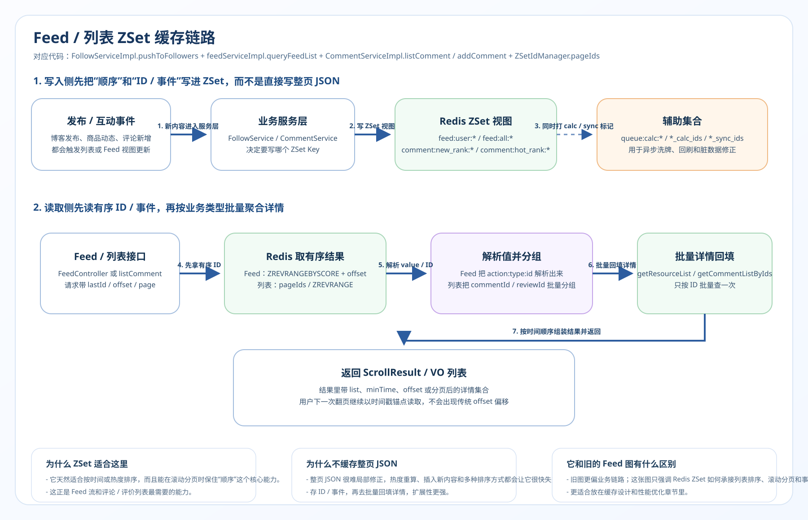</a> | [查看详细 SVG](./diagrams/detail-src/redis-feed-zset-cache-chain-detailed.svg) |
| 详情页缓存读写链路 | 逻辑过期、空值缓存、互斥锁重建、写后删缓存 | <a href="./diagrams/redis-detail-cache-readwrite-chain.svg" target="_blank" rel="noreferrer">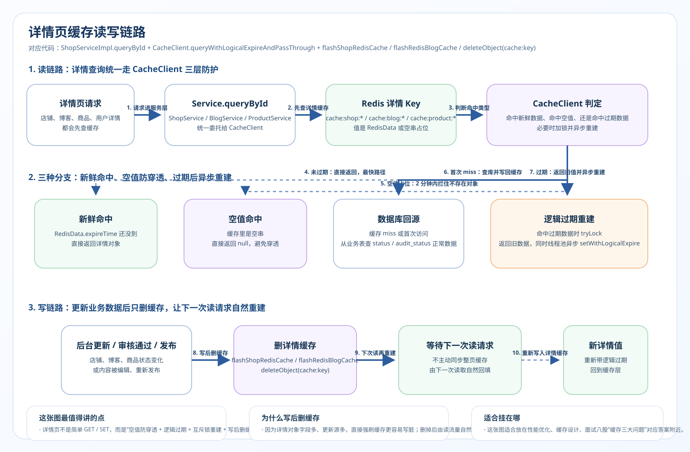</a> | [查看详细 SVG](./diagrams/detail-src/redis-detail-cache-readwrite-chain-detailed.svg) |

### 调度与定时任务

这组主要看订单兜底、秒杀预热、互动回刷、热榜重建和销量同步如何由调度体系统一承接。真实后台页、任务列表和执行器截图可以继续看 [PAGE_GALLERY.md - XXL-JOB 调度后台](PAGE_GALLERY.md#admin-scheduler)。

#### 第一层：总览图

| 链路 | 重点看什么 | 展示图 | 详细版入口 |
|:---|:---|:---|:---|
| XXL-JOB 定时任务体系总览 | 28 个定时任务如何拆到订单、秒杀、互动、热榜和销量同步六大类 | <a href="./diagrams/xxl-job-scheduler-overview.svg" target="_blank" rel="noreferrer">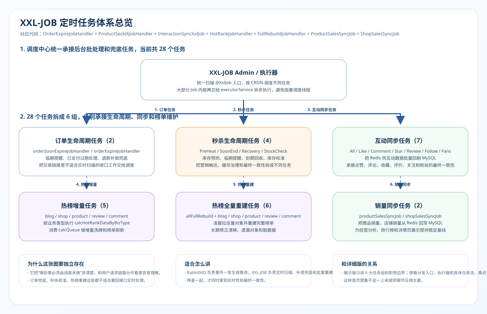</a> | [查看详细 SVG](./diagrams/detail-src/xxl-job-scheduler-overview-detailed.svg) |

#### 第二层：4 张子图

| 链路 | 重点看什么 | 展示图 | 详细版入口 |
|:---|:---|:---|:---|
| 秒杀预热与库存校准链路 | 预热库存和详情缓存，后续再按订单销量校准 MySQL 与缓存 | <a href="./diagrams/seckill-preheat-stock-calibration-chain.svg" target="_blank" rel="noreferrer">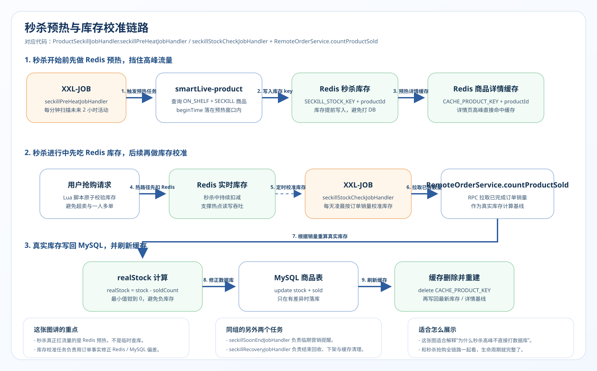</a> | [查看详细 SVG](./diagrams/detail-src/seckill-preheat-stock-calibration-chain-detailed.svg) |
| 热榜增量维护与全量重建链路（调度视角） | HotRankJobHandler / FullRebuildJobHandler 如何分发增量维护与全量重建 |  | [查看详细 SVG](./diagrams/detail-src/hot-rank-wash-rebuild-chain-detailed.svg) |
| 互动数据回刷与双轨同步链路（调度视角） | InteractionSyncXxlJob / SyncDataServiceImpl 如何回刷 MySQL 并联动热榜 |  | [查看详细 SVG](./diagrams/detail-src/interaction-dual-track-sync-sequence-detailed.svg) |
| 订单生命周期兜底处理链路 | 临期提醒、过期处理、库存销量回滚与退款补偿兜底 | <a href="./diagrams/order-lifecycle-fallback-chain.svg" target="_blank" rel="noreferrer">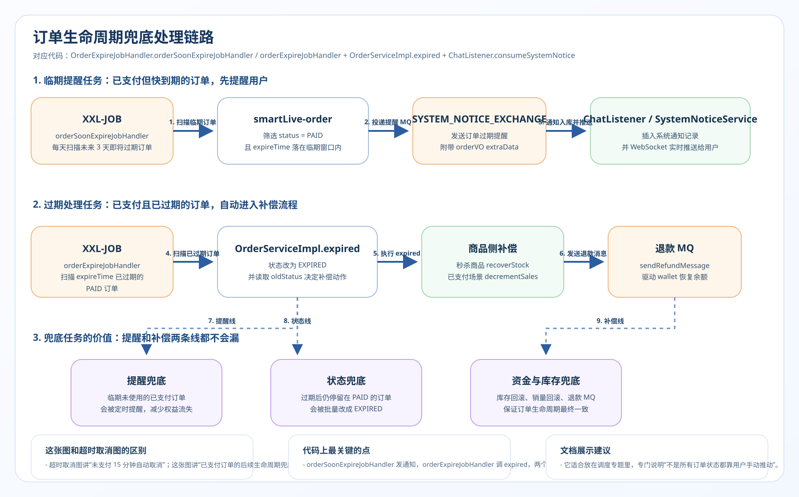</a> | [查看详细 SVG](./diagrams/detail-src/order-lifecycle-fallback-chain-detailed.svg) |

### 历史详细图补充

| 链路 | 重点看什么 | 展示图 | 详细版入口 |
|:---|:---|:---|:---|
| UGC 异步审核与分发 | 审核消息投递、责任链处理、回调源服务 | <a href="./diagrams/ugc-audit-flow.svg" target="_blank" rel="noreferrer">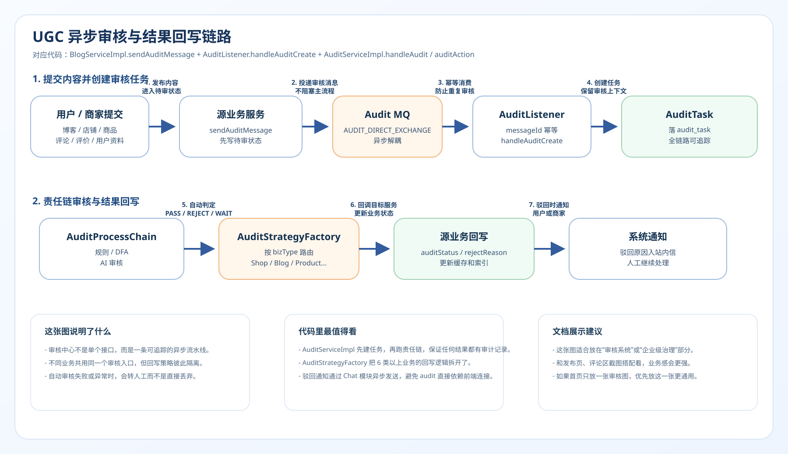</a> | [查看详细 SVG](./diagrams/detail-src/ugc-audit-flow-detailed.svg) |
| Feed 动态扇出 | 发布动态、粉丝分发、读扩散 / 写扩散 | <a href="./diagrams/feed-fanout-sequence.svg" target="_blank" rel="noreferrer">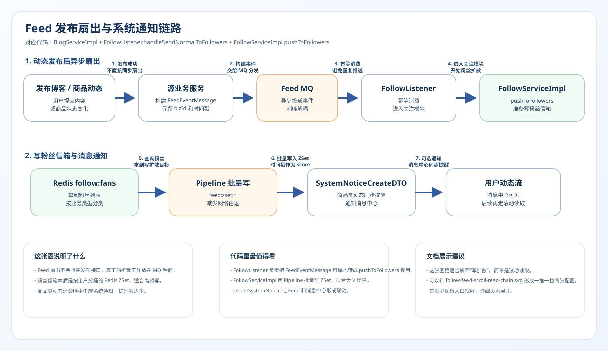</a> | [查看详细 SVG](./diagrams/detail-src/feed-fanout-sequence-detailed.svg) |
| 搜索与向量库同步 | ES 索引同步、Milvus 向量写入、异步一致性 | <a href="./diagrams/search-es-milvus-sync-sequence.svg" target="_blank" rel="noreferrer">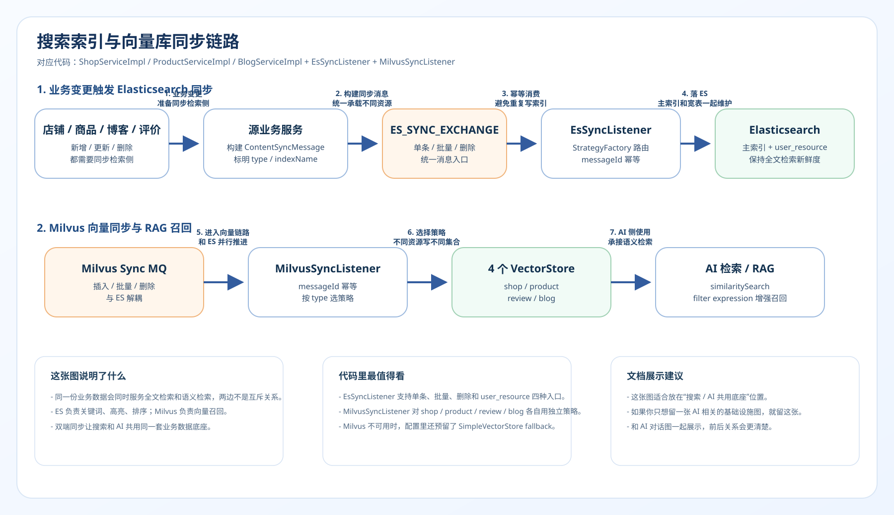</a> | [查看详细 SVG](./diagrams/detail-src/search-es-milvus-sync-sequence-detailed.svg) |

## 7. 如何继续阅读

- 想按页面继续看用户端 App / 管理端 Web：看 [PAGE_GALLERY.md](PAGE_GALLERY.md)
- 想把项目跑起来：看 [OPEN_SOURCE.md](OPEN_SOURCE.md)
- 想做本地或服务器部署：看 [DEPLOYMENT_GUIDE.md](DEPLOYMENT_GUIDE.md)
- 想参与贡献：看 [GitHub · CONTRIBUTING.md](https://github.com/mumulinya/smartLive-Cloud/blob/main/CONTRIBUTING.md)
- 想了解安全和密钥边界：看 [GitHub · SECURITY.md](https://github.com/mumulinya/smartLive-Cloud/blob/main/SECURITY.md)
