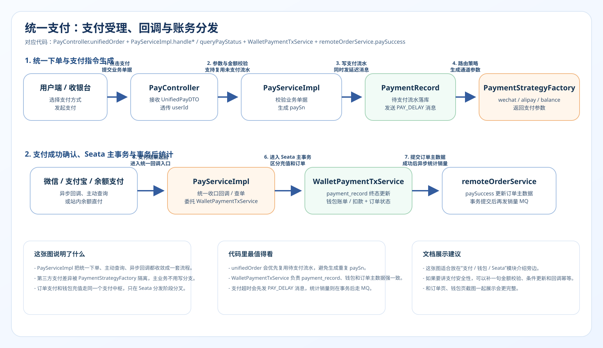
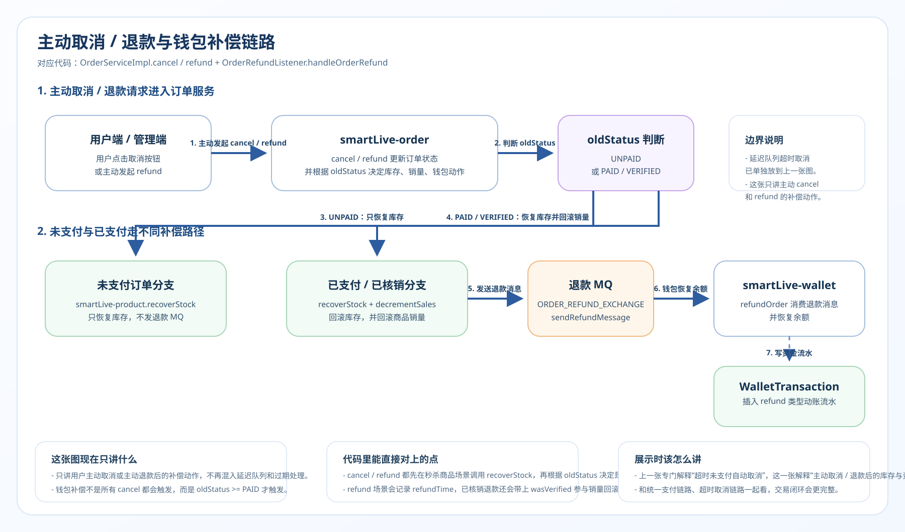
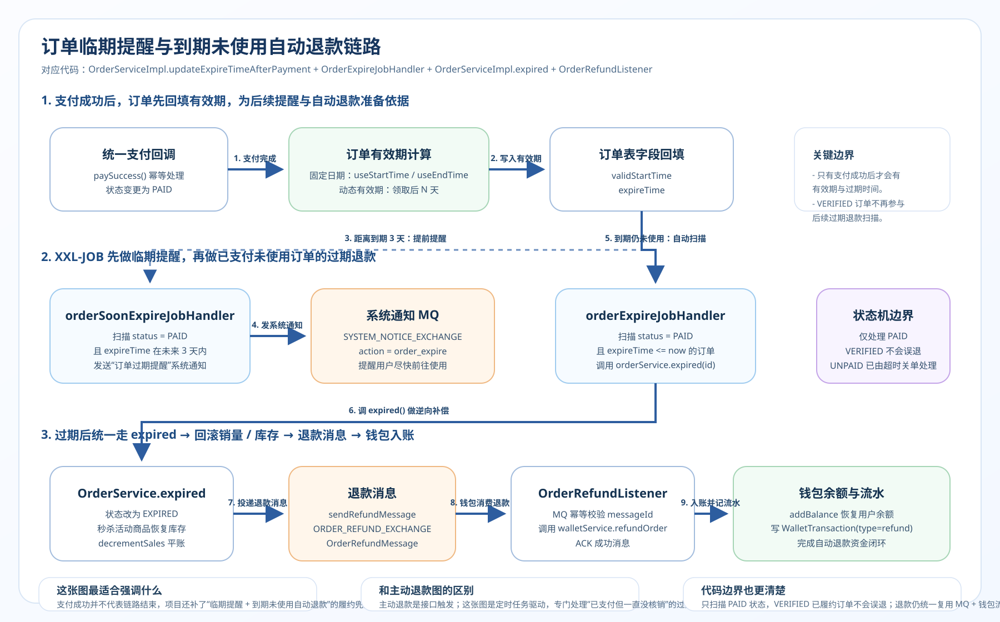

# 2. 下单 / 统一支付 / 退款补偿全链路详解

> 本文档是 SmartLive 项目核心交易链路的深度拆解，适合面试 10 分钟讲解版本。  
> 涵盖：防丢单设计 → MQ 异步扣减库存 → `wallet + order` 支付成功 Seata XA 强事务 → 支付后销量统计异步收敛 → 主动退款 / 已支付未使用过期自动退款的状态流转与资金补偿。

---

## 1. 链路总览图

普通下单：  


统一支付：  


订单超时取消：  


主动取消 / 退款补偿：  


已支付未使用到期自动退款：  


补充说明：  
- 支付成功后会根据商品 `validityType` 回填 `validStartTime / expireTime`，后续临期提醒和过期退款都基于这两个时间字段判断。  
- `orderSoonExpireJobHandler` 会扫描未来 3 天内即将过期、且状态仍为 `PAID` 的订单，提前发送系统提醒。  
- `orderExpireJobHandler` 会扫描 `status = PAID && expireTime <= now` 的未核销订单，调用 `orderService.expired()` 将订单置为 `EXPIRED`，再复用 `sendRefundMessage()` 进入钱包退款补偿链路。  

---

## 2. 每一步的技术细节与面试追问

### Step 1~4：普通订单防重与异步创建

**做了什么：**

1. 计算业务重号：基于 `user_id` 和 `source_id` 在 DB 去重拦截（剔除已取消/已过期），发现重复直接返回并释放 Redis 库存。
2. 插入订单表（状态 `UNPAID`）。
3. 落库成功后发送两条 MQ 消息：
   - 到 `PRODUCT_STOCK_EXCHANGE` 异步驱动上游完成实际库存扣减。
   - 到 `ORDER_DELAY_EXCHANGE` 投递一个 TTL 15分钟的死信延迟队列。

**面试追问与回答：**

| 问题                                                           | 回答                                                                                              |
| :------------------------------------------------------------- | :------------------------------------------------------------------------------------------------ |
| 落库前为什么不利用唯一索引防重，而是用 DB Count？              | 我们对 `orderId` 本身有唯一索引，防的是机器故障重复生成单。但这里的 Count 拦截的是“同一个用户短时间内对同一个商品点多次产生多张不同单号的待支付订单”。以此防用户端滥刷。|
| 为什么普通下单不走同步扣库存，而去发消息 `PRODUCT_STOCK_EXCHANGE`？| 遵循核心微服务解耦与性能提升原则。订单中心只管建单成功，把具体扣商品域或店铺域库存的繁琐操作放到 MQ 里去，既提升下单接口 QPS，又能在商品服务短暂不可用时利用 MQ 的 Retry 机制做故障隔离。 |
| 创建失败后 Redis 的兜底补偿怎么做的？                          | 如果 Spring Data JPA `save` 操作失败抛出异常，业务代码捕获后立刻远程调用恢复 Redis 中拦截用的预扣库存和防重令牌（`order:status:{id}`）。 |

---

### Step 5：站内/站外统一支付路由与主数据强一致入口

**做了什么：**

在 Wallet 模块维护统一钱包：
- **站外支付**：不论是微信还是支付宝，异步回调和主动查单成功都会统一收口到 `WalletPaymentTxService.confirmPaymentSuccess()`，再把 `payment_record + 钱包账单 + order.paySuccess()` 纳入同一个 Seata XA 全局事务。
- **站内余额支付**：走 `BalancePayService -> WalletPaymentTxService.payOrderByBalance()`，把支付流水、钱包扣款、订单状态更新纳入同一个 Seata XA 全局事务。
- **钱包扣减本身**：余额扣款仍然保留原子更新 SQL：
  `UPDATE user_wallet SET balance = balance - ?, version = version + 1 WHERE user_id = ? AND balance >= ?`
- **钱包充值**：充值场景仍然留在 Wallet 单服务本地事务内，因为它不涉及订单库双写。

**面试追问与回答：**

| 问题                                                           | 回答                                                                                              |
| :------------------------------------------------------------- | :------------------------------------------------------------------------------------------------ |
| 钱包扣减余额是如何处理并发请求，防止钱扣成负数的？             | 不在 Java 层面查出 Balance 进行减法再 Set 保存。而是把条件 `balance >= amount` 下推到 MySQL 的 Update 语句作为前置防御，利用 InnoDB 的记录行级排它锁，属于绝对的天然乐观防御，防超扣 100% 安全。 |
| 如果用户同一时间双端发起多次余额支付，会不会被扣多次？         | 一方面 `WalletPaymentTxService` 只允许核心数据按既定状态机流转，另一方面钱包扣减 SQL 自带 `balance >= amount` 和 `version = version + 1` 双重防线，能兜住并发超扣与重复扣款。 |
| 第三方回调和主动查单并发到了怎么办？                           | `payment_record` 只允许从 `PENDING -> SUCCESS / FAILED` 条件更新，重复回调或重复查单命中终态后会直接短路，订单侧 `paySuccess()` 也只允许 `UNPAID -> PAID` 条件更新。 |

---

### Step 6~9：支付成功确认、销量统计异步化与有效期准备

**做了什么：**

- `WalletPaymentTxService` 内部先更新 `payment_record` 终态，再驱动钱包账单和 `OrderServiceImpl.paySuccess()` 一起提交。
- `OrderServiceImpl.paySuccess()` 现在只负责订单库主数据：校验当前状态、写入 `payTime / payType / validStartTime / expireTime`。
- 订单销量不再在 `paySuccess()` 里同步写 Redis，而是在全局事务成功返回后由 Wallet 侧发送 `OrderPaidStatsMessage`。
- `smartLive-order` 里的 `OrderPaidStatsListener` 异步消费该消息，再调用 `handleOrderPaidStats()` 累加商品销量；同时通过 Redis marker 保证重复消息不重复累计。
- 这一步会给后续“临期提醒”和“已支付未使用自动退款”准备判断依据：后面的定时任务都只看 `status` 与 `expireTime`。

**面试追问与回答：**

| 问题                                                   | 回答                                                                                              |
| :----------------------------------------------------- | :------------------------------------------------------------------------------------------------ |
| 支付回调接口怎么防止被第三方接口超时重发导致多次执行业务？ | 一层是 `payment_record` 只允许 `PENDING -> SUCCESS / FAILED` 条件更新；另一层是订单 `paySuccess()` 只允许 `UNPAID -> PAID` 条件更新。重复回调、回调与主动查单并发都会被状态机和条件更新拦住。 |
| 为什么现在不在 `paySuccess()` 里直接加销量？           | 因为 Redis 统计不是 Seata 可回滚资源。如果把它塞进主事务，Redis 先执行、全局事务后失败时就会留下脏统计。现在改成“主交易 Seata 强一致，销量统计 MQ 最终一致”，边界更稳。|
| 为什么在订单付款后才加销量，而不是下单时加？           | 这是典型的业务交易指标防刷设计。如果点击下单就给销量+1，恶意竞争者可以疯狂下无效单但不付款，挤占榜单。仅针对真实成交（PAID/VERIFIED）才加销，且退款后必定扣销（`decrementSales`），确保榜单含金量。|

---

### Step 10~14：主动退款、过期未使用退款与回滚补偿链路

**做了什么：**

- 订单系统内主动或超时发起 `cancel / refund` 操作：先通过状态机变更 `status -> CANCELLED/REFUNDED`。
- 如果是取消：将原商品关联的活动库存远程重置（比如秒杀活动名额放归）。如果原状态是已支付，调用退款流程。
- 如果是“已支付但未核销且已过期”的订单：由 `orderExpireJobHandler` 定时扫描后调用 `orderService.expired(id)`，将状态改为 `EXPIRED`，再继续走库存回收与退款补偿。
- 将已加的 Redis / DB 店铺与商品销量执行 `decrementSales` 平账；其中商品销量会先校验“支付统计是否已实际累计”的 marker，避免延迟统计消息与退款任务抢跑。
- 投递核心 MQ `OrderRefundMessage`，支付钱包中心订阅此消息后，执行原路加款回退 `balance = balance + refundAmount`。
- 对于即将过期但尚未到期的订单，`orderSoonExpireJobHandler` 还会提前 3 天通过系统通知提醒用户尽快使用，减少无感过期带来的投诉。

**面试追问与回答：**

| 问题                                               | 回答                                                                                              |
| :------------------------------------------------- | :------------------------------------------------------------------------------------------------ |
| 取消订单和退款退单在具体实现上有什么差别？         | 取消包含纯粹未支付的订单废弃（仅恢复库存/优惠券等），如果是已支付发起取消，底层逻辑会顺带触发 `sendRefundMessage` 走资金逆向。单纯的 Refund 是确定性的已支付资金逆向（需更新 `refundTime` 等特定流转）。两者共享库存与金额的回滚模型。 |
| 已支付但一直没用、过期了怎么办？                   | 这条不是靠用户手动触发，而是靠 XXL-JOB 的 `orderExpireJobHandler` 定时扫描 `status = PAID && expireTime <= now` 的未使用订单，自动把状态改成 `EXPIRED`，并复用 `sendRefundMessage` 异步退款到钱包，形成“支付成功 → 到期未使用 → 自动退款”的逆向闭环。 |
| 为什么退款发 MQ 异步通知，不直接改成 Seata 强事务？ | 当前退款在业务上允许短暂延迟到账，而且钱包服务短暂不可用时也需要靠消息重试收敛。相比把退款慢链路绑进订单主流程，保留 `OrderRefundMessage` 异步补偿更稳，也更符合“支付强一致、退款最终一致”的分层治理。 |
| 过期未使用自动退款会不会把已经核销的单子也退掉？   | 不会。定时任务只扫描 `status = PAID` 的订单，已核销订单状态是 `VERIFIED`，不会命中过期退款任务。所以“已支付未使用”和“已核销已履约”在状态机层面天然分开。 |

---

## 3. 整条链路涉及的核心技术点汇总

```
┌─────────────────────────────────────────────────────┐
│                   技术点对照表                        │
├──────────────┬──────────────────────────────────────┤
│ 数据库与 SQL │ · DB Count 拦截一人重复起多单          │
│              │ · Balance >= Amount 数据库行锁防超扣   │
│              │ · 状态机约束防并发幂等问题 (`oldStatus`)│
├──────────────┼──────────────────────────────────────┤
│ Seata 强事务 │ · `payment_record + wallet + order` XA │
│              │ · 仅覆盖支付成功主数据，不拉入 Redis/MQ │
├──────────────┼──────────────────────────────────────┤
│ 消息队列 MQ  │ · Direct 交换机异步下发扣减库存        │
│              │ · Dead Letter 延迟队列执行超时清理判定  │
│              │ · 最终一致性退款的补偿 MQ 信道          │
│              │ · 支付成功后销量统计异步消息             │
│              │ · 临期提醒 / 过期退款的异步通知闭环     │
├──────────────┼──────────────────────────────────────┤
│ 业务解耦设计 │ · 订单层与资金层(Wallet)的高度物理分割  │
│              │ · 支付主数据强一致，统计与退款最终一致  │
│              │ · 统一汇聚站内站外流水记录，抹平账务差  │
├──────────────┼──────────────────────────────────────┤
│ 幂等保障     │ · 回调通知拦截重入短路                  │
│              │ · 资金账目增加与扣减强绑定业务状态唯一单│
└──────────────┴──────────────────────────────────────┘
```

---

## 4. 面试 10 分钟讲述模板

> **讲述思路：先描述建单的边界防卫，再讲钱包支付的极致并发安全，最后收尾到退款补偿的架构鲁棒性。**

### 开场（1 分钟）

> "在 SmartLive 平台里，我负责了核心的交易正逆向闭环，主要指：订单异步落库、统一支付路由台以及全自动退款补偿体系。这套体系的设计初衷，是为了把繁重的金融资金核算从主链上剥开，将高频交易做到极度性能化与防脱钩错账保护。"

### 正向建单：解耦与兜底防护（3 分钟）

> "普通下单进来后，我先用 count 根据 userId 和 sourceId 做恶意灌水防护，插入表后我们并不进行耗时的远程RPC扣库存，而是甩两条 MQ：一条去要求上架商品端减库，一条发给死信队列卡死 15 分钟失效期。万一数据库瞬时拒绝连接落单失败了，我还用 try-catch 搭配远端去重置 Redis 所预锁的库存，做到天衣无缝的资源复原。"

### 统一支付：防并发超扣与流水收口（3 分钟）

> "到了支付收银台，无论是接了微信、支付宝还是本站余额，我都会先统一落 `payment_record`。真正的支付成功确认阶段，`payment_record + 钱包账单 + 订单状态` 已经收口到 `WalletPaymentTxService` 的 Seata XA 全局事务里，保证主数据要么一起成功、要么一起回滚。而站内余额支付并发最高也最危险，我没有在 Java 层先查余额再相减，而是采用 `UPDATE balance = balance - X WHERE balance >= X`，把超扣防线直接压到 InnoDB 的行级锁和条件更新上。"

### 逆向环节：主动退款 + 到期未使用自动退款（2 分钟）

> "用户如果主动发起退款，或者订单已经支付但到期一直没核销，我都会走同一套逆向补偿模型。前者由接口直接触发，后者由 XXL-JOB 的 `orderExpireJobHandler` 定时扫描 `status = PAID && expireTime <= now` 自动触发。第一步先通过状态机截断外部更新；接着把已经累计过的商品、店铺销量做反向扣减平账；最后发一张『退款通知』到 MQ，异步交给钱包中心原路退回用户余额。这里我刻意没有把退款也硬塞进强事务，因为退款允许短暂延迟到账，更适合消息补偿模型。"

### 总结亮点（1 分钟）

> "这条交易线，本质就是通过 **天然行锁抗并发漏洞，通过 MQ 拆分解耦上下游延迟，再借由纯粹的状态机限制一切可能发生的黑客篡改重播与幂等威胁**。做到金融系统的基本要求：不重买，不超卖，不错退。"

---

## 5. 高频追问速查表

| 追问方向     | 关键问题                      | 核心回答                                                     |
| :----------- | :---------------------------- | :----------------------------------------------------------- |
| **库联一致** | 支付成功后怎么保证钱包和订单不会一边成功一边失败？| 当前 `wallet + order` 的支付成功主数据已经用 Seata XA 收口，覆盖 `payment_record + 钱包账单 / 扣款 + 订单状态`。但 Redis 统计和退款消息不进强事务，继续走 MQ 最终一致。|
| **防超扣**   | SQL 拼接的 `balance >= amount` 这个真的够吗？| 对于钱包扣减是够的。InnoDB `UPDATE` 会走当前读（Current Read），自动加上 X 排它锁。无论其他事务多高并发被唤醒进入执行时，都要基于最新行的余额核对 >= amount 这个准入条件，从而保证数据强约束。|
| **数据清洗** | 你有支付过期时间策略，那过期没付怎么关单？| 发了延时队列 (15-30min)，一旦消费者拿到消息，用主键二次查库发现仍是 UNPAID，直接触发我核心服务内的 `cancel` 方法，把没付款的库存用 MQ 释放掉。 |
| **过期退款** | 那已支付但一直没使用、最后过期的订单怎么处理？| 支付成功时会写入 `expireTime`。后面由 XXL-JOB 的 `orderExpireJobHandler` 每天扫描 `status = PAID && expireTime <= now` 的未使用订单，统一转为 `EXPIRED`，回收活动库存、回滚销量，并通过 `OrderRefundMessage` 异步退款到钱包。 |
| **幂等重放** | 三方支付网络波动导致回调重复触发 5 次怎么办？ | 第一次进入 `paySuccess()` 时，会先根据 SQL 或 Java 取回的原状态判断；一旦 `!= UNPAID` 或 `== PAID` 则马上返回 `return 1;`，阻断后续重放，拦截网络重复回调。 |

---

## 6. 扩展：这条链路和八股的关联

```
订单支付退款链路 ←→ 八股知识点映射

MySQL 数据库底层八股：
  ├── 行级锁（X锁）在 Update WHERE 上的悲观防超卖表现机制 
  ├── 并发与隔离级别（Read Committed 对 count防重判断下的影响）
  └── 乐观锁实现（基于 Version 字段自增及重试）

MQ 高级应用框架八股：
  ├── MQ 解耦强一致还是弱一致的方案选择（订单与库存解耦）
  ├── 消息持久化投递及防网络闪断丢消息
  └── 延迟队列在电商过期关单业务的具体使用场景与瓶颈

支付与幂等抽象八股：
  ├── 状态机模型（如枚举控制 UNPAID 往 PAID/REFUNDED 必须具有不可回撤性）
  ├── 第三方回调与本地防重放应对机制
  ├── XXL-JOB 在“临期提醒 / 过期未使用自动退款”中的职责边界
  └── 如何把支付主数据交给 Seata XA，而把销量统计 / 退款补偿交给最终一致性

企业级架构设计八股：
  ├── 金融账户记账隔离设计（支付手段与资金载体的抽象转化化解模块交叠）
  └── Write-Through 在热数据销量统计上的落点与使用 
```

---

> **一句话总结**：传统单体查个全表 `insert` 就完事，而在微服务里我们需要明白的精髓是：**把支付主数据收口到 Seata 强一致，把库存、销量、退款这些外围副作用拆给 MQ 与调度补偿，再用数据库条件更新锁死幂等和超扣问题。** 带着这套思想，你面试时面对支付核心流程和故障容错才能有的放矢。
