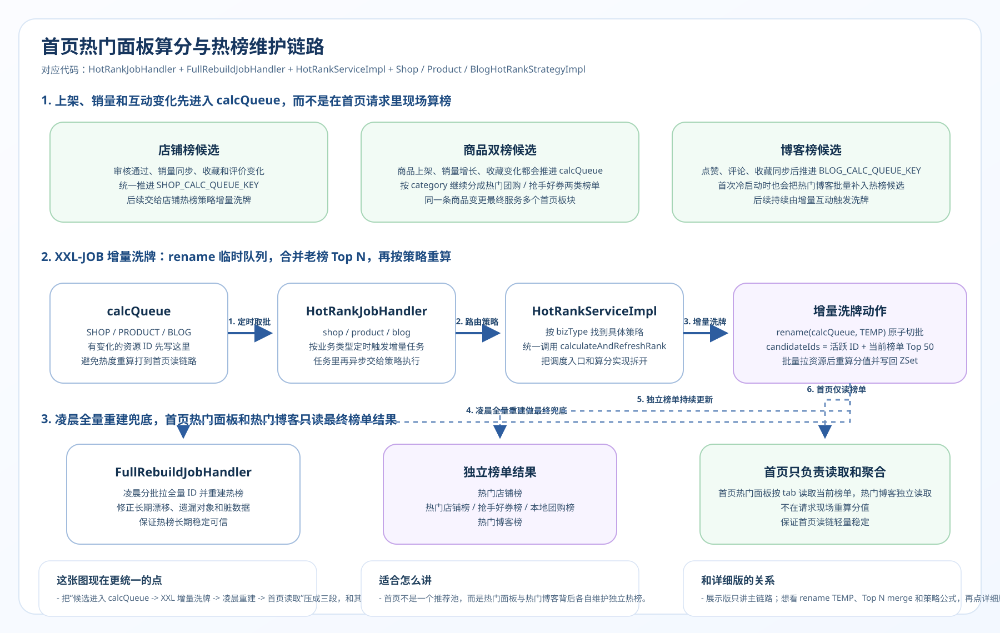
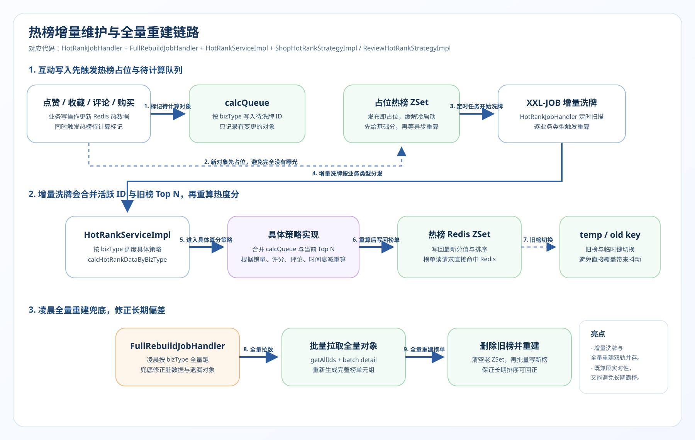

# 7. 热榜增量洗牌与全量重建全链路详解

> 本文档是 SmartLive 项目热榜架构的深度拆解，适合面试 10 分钟讲解版本。  
> 涵盖：防冷启动（发布即占位） → 双阶段调度（XXL-JOB 异步重排） → 融合算法（基础分 + 互动权重 + 时间衰减） → 防霸榜策略（Merge Top N 老数据重算）。

---

## 一、链路总览图

首页热榜维护：  


增量洗牌与全量重建：  


---

## 二、每一步的技术细节与面试追问

### Step 1~2：发布即上榜与防冷启动

**做了什么：**

传统的定时算榜最大的弱点是“准实时性差”，新发内容要等下个周期才能曝光。
本项目采用“发布即占位”策略。一旦内容发布成功，就在对应的热度 Redis ZSet 中，用当前时间戳等粗略权重塞入该 ID。新内容立刻拥有了展出的机会（天然享有最近时间线曝光），吸引第一波自然流量用户的点赞/收藏等互动打点，完成冷启动原始累积。

**面试追问与回答：**

| 问题                                                           | 回答                                                                                              |
| :------------------------------------------------------------- | :------------------------------------------------------------------------------------------------ |
| 为什么不去监听所有的互动动作实时算分，还要搞定时重排这么复杂？ | C 端应用的互动 TPS 极高（几千人在同时点赞）。如果每次点赞都要把文章全盘算一次最新热度，数据库连表查询和 CPU 扛不住。实时累加指标不等于实时提权重排，“统计轻操作，排榜重操作”的异步降维解耦势在必行。 |

---

### Step 3~7：增量合池计算与融合算法 (AbstractHotRankStrategy)

**做了什么：**

- **XXL-JOB 定时触发**：每五分钟拉起一把高频增量榜单重洗。
- **霸主老池合并 (`getTopIds`)**：只拉取这 5 分钟活跃的人算分是没用的，因为这会导致榜单上的“历史大爆款”没有更新分数而发生暴跌（漂移）。所以代码中强行合并了 `HOT_RANK_MERGE_TOP_N = 50` 也就是上一期的前50强老成员进池子一块PK。
- **应用热力学公式**：以 `AbstractHotRankStrategy` 模板类为主轴：
  - 加分项：互动乘数（点赞、收藏占比各不同）。
  - 衰减项：`calcTimeDecay()` 方法严格执行：`30天 - 已存活天数` 的线性衰减规律；大于30天彻底丧失时间加持，全凭自身硬核互动维持在热榜不死。

**面试追问与回答：**

| 问题                                                           | 回答                                                                                              |
| :------------------------------------------------------------- | :------------------------------------------------------------------------------------------------ |
| 你设计的时间衰减公式，解决了什么痛点？                         | 完美解决了“榜单阶层固化（霸榜）”。如果不做衰减，1年前拥有10万赞的老文章会让今天发出的只有1千赞的新文章永远抬不起头。加上 `30-已发天数` 的重力抛物线，强制让老数据不断流失分数，赋权新星上位。|
| 更新 ZSet 排行榜时怎么防止前端刷新时看到空数据流？             | 两种方案可选。方案一：Redis 开启 Pipeline 对指定元素做批量强行覆盖 `zadd` 刷新，不管老数据；方案二（推荐）：建一个 `ZSet_NEW` 临时表，大批量数据全部插好后，用 `RENAME ZSet_NEW ZSet_OLD` 原子替换指针。绝不让客户在更新的真空期拉到空榜。|

---

### Step 8~10：凌晨全盘扫描兜底防丢

**做了什么：**

每天凌晨 3 点，调度器起底执行全库级大盘热度重算。主要为了防止：因为 Redis 哨兵切换或网络抖动导致的短时增量记账数据丢失或落后，靠这记猛药重新将全量业务指标（甚至脱离缓冲期的长尾数据）在 Redis 内存里强行拉齐一致。

**面试追问与回答：**

| 问题                                           | 回答                                                                                              |
| :--------------------------------------------- | :------------------------------------------------------------------------------------------------ |
| 为什么增量 + 全量的双重调度架构在工业界这么普遍？| 增量算分是为了“快”（低消耗、省资源），全量扫盘是为了“准”（兜底一切异常或数据丢失）。在热搜排行榜这种带有绝对竞技排名的系统中，单靠状态拼接早晚错位，需要靠低峰期的重置来净化环境。|

---

## 三、整条链路涉及的核心技术点汇总

```
┌─────────────────────────────────────────────────────┐
│                   技术点对照表                        │
├──────────────┬──────────────────────────────────────┤
│ 基础架构组件 │ · XXL-JOB 分布式任务调度中心         │
│              │ · Redis ZSet 核心排位树模型          │
├──────────────┼──────────────────────────────────────┤
│ 并发与解耦   │ · 读写行为极度割裂解耦 (点击/批算)   │
│              │ · Pipeline 批量预取 / RENAME 原子换新│
├──────────────┼──────────────────────────────────────┤
│ 打分流算法   │ · 牛顿冷却定律变形 (Time Decay)      │
│              │ · HotList 老新交替 Top N 混池 PK 制  │
└──────────────┴──────────────────────────────────────┘
```

---

## 四、面试 10 分钟讲述模板

> **讲述思路：第一句话抛出读写分离定个调，再深入剖析衰减公式的作用，最后给出全量兜底的架构闭环。**

### 开场（1 分钟）

> "在 SmartLive 平台里，首页的四大金刚榜单（店铺榜、商品榜、博客榜）绝不是单纯在 MySQL 里打个 `ORDER BY score` 就完事了。面对海量高并发，如果每次打开首页都要触发排序那是灾难。我这套热榜架构的核心灵魂是：**日常轻互动与重算力脱钩，同时引入了双规双调机制。**"

### 解决实时与性能的矛盾（3 分钟）

> "有人点赞我们就给他算分排表？绝不！创作者一点下发布，我就立刻把他的新 ID 跟随时间戳塞入 Redis ZSet 发挥防冷启动曝光；而在随后极繁密的点赞/收藏交互中，后台只傻傻的把该条数据累加并塞进消息对队标记为 '已脏'。脏数据的清算全部外委给了 XXL-JOB 进行每五分钟一次的微秒级『增量洗牌』。做到了首页点开永远在毫秒内读取现成的数据榜单。"

### 精辟的老数据合并与防固化计算（3 分钟）

> "热榜最大的毒瘤是『头部固化』。一个陈年老贴赞多到吓人，新贴根本出不了头。所以我在 `AbstractHotRankStrategy` 中引入了经典的线性倒计时衰减公式。只要发布超过 30 天，你的发帖红利权重会彻底清零，纯靠真实活人硬性点赞保命；更有趣的是，在算新五分钟的榜单前，我会用 `getTopIds()` 强制把上一届冠军的前 50 人拉进来陪跑 PK，以防这些大佬没有新增互动而被系统遗漏跌出榜单引发『大崩盘』。"

### 全量重置与总结亮点（2 分钟）

> "夜深人静的 3 点是我这套系统最后的保险阀。全库数据的全量洗版会将系统一整天累积在增量算法里的零杂误差强制抹平校准。我把它概括为：**利用 ZSet 天然榜单接客，利用 XXL-JOB 剥离了算力成本，利用降维打击的牛顿冷却公式确保了榜单池源源不断的活水新星替换！**"

---

## 五、高频追问速查表

| 追问方向     | 关键问题                      | 核心回答                                                     |
| :----------- | :---------------------------- | :----------------------------------------------------------- |
| **内存溢出** | ZSet如果全量一直加，内存不会越排越大爆满吗？| 洗盘的最后一步就是裁剪！ZSet 是动态表，我会利用 `zremrangeByRank` 每次计算完无情裁剪掉 500 名开外没有潜力的长尾节点，保证该榜单永远控制在微小的几 KB 常驻内存。 |
| **公式权衡** | 不同种类（比如店铺和博客）的分数计算是一样的吗？| 当然不一样。我利用了策略与工厂模式：对于商品，它压根就没有 30 天时间衰减一说，只要爆单多它就该是老字号热榜；只有类似评论、博客这样的信息流 UGC，才必须用时间衰减公式逼迫它们迭代。|
| **性能极限** | 取这 5 分钟几百个脏 ID 去 MySQL 里拖互动明细，查慢死怎么办？ | 我们全量的互动数（比如点赞总数）根本不查实表！它本来就是利用 Hash 或 String 平行挂载在 Redis 热快照里的。取 ID 後通过批量 mget 一次性从内存切出计算源参数，耗时仅几毫米。 |

---

## 六、扩展：这条链路和八股的关联

```
热度推荐排榜链路 ←→ 八股知识点映射

Redis 底层数据结构再深入：
  ├── ZSet 底层结构：Skiplist（跳跃表）+ Dict（哈希表）为何能做到 O(1) 取分与 O(logN) 排序？
  └── Redis 事务 / Pipeline / Lua 脚本 在榜单替换阶段保证强一致原子性应用

时间/热力学衰减算法引申：
  ├── 为什么像 Hacker News 使用牛顿冷却定律算法作为发文时间的递减重力牵引？
  └── 曝光冷启动系统设计背后的 EE（Explore / Exploit 探索与利用）模型问题

分布式定时调度原语八股：
  ├── XXL-JOB 调度中心底层实现：惊群效应如何防？（通过 DB 写悲观锁防并发多台执行防重拉）
  └── 微服务下“读密集”与“计算密集”架构分拆理念
```
