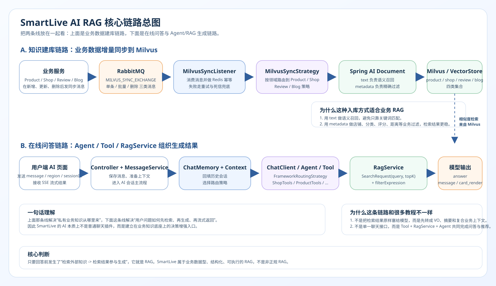
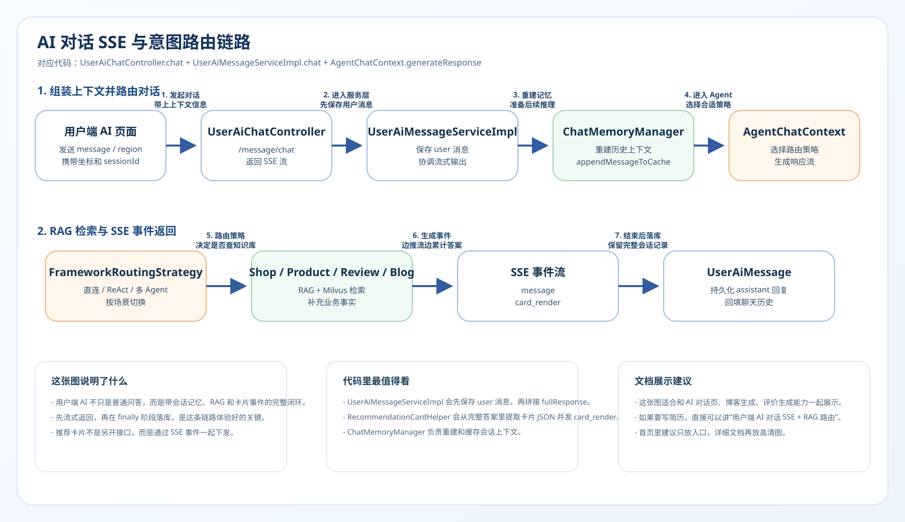

# 8. AI Agent策略路由与RAG多维增强生成链路

> 这页重点回答 3 个问题：
> 
> 1. SmartLive 的业务数据为什么要先同步到 Milvus；
> 2. 这套实现和常见“教程式 RAG”到底有什么不同；
> 3. 这是不是正规的 RAG。
>
> 先说结论：**是正规的 RAG。** 只是它不是“PDF/知识库问答型 RAG”，而是更偏生产落地的**业务数据型 RAG**。

---

## 1. 先抓住这条链路最重要的两条线

你可以把 SmartLive 里的 AI 主链路拆成两段来看：

1. **知识建库链路**：商品、店铺、评价、博客等业务数据先从业务服务发出同步消息，再进入 AI 模块写入 Milvus。
2. **在线问答链路**：用户发起 AI 对话后，由 Agent/Tool 选择合适的 `RagService`，到 Milvus 做向量检索，再把结果组织成回答或卡片通过 SSE 返回前端。

只有把这两段放到同一张图里，才容易看明白：**你的向量库不是“额外搞的一套库”，而是业务知识底座的一部分。**

---

## 2. AI 核心链路总图

---

## 3. 一句话定义你现在这套实现

SmartLive 当前主流程不是很多教程里那种 `QuestionAnswerAdvisor -> 自动检索 -> 自动拼 Prompt` 的默认 RAG 流程，
而是：

**`Spring AI 基础能力 + 自定义 Milvus 向量存储 + Tool 调用 + 业务化 RagService + Agent 路由`**。

换句话说：

- `Spring AI` 负责提供 `ChatClient`、`ChatMemory`、`EmbeddingModel`、`VectorStore`、`Tool` 这些底层能力。
- 业务层自己决定检索哪个领域、用什么过滤条件、取多少条结果、最后返回结构化对象还是摘要文本。
- 模型拿到的不只是“文档片段”，而是**带业务含义的店铺、商品、评价、博客上下文**。

---

## 4. 先看知识建库链路：业务数据怎么进入 Milvus

### 4.1 链路职责

这段链路做的是一件事：

**把 MySQL 中的业务事实，增量同步成适合语义检索的向量索引。**

它不是“为了 AI 重新存一份业务库”，而是把业务对象转换成：

- 一段适合做语义召回的 `text`
- 一组适合做精确过滤的 `metadata`

### 4.2 在项目里是怎么落地的

| 步骤 | 做了什么 | 对应实现 |
|:---|:---|:---|
| 1 | 商品、店铺、评价、博客等业务服务在新增、更新、删除、批量导入后发送同步消息 | `smartLive-product`、`smartLive-shop`、`smartLive-interaction`、`smartLive-blog` |
| 2 | AI 模块监听 `MILVUS_SYNC_*` 队列并做 Redis 幂等校验 | `MilvusSyncListener` |
| 3 | 按业务类型路由到不同的 `MilvusSyncStrategy` | `ProductMilvusStrategy`、`ShopMilvusStrategy`、`ReviewMilvusStrategy`、`BlogMilvusStrategy` |
| 4 | 把业务对象转成 `Document(text + metadata)` | `createDocument(...)` |
| 5 | 调用 `VectorStore.add(...)` 写入 Milvus 集合 | `review/shop/product/blogVectorStore` |

### 4.3 为什么这里不是“乱写向量库”

这里最关键的不是“写没写 Milvus”，而是你写进去的结构很清晰。

以商品为例，当前实现里：

- `text` 主要来自 `name + subTitle + rulesJson`
- `metadata` 里保留了 `shopId`、`activityType`、`category`、`price`、`stock`、时间字段等业务属性

这意味着检索时可以同时做到两件事：

1. 让向量库根据语义召回“这是不是用户想找的商品”。
2. 让业务层再用 `metadata` 精确限制“是不是这家店、这个分类、这个活动类型”。

同理：

- 店铺文档更强调 `name / area / address / coordinates`
- 评价文档更强调 `content / score / sourceType / shopId`
- 博客文档更强调 `title / content / author / shopId`

这其实比“把一大段长文切块后直接入库”更适合本地生活业务。

### 4.4 这段链路的工程价值

这段建库链路真正体现的是 3 个工程点：

1. **异步解耦**：业务主链路不直接等待向量入库完成。
2. **增量同步**：不是每次重建全库，而是跟随业务变更持续更新。
3. **幂等兜底**：消费端先做 Redis 去重，再决定是否真正写入向量库。

---

## 5. 再看在线问答链路：用户问题怎么走到 RAG 与 Agent

### 5.1 主流程

在线问答链路可以按下面顺序理解：

| 步骤 | 做了什么 | 对应实现 |
|:---|:---|:---|
| 1 | 用户端发起 AI 对话，请求进入 AI 控制层 | `UserAiChatController` |
| 2 | 服务层先保存消息、准备会话上下文 | `UserAiMessageServiceImpl` |
| 3 | 从 `ChatMemory` 取回历史对话并重建上下文 | `ChatMemoryManager` / `MessageChatMemoryAdvisor` |
| 4 | `AgentChatContext` 选择路由策略 | `FrameworkRoutingStrategy` / `DirectRoutingStrategy` / `AutonomousAgentStrategy` |
| 5 | 被选中的 `ChatClient` 或 Agent 触发对应 Tool | `ShopTools`、`ProductTools`、`ReviewTools`、`BlogTools` |
| 6 | Tool 调用对应 `RagService` 做向量检索 | `ShopRagService`、`ProductRagService`、`ReviewRagServiceImpl`、`BlogRagService` |
| 7 | `RagService` 构建 `SearchRequest(query, topK, filterExpression)` | `VectorStore.similaritySearch(...)` |
| 8 | 检索结果转换成 `VO`、摘要文本或复合上下文 | `ShopVO`、`ProductVO`、`ReviewVO`、`BlogVO` |
| 9 | 模型综合这些业务事实生成回答，并通过 SSE 持续回传 | `message` / `card_render` 事件 |

### 5.2 你这里的 RAG 和很多 Demo 最大的不同

很多 RAG Demo 的路径是：

`用户问题 -> 检索几段文本 -> 直接拼到 Prompt -> 大模型回答`

SmartLive 更像：

`用户问题 -> Agent 判断领域 -> Tool 调业务 RAG -> 检索结果转结构化业务对象 / 摘要 -> 大模型组织成最终答案或卡片`

所以它更适合回答下面这类问题：

- “附近有什么适合聚餐的店？”
- “这家店有什么券能下单？”
- “评价里大家都在吐槽什么？”
- “给我总结下这家店最近的探店笔记”

这些问题本质上都不是单纯的知识问答，而是**业务决策增强**。

### 5.3 SSE 与路由细化图

下面这张图更聚焦“对话发起、策略路由、流式返回”的细化过程：

---

## 6. 这和传统教程式 RAG 到底有什么区别

| 维度 | 常见教程式 RAG | SmartLive 当前实现 |
|:---|:---|:---|
| 数据来源 | PDF、Markdown、知识库文档 | MySQL 中的商品、店铺、评价、博客等业务数据 |
| 入库对象 | 文本切块（chunk） | 结构化业务实体转 `Document(text + metadata)` |
| 检索方式 | 多为纯向量召回 | 向量召回 + `metadata` 精确过滤 |
| 编排方式 | 检索后直接拼 Prompt | Tool 调用 + RagService + Agent 路由 |
| 返回结果 | 原始文本片段为主 | 结构化对象、摘要文本、推荐卡片上下文 |
| 目标 | 回答“文档里写了什么” | 回答“业务里现在有什么、推荐什么、怎么决策” |

所以更准确地说：

**SmartLive 不是“非正规 RAG”，而是“业务数据型、结构化、可执行的 RAG”。**

---

## 7. 这是不是正规的 RAG

答案是：**是。**

判断是不是 RAG，看的是“生成前有没有检索外部知识并把检索结果参与回答”，而不是“数据源是不是 PDF”。

你的实现满足了 RAG 的核心条件：

1. **外部知识源存在**：Milvus 中保存的是从业务数据构建出来的知识索引。
2. **回答前先检索**：`RagService` 会在生成前先做 `similaritySearch(...)`。
3. **检索结果参与回答**：结果会先转成业务对象或摘要，再被 Tool / Agent / ChatClient 纳入回答过程。

所以“把本地数据库的数据写入向量库”不是不正规，反而正是很多生产系统的标准做法。

真正不属于 RAG 的情况，反而是：

- 只有大模型直答，没有检索
- 只有关键词查库，没有把检索结果送回生成链路
- 向量库只是装饰，没有在回答前真正参与决策

---

## 8. Spring AI 在这个项目里，和别的项目哪里不一样

### 8.1 一样的地方

你依然是在用标准的 Spring AI 基础能力：

- `ChatClient`
- `ChatMemory`
- `EmbeddingModel`
- `VectorStore`
- `Tool`

这些都是正统的 Spring AI 组件。

### 8.2 不一样的地方

你这个项目和很多普通 Spring AI 项目不同，主要有 4 点：

| 维度 | 常见项目 | SmartLive |
|:---|:---|:---|
| 向量库接入 | 用自动配置直接起一个默认 `VectorStore` | 手动排除自动配置并自定义 `MilvusConfig` |
| RAG 编排 | 常见 `Advisor` 直接接入 | 手写 `RagService` 控制 query / topK / filter |
| 对话组织 | 单个 `ChatClient` 直接回答 | 多个 `ChatClient` + Tool + Agent 路由 |
| 业务输出 | 文本回答为主 | 文本回答 + 结构化卡片 + 下单/推荐场景 |

也就是说：

**你用的是 Spring AI，但不是“最省事的默认用法”，而是更贴近业务系统的深度定制用法。**

---

## 9. 这页最适合怎么对外讲

如果你要把这条链路讲给开源访客、面试官或者协作者，最推荐的顺序是：

1. **先讲建库链路**：业务数据不是直接给模型，而是先通过 MQ 增量同步进 Milvus。
2. **再讲问答链路**：模型回答前不会硬猜，而是先通过 Tool 调用业务化 `RagService` 做检索。
3. **最后讲结论**：这不是简单聊天机器人，而是建立在业务知识底座之上的 AI 决策增强入口。

30 秒版可以直接这样讲：

> SmartLive 的 AI 不是把大模型接进来就结束了，而是先把商品、店铺、评价、博客这些业务数据增量同步到 Milvus，形成私有知识底座；用户提问后，Agent 会根据意图触发不同 Tool，再由 `RagService` 结合语义检索和元数据过滤返回业务事实，最后通过 SSE 把回答和推荐卡片流式推给前端。这是一套业务数据型、结构化、可执行的 RAG。 

---

## 10. 对应源码位置

如果你想顺着这页回到源码，建议优先看这些文件：

- `smartLive-modules/smartLive-ai/src/main/java/com/smartLive/ai/config/CommonConfiguration.java`
- `smartLive-modules/smartLive-ai/src/main/java/com/smartLive/ai/config/milvusConfig.java`
- `smartLive-modules/smartLive-ai/src/main/java/com/smartLive/ai/listener/MilvusSyncListener.java`
- `smartLive-modules/smartLive-ai/src/main/java/com/smartLive/ai/strategy/milvus/`
- `smartLive-modules/smartLive-ai/src/main/java/com/smartLive/ai/service/rag/impl/`
- `smartLive-modules/smartLive-ai/src/main/java/com/smartLive/ai/tools/`
- `smartLive-modules/smartLive-ai/src/main/java/com/smartLive/ai/strategy/user/impl/`

---

## 11. 这一页补上了什么信息缺口

这页补的不是“AI 能聊天”这种表层信息，而是 3 个更关键的认知点：

1. **为什么业务库数据进入向量库是合理的。**
2. **为什么这套实现和传统文档型 RAG 不一样，但仍然是正规 RAG。**
3. **为什么 SmartLive 的 AI 本质上是业务系统里的一个增强决策层，而不是单纯的聊天外挂。**
