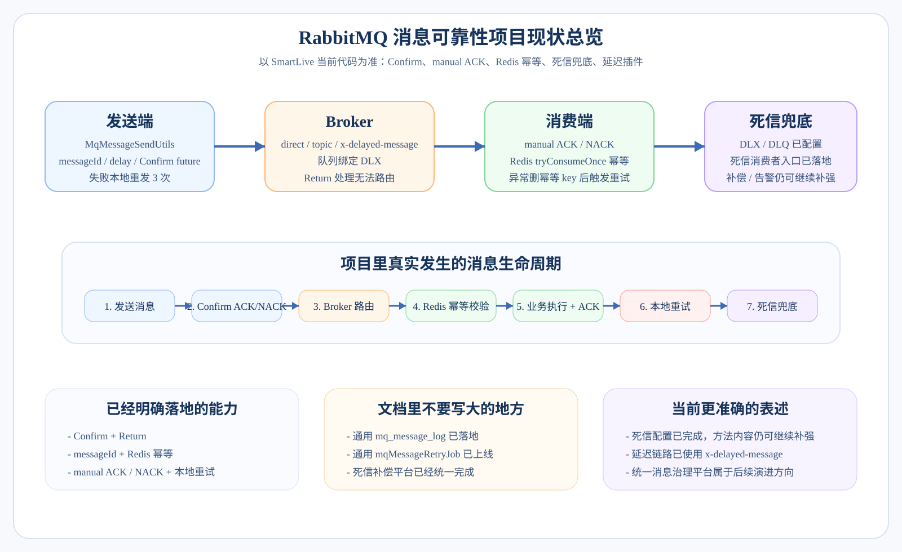
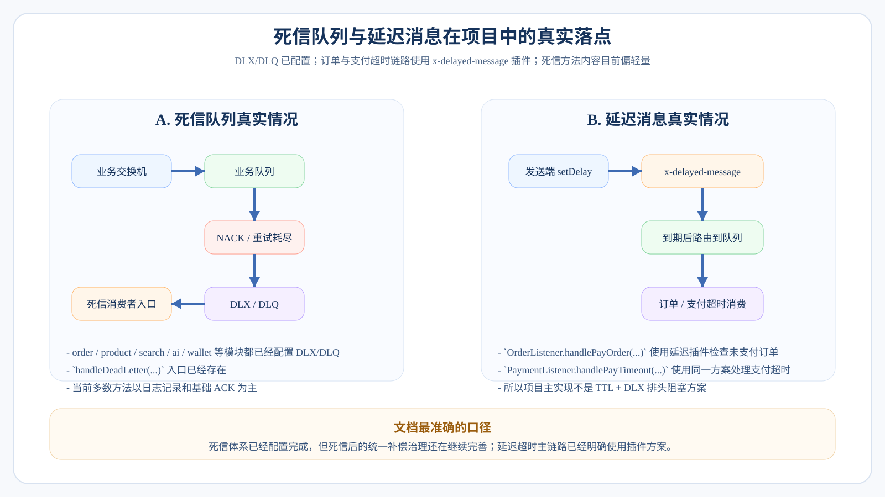

# RabbitMQ 消息可靠性全链路详解

> 本文档是 SmartLive 项目 RabbitMQ 消息可靠性机制的深度拆解，适合面试 10 分钟讲解版本。  
> 涵盖：消息发送工具类封装 → 生产者 Confirm 确认 → 消费者 ACK/NACK → 重试机制 → 幂等性保障 → 死信队列 → 延迟队列 → 兜底对账。

---

## 1. 消息可靠性全链路总览



---

## 2. 消息发送工具类封装

### 为什么要封装？

直接用 `RabbitTemplate.convertAndSend()` 存在的问题：
- 每次发送都要写交换机名、路由键、消息体、消息属性 → **重复代码多**
- 忘记设置 `messageId` → **无法做幂等**
- 忘记设置消息持久化 → **宕机丢消息**
- 没有统一的异常处理和日志 → **故障排查难**
- 没有 Confirm 回调 → **发送丢失无感知**

### 工具类设计

```java
@Slf4j
@Component
@RequiredArgsConstructor
public class RabbitMQHelper {

    private final RabbitTemplate rabbitTemplate;

    /**
     * 发送消息（通用方法）
     * @param exchange   交换机
     * @param routingKey 路由键
     * @param message    消息体（自动序列化为 JSON）
     * @param msgId      唯一消息ID（用于幂等 + 日志追踪）
     */
    public void sendMessage(String exchange, String routingKey, 
                            Object message, String msgId) {
        try {
            rabbitTemplate.convertAndSend(exchange, routingKey, message, msg -> {
                // 1. 设置消息ID（幂等关键）
                msg.getMessageProperties().setMessageId(msgId);
                // 2. 设置持久化（PERSISTENT = 2）
                msg.getMessageProperties().setDeliveryMode(MessageDeliveryMode.PERSISTENT);
                // 3. 设置消息时间戳
                msg.getMessageProperties().setTimestamp(new Date());
                return msg;
            });
            log.info("[MQ] 消息发送成功 | exchange={}, routingKey={}, msgId={}", 
                     exchange, routingKey, msgId);
        } catch (Exception e) {
            log.error("[MQ] 消息发送异常 | exchange={}, routingKey={}, msgId={}, error={}", 
                      exchange, routingKey, msgId, e.getMessage());
            // 异常处理：记录到数据库 / 重试 / 告警
            saveFailedMessage(exchange, routingKey, message, msgId, e);
        }
    }

    /**
     * 发送延迟消息
     */
    public void sendDelayMessage(String exchange, String routingKey, 
                                  Object message, String msgId, long delayMs) {
        rabbitTemplate.convertAndSend(exchange, routingKey, message, msg -> {
            msg.getMessageProperties().setMessageId(msgId);
            msg.getMessageProperties().setDeliveryMode(MessageDeliveryMode.PERSISTENT);
            // 设置延迟时间（需要延迟消息插件）
            msg.getMessageProperties().setHeader("x-delay", delayMs);
            return msg;
        });
        log.info("[MQ] 延迟消息发送成功 | msgId={}, delay={}ms", msgId, delayMs);
    }

    /**
     * 记录发送失败的消息（用于重试 / 兜底）
     */
    private void saveFailedMessage(String exchange, String routingKey, 
                                    Object message, String msgId, Exception e) {
        // 插入 mq_message_log 表，状态 = SEND_FAILED
        // XXL-JOB 定时扫描重试
    }
}
```

### 消息 ID 生成策略

```
方案 1：业务ID 组合
  msgId = "ORDER:" + orderId          // 订单消息
  msgId = "SECKILL:" + seckillId + ":" + userId  // 秒杀消息
  优点：天然幂等（同一业务操作产生同一 msgId）
  
方案 2：UUID / 雪花ID
  msgId = UUID.randomUUID().toString()
  优点：全局唯一，简单通用
  缺点：重发消息会产生新 ID，需要额外幂等手段

推荐：业务场景用方案 1，通用场景用方案 2
```

### 面试追问与回答

| 问题 | 回答 |
|:---|:---|
| 为什么要封装工具类？ | 统一消息格式（msgId + 持久化 + 时间戳）、统一异常处理和日志、避免各业务方重复代码、方便后续扩展（如加链路追踪 traceId）。 |
| msgId 有什么用？ | 两个作用：① 消费者做幂等判断 ② 日志追踪，排查消息链路问题。 |
| 消息体用什么序列化？ | JSON（Jackson）。可读性好、跨语言兼容。配置 `MessageConverter` 为 `Jackson2JsonMessageConverter`。 |

---

## 3. 生产者 Confirm 确认机制

### 什么是 Confirm？

消息从生产者到 Broker 的过程中，**Broker 收到消息后给生产者的回执**。

```
生产者 ──── 消息 ────→ Exchange ────→ Queue
  ↑                      │               │
  │         ④ Return     │    ③ 路由      │
  │        （路由失败）    │    成功        │
  │                      ▼               │
  └──── ② Confirm ───── Broker ──────────┘
        ACK / NACK
```

### 两种回调

```
┌──────────────────────────────────────────────────────────┐
│                  Confirm 回调                             │
│  触发时机：消息到达 Exchange 时                             │
│  · ACK = 交换机收到了消息                                  │
│  · NACK = 交换机没收到（Broker 异常、磁盘满等）             │
├──────────────────────────────────────────────────────────┤
│                  Return 回调                              │
│  触发时机：消息到达 Exchange 但无法路由到任何 Queue            │
│  · 原因：routingKey 错误 / 没有绑定的队列                   │
│  · 如果不设置 Return 回调，消息会被静默丢弃                  │
└──────────────────────────────────────────────────────────┘
```

### 配置与代码

```yaml
# application.yml
spring:
  rabbitmq:
    publisher-confirm-type: correlated   # 异步 Confirm 回调
    publisher-returns: true              # 开启 Return 回调
    template:
      mandatory: true                    # 消息无法路由时触发 Return 而不是丢弃
```

```java
@Slf4j
@Configuration
public class RabbitMQConfig {

    @Bean
    public RabbitTemplate rabbitTemplate(ConnectionFactory factory) {
        RabbitTemplate template = new RabbitTemplate(factory);
        
        // Confirm 回调：消息是否到达 Exchange
        template.setConfirmCallback((correlationData, ack, cause) -> {
            String msgId = correlationData != null ? correlationData.getId() : "unknown";
            if (ack) {
                log.info("[MQ-Confirm] 消息投递 Exchange 成功 | msgId={}", msgId);
                // 更新消息日志状态：SEND_SUCCESS
            } else {
                log.error("[MQ-Confirm] 消息投递 Exchange 失败 | msgId={}, cause={}", 
                          msgId, cause);
                // 更新消息日志状态：SEND_FAILED
                // 触发重试逻辑
            }
        });

        // Return 回调：消息无法路由到 Queue
        template.setReturnsCallback(returned -> {
            log.error("[MQ-Return] 消息无法路由 | exchange={}, routingKey={}, replyCode={}, msg={}",
                returned.getExchange(), 
                returned.getRoutingKey(),
                returned.getReplyCode(), 
                returned.getReplyText());
            // 记录异常消息 / 告警
        });

        template.setMessageConverter(new Jackson2JsonMessageConverter());
        return template;
    }
}
```

### 面试追问与回答

| 问题 | 回答 |
|:---|:---|
| Confirm 和事务哪个好？ | Confirm 是异步回调，不阻塞发送线程，性能远高于事务（AMQP 事务会将每条消息变成同步确认，吞吐量下降几十倍）。生产环境一律用 Confirm。 |
| Confirm ACK 了就一定不丢吗？ | ACK 说明 Broker 收到了，但如果 Broker 在写入磁盘前宕机，消息仍可能丢。所以需要**消息持久化**（durable 交换机 + durable 队列 + persistent 消息）三者缺一不可。 |
| NACK 了怎么办？ | 记录到消息日志表，由 XXL-JOB 定时重试或人工介入。不建议在 Confirm 回调里直接重发（可能造成死循环）。 |
| Return 回调什么时候触发？ | 消息到了 Exchange 但找不到匹配的 Queue（routingKey 配错了，或者 Queue 没绑定）。这是**配置错误**，需要告警修复。 |

---

## 4. 消费者 ACK / NACK 机制

### 三种确认模式

```
┌──────────────────────────────────────────────────────────────┐
│ 模式              │ 行为                   │ 风险             │
├───────────────────┼────────────────────────┼──────────────────┤
│ auto（默认）       │ 消费方法return后自动ACK  │ 方法内异常但已ACK │
│                   │ 抛异常自动NACK          │ → 可能丢消息      │
├───────────────────┼────────────────────────┼──────────────────┤
│ manual（手动）✅   │ 由代码显式调用          │ 忘记ACK → 消息    │
│                   │ basicAck / basicNack   │ 堆积在队列        │
├───────────────────┼────────────────────────┼──────────────────┤
│ none              │ 投递即确认,不管成功失败  │ 一定会丢消息       │
└──────────────────────────────────────────────────────────────┘

生产环境一律使用 manual 手动确认
```

### 配置

```yaml
spring:
  rabbitmq:
    listener:
      simple:
        acknowledge-mode: manual        # 手动 ACK
        prefetch: 1                      # 每次只取 1 条（公平分发，防止消费者堆积）
        retry:
          enabled: true                  # 开启本地重试
          max-attempts: 3                # 最多重试 3 次
          initial-interval: 1000         # 首次重试间隔 1 秒
          multiplier: 2                  # 重试间隔倍数（1s → 2s → 4s）
          max-interval: 10000            # 最大重试间隔 10 秒
```

### 消费者代码模板

```java
@Slf4j
@Component
@RequiredArgsConstructor
public class OrderMessageConsumer {

    private final OrderService orderService;
    private final IdempotentService idempotentService;

    @RabbitListener(queues = "order.create.queue")
    public void handleOrderCreate(Message message, Channel channel) throws IOException {
        String msgId = message.getMessageProperties().getMessageId();
        long deliveryTag = message.getMessageProperties().getDeliveryTag();

        try {
            // ① 幂等校验
            if (idempotentService.isDuplicate(msgId)) {
                log.warn("[MQ] 重复消息，跳过 | msgId={}", msgId);
                channel.basicAck(deliveryTag, false);  // 重复消息也要 ACK，否则会一直重试
                return;
            }

            // ② 反序列化消息体
            OrderCreateDTO dto = JsonUtils.fromBytes(message.getBody(), OrderCreateDTO.class);

            // ③ 执行业务逻辑
            orderService.createOrder(dto);

            // ④ 标记消息已消费（幂等记录）
            idempotentService.markConsumed(msgId);

            // ⑤ 手动 ACK
            channel.basicAck(deliveryTag, false);
            log.info("[MQ] 消息消费成功 | msgId={}", msgId);

        } catch (Exception e) {
            log.error("[MQ] 消息消费失败 | msgId={}, error={}", msgId, e.getMessage());

            // ⑥ 判断是否需要重入队列
            int retryCount = getRetryCount(message);
            if (retryCount < 3) {
                // 重回队列重试（requeue = true）
                channel.basicNack(deliveryTag, false, true);
                log.info("[MQ] 消息重回队列 | msgId={}, retry={}", msgId, retryCount);
            } else {
                // 超过重试次数 → 拒绝，进入死信队列（requeue = false）
                channel.basicNack(deliveryTag, false, false);
                log.error("[MQ] 消息进入死信队列 | msgId={}", msgId);
            }
        }
    }
}
```

### ACK / NACK / Reject 对比

```
┌──────────────────────────────────────────────────────────────────┐
│ 方法                        │ 效果                              │
├────────────────────────────┼──────────────────────────────────┤
│ basicAck(tag, false)        │ 确认单条消息，从队列中移除          │
│ basicAck(tag, true)         │ 确认 tag 及之前的所有消息（批量）   │
│ basicNack(tag, false, true) │ 拒绝单条，重新放回队列头部          │
│ basicNack(tag, false, false)│ 拒绝单条，不重回队列 → 进死信队列   │
│ basicReject(tag, true)      │ 同 Nack，但只能处理单条             │
│ basicReject(tag, false)     │ 拒绝单条，进死信队列               │
└──────────────────────────────────────────────────────────────────┘
```

### 面试追问与回答

| 问题 | 回答 |
|:---|:---|
| 为什么不用自动 ACK？ | 自动 ACK 在消息投递给消费者后立即确认，如果消费者处理到一半崩溃了，消息已经被 ACK，就丢了。手动 ACK 保证业务处理完成后才确认。 |
| prefetch 为什么设 1？ | 公平分发。如果 prefetch 太大，一个慢消费者会堆积大量消息，而其他消费者空闲。设为 1 保证每个消费者处理完一条才取下一条。高吞吐场景可以适当调大（如 10~50）。 |
| NACK requeue=true 会不会无限循环？ | 会！如果消息本身有问题（比如数据格式错误），每次重回队列都会失败 → 无限循环。所以必须加**重试次数限制**，超过后 requeue=false 进死信队列。 |
| 消费者宕机了会丢消息吗？ | 不会。未 ACK 的消息会被 Broker 重新投递给其他消费者（如果有的话），或者等该消费者重启后再投递。 |

---

## 5. 消息幂等性保障

### 为什么会重复消费？

```
场景 1：网络抖动
  消费者处理成功 → 发 ACK → 网络断开 → Broker 没收到 ACK → 重新投递

场景 2：消费者重启
  消费者处理成功 → 还没发 ACK → 消费者崩溃 → Broker 重新投递

场景 3：生产者重发
  生产者发完消息 → Confirm 回调超时/丢失 → 生产者以为失败了重发

结论：MQ 无法保证 Exactly-Once，只能保证 At-Least-Once
      所以消费者必须做幂等处理
```

### 幂等方案

```
┌────────────────────────────────────────────────────────────────┐
│                      幂等性实现方案                              │
├──────────────────┬─────────────────────────────────────────────┤
│ 方案              │ 实现方式                                    │
├──────────────────┼─────────────────────────────────────────────┤
│ ① Redis 消息ID    │ 消费前 SETNX msgId，成功则处理，失败则跳过    │
│   去重            │ 设置过期时间（如 24h），防止 key 无限增长      │
│                  │ 优点：轻量、高性能                           │
│                  │ 缺点：Redis 与业务不在同一事务中               │
├──────────────────┼─────────────────────────────────────────────┤
│ ② 数据库唯一索引   │ 业务表对关键字段建唯一索引                    │
│                  │ 如：订单表对 (orderId) 建唯一索引              │
│                  │ 重复插入直接报错 → catch 后忽略                │
│                  │ 优点：最终兜底，100% 可靠                     │
│                  │ 缺点：依赖数据库，性能略低                    │
├──────────────────┼─────────────────────────────────────────────┤
│ ③ 状态机判断       │ 根据当前数据状态判断是否已处理                 │
│                  │ 如：订单状态已经是 PAID → 跳过重复支付回调     │
│                  │ WHERE status = 'UNPAID' 更新，影响行数=0则跳过│
│                  │ 优点：逻辑清晰，天然幂等                      │
│                  │ 缺点：只适用于有状态的业务                    │
├──────────────────┼─────────────────────────────────────────────┤
│ ④ 去重表           │ 独立 mq_consume_log 表记录已消费的 msgId     │
│                  │ 消费前查是否存在 → 不存在则插入 + 处理业务     │
│                  │ 优点：通用、可审计                            │
│                  │ 缺点：多一次数据库查询                       │
└──────────────────┴─────────────────────────────────────────────┘
```

### 项目中的组合方案

```
消费者收到消息
      │
      ▼
  ① Redis SETNX 检查 msgId     ←── 第一层：快速过滤（99% 重复在这里拦截）
      │
      │ 不存在（首次消费）
      ▼
  ② 执行业务逻辑               ←── 第二层：状态机保护
     · 如：WHERE status = 'UNPAID'       （幂等的 SQL 更新）
     · 影响行数 = 0 → 说明已处理，跳过
      │
      │ 成功
      ▼
  ③ MySQL 唯一索引兜底          ←── 第三层：最终兜底
     · 如果并发插入，唯一索引报错
     · catch DuplicateKeyException → 跳过
      │
      ▼
  ④ 标记 Redis 已消费 + ACK
```

### 幂等服务代码

```java
@Slf4j
@Service
@RequiredArgsConstructor
public class IdempotentService {

    private final StringRedisTemplate redisTemplate;

    private static final String IDEMPOTENT_PREFIX = "mq:consumed:";
    private static final long EXPIRE_HOURS = 24;

    /**
     * 判断消息是否已消费
     * @return true = 已消费（重复消息）
     */
    public boolean isDuplicate(String msgId) {
        Boolean result = redisTemplate.opsForValue()
            .setIfAbsent(IDEMPOTENT_PREFIX + msgId, "1", 
                         EXPIRE_HOURS, TimeUnit.HOURS);
        // setIfAbsent 返回 true = key 不存在，设置成功 = 首次消费
        // 返回 false = key 已存在 = 重复消费
        return result == null || !result;
    }

    /**
     * 标记消息已消费（业务处理成功后调用）
     */
    public void markConsumed(String msgId) {
        redisTemplate.opsForValue()
            .set(IDEMPOTENT_PREFIX + msgId, "1", 
                 EXPIRE_HOURS, TimeUnit.HOURS);
    }

    /**
     * 消费失败时，移除幂等标记（允许重试）
     */
    public void removeIdempotentKey(String msgId) {
        redisTemplate.delete(IDEMPOTENT_PREFIX + msgId);
    }
}
```

### 面试追问与回答

| 问题 | 回答 |
|:---|:---|
| 为什么需要三层幂等？ | 单层不够可靠：Redis 可能挂、状态机可能并发穿透、唯一索引是最后兜底。三层组合：Redis 拦截 99%，状态机防并发，唯一索引最终保证。 |
| Redis SETNX 设了但业务失败怎么办？ | 需要在 catch 里调用 `removeIdempotentKey(msgId)` 删掉 Redis 标记，让下次重试能正常进来。 |
| 幂等 key 用什么？ | 优先用**业务语义 ID**（如 `ORDER:12345`），而不是纯 MQ 的 deliveryTag。因为同一业务操作重发消息时 deliveryTag 会变，但业务 ID 不变。 |
| 去重表会不会越来越大？ | 设置 TTL 或定时清理。如 24 小时内的消息才做去重，超过 24 小时的记录定期归档或删除。 |

---

## 6. 重试机制

### 两种重试层次

```
┌─────────────────────────────────────────────────────────────┐
│                       重试机制分层                           │
├──────────────────────┬──────────────────────────────────────┤
│ 本地重试（Spring）    │ 消息不重回 Broker，在消费者内部重试    │
│                      │ 通过 Spring Retry 配置                │
│                      │ max-attempts=3，指数退避               │
│                      │ 重试期间消息不会投递给其他消费者         │
│                      │ 适合：临时性异常（网络抖动、数据库超时）  │
├──────────────────────┼──────────────────────────────────────┤
│ Broker 重试（Requeue）│ basicNack(requeue=true)              │
│                      │ 消息重新回到队列头部                    │
│                      │ 可能被同一个或其他消费者再次消费         │
│                      │ 适合：消费者故障需要换一个实例处理        │
│                      │ ⚠️ 必须限制次数，否则无限循环           │
└──────────────────────┴──────────────────────────────────────┘
```

### 完整重试流程

```
消费者收到消息
      │
      ▼
  本地重试（Spring Retry）
  第 1 次尝试 → 失败
  等待 1 秒
  第 2 次尝试 → 失败
  等待 2 秒
  第 3 次尝试 → 失败
      │
      ▼
  本地重试耗尽
      │
      ▼
  进入 MessageRecoverer
      │
      ├── 方案 A：RepublishMessageRecoverer
      │   · 将消息发送到专用的错误交换机/队列
      │   · 相当于"人工死信队列"
      │   · 可以附加错误信息和堆栈
      │
      └── 方案 B：basicNack(requeue=false)
          · 消息进入原队列绑定的死信队列
          · 由死信消费者处理
```

### RepublishMessageRecoverer 配置

```java
@Bean
public MessageRecoverer messageRecoverer(RabbitTemplate rabbitTemplate) {
    // 本地重试全部失败后，消息转发到 error 交换机
    return new RepublishMessageRecoverer(
        rabbitTemplate, 
        "error.exchange",       // 错误交换机
        "error.routing.key"     // 错误路由键
    );
}
```

### 面试追问与回答

| 问题 | 回答 |
|:---|:---|
| 本地重试和 Broker 重试哪个好？ | 优先用本地重试。Broker 重试（requeue）会导致消息在队列头部反复消费，影响后面的消息。本地重试不影响队列中其他消息的消费。 |
| 重试间隔怎么设计？ | 指数退避（Exponential Backoff）：1s → 2s → 4s。避免短时间内密集重试，给故障恢复留时间。 |
| 所有异常都应该重试吗？ | 不是。**临时性异常**（网络超时、数据库连接池满）适合重试；**永久性异常**（参数校验失败、数据不存在）不应该重试，直接进死信队列。 |

---

## 7. 死信队列（DLX）



### 什么是死信？

消息变成"死信"（Dead Letter）的三种情况：

```
① 消费者拒绝（basicNack / basicReject，requeue=false）
② 消息 TTL 过期（用于延迟队列场景）
③ 队列满了（maxLength），新消息被挤出
```

### 死信队列架构

```
正常业务交换机                              死信交换机
┌──────────────────┐                    ┌──────────────────┐
│  order.exchange   │                    │  dlx.exchange     │
└────────┬─────────┘                    └────────┬─────────┘
         │                                       │
         ▼                                       ▼
┌──────────────────┐   死信路由        ┌──────────────────┐
│  order.queue      │ ──────────────→  │  dlx.order.queue  │
│                  │   (消息被拒绝      │                  │
│  x-dead-letter   │    / TTL过期      │  死信消费者监听    │
│  -exchange:      │    / 队列满)      │  · 记录日志       │
│   dlx.exchange   │                   │  · 发送告警       │
│  x-dead-letter   │                   │  · 人工处理       │
│  -routing-key:   │                   │  · 兜底补偿       │
│   dlx.order      │                   │                  │
└──────────────────┘                    └──────────────────┘
```

### 配置代码

```java
@Configuration
public class DeadLetterConfig {

    // ========== 正常业务队列（绑定死信交换机） ==========
    @Bean
    public Queue orderQueue() {
        return QueueBuilder.durable("order.create.queue")
            .deadLetterExchange("dlx.exchange")          // 死信交换机
            .deadLetterRoutingKey("dlx.order.create")    // 死信路由键
            .maxLength(10000)                            // 队列最大长度
            .build();
    }

    // ========== 死信交换机 ==========
    @Bean
    public DirectExchange dlxExchange() {
        return new DirectExchange("dlx.exchange", true, false);
    }

    // ========== 死信队列 ==========
    @Bean
    public Queue dlxOrderQueue() {
        return QueueBuilder.durable("dlx.order.create.queue").build();
    }

    @Bean
    public Binding dlxBinding() {
        return BindingBuilder.bind(dlxOrderQueue())
            .to(dlxExchange())
            .with("dlx.order.create");
    }
}
```

### 死信消费者

```java
@Slf4j
@Component
public class DeadLetterConsumer {

    @RabbitListener(queues = "dlx.order.create.queue")
    public void handleDeadLetter(Message message, Channel channel) throws IOException {
        String msgId = message.getMessageProperties().getMessageId();
        String body = new String(message.getBody());
        
        log.error("[DLX] 死信消息 | msgId={}, body={}, queue={}", 
                  msgId, body, message.getMessageProperties().getConsumerQueue());

        // 1. 记录到 dead_letter_log 表
        // 2. 发送告警（钉钉/企微/邮件）
        // 3. 特定类型消息做兜底补偿
        // 4. ACK 死信消息（避免死信队列也堆积）
        channel.basicAck(message.getMessageProperties().getDeliveryTag(), false);
    }
}
```

### 面试追问与回答

| 问题 | 回答 |
|:---|:---|
| 死信队列和普通队列有什么区别？ | 本质上没有区别，都是普通队列。只是它接收的是从其他队列"死亡"流转过来的消息。死信队列的消费者通常做告警、记录、补偿等兜底操作。 |
| 死信队列的消息还会失败怎么办？ | 死信消费者的逻辑要尽量简单（只做记录和告警），降低失败概率。如果真的失败了，记录到数据库，由 XXL-JOB 兜底。 |
| 延迟队列和死信队列是什么关系？ | 延迟队列是死信队列的一种应用：正常队列设置 TTL → 消息到期 → 流转到死信队列 → 死信消费者处理。本质是用 TTL + DLX 实现了"定时投递"的效果。 |

---

## 8. 延迟队列实现

### 两种方案对比

```
┌─────────────────────────────────────────────────────────────────┐
│                    延迟队列实现方案对比                           │
├──────────────────────┬──────────────────────────────────────────┤
│ 方案 A：TTL + 死信    │ 方案 B：延迟消息插件                     │
├──────────────────────┼──────────────────────────────────────────┤
│ 原理：                │ 原理：                                  │
│ · 正常队列设置消息 TTL │ · 安装 rabbitmq_delayed_message_exchange │
│ · 消息过期 → 死信队列  │ · 交换机类型设为 x-delayed-message      │
│ · 死信消费者处理       │ · 发送时设置 x-delay 头                 │
│                      │ · 到期后交换机才路由消息                  │
├──────────────────────┼──────────────────────────────────────────┤
│ 优点：原生支持         │ 优点：精确延迟，无排头阻塞               │
│ 缺点：排头阻塞 ⚠️     │ 缺点：需安装插件                        │
├──────────────────────┼──────────────────────────────────────────┤
│ 排头阻塞问题：         │                                        │
│ 消息 A TTL=30min      │                                        │
│ 消息 B TTL=5min       │                                        │
│ A 先入队，B 后入队     │                                        │
│ → B 要等 A 过期后      │                                        │
│   才能被检查           │                                        │
│ → B 实际延迟 > 5min    │                                        │
└──────────────────────┴──────────────────────────────────────────┘
```

### 项目中的使用场景

| 延迟场景 | 延迟时间 | 用途 |
|:---|:---|:---|
| 订单超时取消 | 30 分钟 | 未支付订单自动关闭 + 库存回滚 |
| 秒杀订单超时 | 15 分钟 | 秒杀订单更短的支付窗口 |
| 延迟通知 | 自定义 | 预约提醒、活动开始提醒 |

---

## 9. 消息日志表 + XXL-JOB 兜底

### 消息日志表设计

```sql
CREATE TABLE mq_message_log (
    id           BIGINT PRIMARY KEY AUTO_INCREMENT,
    msg_id       VARCHAR(64) NOT NULL UNIQUE COMMENT '消息唯一ID',
    exchange     VARCHAR(128) COMMENT '交换机',
    routing_key  VARCHAR(128) COMMENT '路由键',
    msg_body     TEXT         COMMENT '消息体JSON',
    status       VARCHAR(20) NOT NULL COMMENT '状态: SENDING/SEND_SUCCESS/SEND_FAILED/CONSUMED/CONSUME_FAILED/DEAD',
    retry_count  INT DEFAULT 0 COMMENT '重试次数',
    max_retry    INT DEFAULT 3 COMMENT '最大重试次数',
    next_retry   DATETIME     COMMENT '下次重试时间',
    error_msg    TEXT         COMMENT '错误信息',
    create_time  DATETIME DEFAULT CURRENT_TIMESTAMP,
    update_time  DATETIME DEFAULT CURRENT_TIMESTAMP ON UPDATE CURRENT_TIMESTAMP,
    INDEX idx_status_retry (status, next_retry)
) COMMENT '消息发送日志表';
```

### 消息状态流转

```
SENDING ──→ SEND_SUCCESS ──→ CONSUMED ✅
   │              │
   │              └──→ CONSUME_FAILED ──→ DEAD ⚠️
   │
   └──→ SEND_FAILED ──→（重试）──→ SEND_SUCCESS
                  │
                  └──→（超过最大重试）──→ DEAD ⚠️
```

### XXL-JOB 兜底任务

```java
@XxlJob("mqMessageRetryJob")
public void mqMessageRetryJob() {
    // 1. 查找需要重试的消息
    List<MqMessageLog> failedMessages = messageLogMapper.selectList(
        new LambdaQueryWrapper<MqMessageLog>()
            .in(MqMessageLog::getStatus, "SEND_FAILED", "CONSUME_FAILED")
            .lt(MqMessageLog::getNextRetry, LocalDateTime.now())
            .lt(MqMessageLog::getRetryCount, MqMessageLog::getMaxRetry)
    );
    
    for (MqMessageLog msg : failedMessages) {
        try {
            // 2. 重新发送消息
            rabbitMQHelper.sendMessage(msg.getExchange(), msg.getRoutingKey(), 
                                       msg.getMsgBody(), msg.getMsgId());
            // 3. 更新重试次数和下次重试时间
            msg.setRetryCount(msg.getRetryCount() + 1);
            msg.setNextRetry(LocalDateTime.now().plusMinutes(5));  // 5 分钟后再试
            msg.setStatus("SENDING");
        } catch (Exception e) {
            msg.setErrorMsg(e.getMessage());
            if (msg.getRetryCount() >= msg.getMaxRetry()) {
                msg.setStatus("DEAD");
                // 发送告警
            }
        }
        messageLogMapper.updateById(msg);
    }
}
```

---

## 10. 完整消息生命周期图

```
┌─────────────────────────────────────────────────────────────────────┐
│                        消息完整生命周期                               │
│                                                                     │
│  生产者                                                              │
│  ┌──────────────────────────────────────┐                           │
│  │ 1. 生成 msgId                        │                           │
│  │ 2. 记录消息日志（status=SENDING）     │                           │
│  │ 3. 发送消息（封装持久化 + msgId）     │                           │
│  │ 4. Confirm 回调：                    │                           │
│  │    · ACK → 更新日志 SEND_SUCCESS     │                           │
│  │    · NACK → 更新日志 SEND_FAILED     │                           │
│  └──────────────────────────────────────┘                           │
│                         │                                           │
│                         ▼                                           │
│  Broker                                                              │
│  ┌──────────────────────────────────────┐                           │
│  │ 5. 消息持久化到磁盘                   │                           │
│  │ 6. 路由到对应队列                     │                           │
│  │ 7. 投递给消费者                       │                           │
│  └──────────────────────────────────────┘                           │
│                         │                                           │
│                         ▼                                           │
│  消费者                                                              │
│  ┌──────────────────────────────────────┐                           │
│  │ 8. 幂等校验（Redis SETNX）           │                           │
│  │ 9. 业务处理（状态机保护）             │                           │
│  │ 10. 成功 → ACK + 标记已消费           │                           │
│  │     失败 → 本地重试（最多 3 次）       │                           │
│  │     重试耗尽 → NACK → 死信队列        │                           │
│  └──────────────────────────────────────┘                           │
│                         │                                           │
│                    ┌────┴────┐                                       │
│                    ▼         ▼                                       │
│               正常完成    死信队列                                     │
│                          ┌──────────────────┐                       │
│                          │ 11. 记录日志      │                       │
│                          │ 12. 发送告警      │                       │
│                          │ 13. 人工介入      │                       │
│                          └──────────────────┘                       │
│                                                                     │
│  兜底保障                                                            │
│  ┌──────────────────────────────────────┐                           │
│  │ 14. XXL-JOB 定时扫描消息日志表        │                           │
│  │     · SEND_FAILED → 重试发送          │                           │
│  │     · CONSUME_FAILED → 重试投递        │                           │
│  │     · 超过最大重试 → 标记 DEAD + 告警  │                           │
│  └──────────────────────────────────────┘                           │
└─────────────────────────────────────────────────────────────────────┘
```

---

## 11. 技术点汇总

```
┌────────────────────────────────────────────────────────────┐
│                 RabbitMQ 消息可靠性技术点                    │
├──────────────┬─────────────────────────────────────────────┤
│ 生产者端      │ · 消息发送工具类封装                         │
│              │ · 消息 ID（msgId）生成                       │
│              │ · 消息持久化（PERSISTENT）                   │
│              │ · Confirm 确认（ACK / NACK 回调）            │
│              │ · Return 回调（路由失败处理）                 │
│              │ · 消息日志表记录                              │
├──────────────┼─────────────────────────────────────────────┤
│ Broker 端    │ · Exchange 持久化（durable）                 │
│              │ · Queue 持久化（durable）                    │
│              │ · 消息持久化（delivery_mode = 2）            │
│              │ · 死信交换机（DLX）绑定                      │
│              │ · 延迟消息（TTL + DLX / 插件）               │
├──────────────┼─────────────────────────────────────────────┤
│ 消费者端      │ · 手动 ACK（acknowledge-mode = manual）     │
│              │ · prefetch 控制（公平分发）                   │
│              │ · 本地重试（Spring Retry 指数退避）           │
│              │ · NACK 重入队列 / 死信路由                    │
│              │ · 幂等保障（Redis + 状态机 + 唯一索引）       │
├──────────────┼─────────────────────────────────────────────┤
│ 兜底保障      │ · 死信队列消费者（日志 + 告警 + 补偿）        │
│              │ · 消息日志表（状态流转）                      │
│              │ · XXL-JOB 定时重试 / 对账                    │
└──────────────┴─────────────────────────────────────────────┘
```

---

## 12. 面试 10 分钟讲述模板

### 开场（30 秒）

> "我在项目里封装了一套完整的 MQ 消息可靠性机制，保证消息**不丢、不重复消费、失败可恢复**。整体分三层保障：生产者端用 Confirm 确认 + 消息日志表保证'发得出去'；Broker 端用三重持久化保证'存得下来'；消费者端用手动 ACK + 本地重试 + 幂等校验保证'消费正确'。"

### 生产者可靠发送（2 分钟）

> 封装工具类 → msgId + 持久化 → Confirm 回调（ACK/NACK）→ Return 回调 → 消息日志表记录。

### 消费者可靠消费（3 分钟）

> 手动 ACK → 幂等三层防护（Redis + 状态机 + 唯一索引）→ 本地重试（指数退避）→ 重试耗尽进死信。

### 死信队列 + 延迟队列（2 分钟）

> 三种进入死信的情况 → 死信消费者做记录告警补偿 → TTL + DLX 实现延迟队列 → 排头阻塞问题。

### 兜底对账（2 分钟）

> 消息日志表状态流转 → XXL-JOB 定时扫描重试 → 超过最大重试标记 DEAD + 告警。

### 总结（30 秒）

> "核心思想是 **At-Least-Once + 消费端幂等 ≈ Exactly-Once**。通过 Confirm 保证发送可靠，持久化保证存储可靠，手动 ACK + 重试保证消费可靠，幂等保证重复消费无副作用，死信 + XXL-JOB 兜底保证没有消息被遗漏。"

---

## 13. 高频追问速查表

| 追问方向 | 关键问题 | 核心回答 |
|:---|:---|:---|
| **消息丢失** | 消息怎么保证不丢？ | 三个环节：Confirm（发送端）+ 持久化（Broker）+ 手动 ACK（消费端） |
| **重复消费** | 怎么防止重复消费？ | MQ 只能 At-Least-Once，消费端必须幂等：Redis SETNX + 状态机 + 唯一索引 |
| **顺序消费** | 需要保证消息顺序吗？ | 看业务。如果需要，同一业务 ID 的消息发到同一个队列，单消费者消费。项目中订单消息用 orderId 做路由键 |
| **Confirm** | Confirm 和事务哪个好？ | Confirm 异步非阻塞，性能是事务的几十倍。生产环境一律用 Confirm |
| **ACK** | 为什么用手动 ACK？ | 自动 ACK 在投递时确认，消费者宕机就丢。手动 ACK 在业务成功后确认，保证处理完才出队 |
| **死信队列** | 消息什么时候进死信？ | 三种：消费者 NACK(requeue=false) / 消息 TTL 过期 / 队列满了 |
| **延迟队列** | 延迟队列怎么实现？ | TTL + 死信（有排头阻塞）或延迟消息插件（无排头阻塞，推荐） |
| **重试** | 重试机制怎么设计？ | 本地重试优先（Spring Retry 指数退避），耗尽后 NACK 进死信，XXL-JOB 兜底 |
| **幂等** | 幂等 key 用什么？ | 用业务语义 ID（如 ORDER:12345），不要用 deliveryTag（重发会变） |
| **兜底** | MQ 整个挂了怎么办？ | 消息日志表记录了所有发送记录，XXL-JOB 扫描 SEND_FAILED 的记录重试 |

---

> **一句话总结**：RabbitMQ 消息可靠性的核心就是 **"Confirm 管发送 + 持久化管存储 + 手动 ACK 管消费 + 幂等管重复 + 死信管异常 + XXL-JOB 管兜底"**，六位一体保证消息在整个生命周期中不丢、不重、可恢复。
