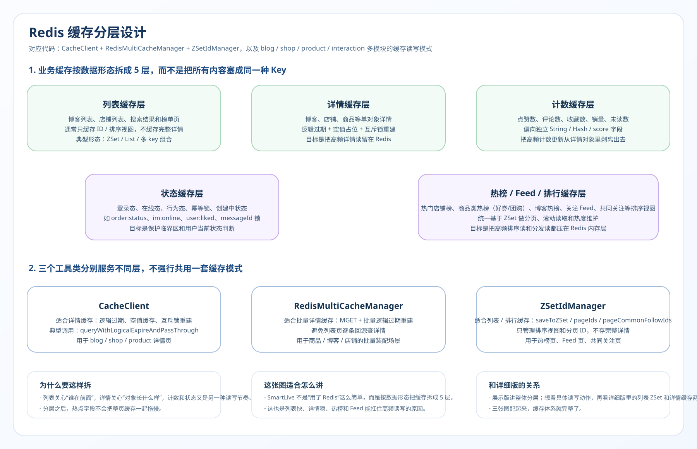
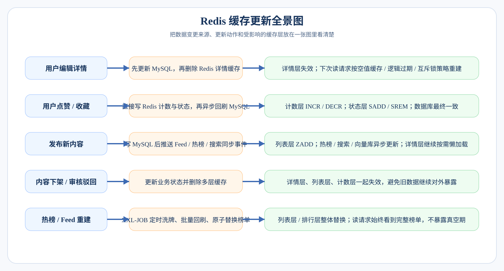

# Redis 分层缓存设计 + 详情页缓存读写链路详解

> 本文档是 SmartLive 项目 Redis 缓存体系的深度拆解，适合面试 10 分钟讲解版本。  
> 涵盖：分层缓存架构 → 列表缓存（ZSet）→ 详情缓存（String）→ 计数缓存 → 状态缓存 → 缓存三兄弟解决方案 → 缓存一致性 → 性能优化（Pipeline / CompletableFuture）。

---

## 1. 分层缓存架构总览

### 核心思想

> **不是所有数据都用同一种方式缓存，不同类型的数据用不同的 Redis 数据结构、不同的更新策略、不同的过期策略。**



### 为什么要分层？

| 问题 | 回答 |
|:---|:---|
| 为什么不把所有数据都用 String 缓存？ | 不同场景对查询方式的需求不同。列表要排序+分页，用 ZSet 天然支持；详情是单条随机读，用 String 最简单高效；计数要原子递增递减，用 String 的 INCR/DECR；状态是布尔判断，用 Set 的 SISMEMBER 或 String 的 0/1。 |
| 分层带来了什么好处？ | ① 每层独立过期和更新，互不影响 ② 更新粒度精细（改详情不影响列表缓存）③ 不同层用不同的防护策略（详情防击穿，列表防雪崩）④ 方便扩展和维护 |
| 分层有什么代价？ | 缓存 key 变多、一致性维护更复杂、需要更多的 Redis 内存。但好处远大于代价。 |

---

## 2. 列表层 —— ZSet 滚动分页

### 场景说明

用户在首页刷列表（店铺、商品、博客、Feed 推荐），需要：
- 按某种分数排序（时间戳、热度、距离）
- 支持滚动分页（不用传统 offset）
- 高性能读取

### 数据结构

```
Key:   feed:user:{userId}        // Feed 信箱
       blog:list:hot             // 热门博客列表
       shop:list:type:{typeId}   // 某分类下店铺列表

Value: ZSet
       member = 内容ID（blogId / shopId / productId）
       score  = 时间戳 / 热度分 / 距离分
```

### 滚动分页 vs 传统分页

```
传统分页（offset + limit）：
  SELECT * FROM blog ORDER BY create_time DESC LIMIT 10 OFFSET 100
  问题 1：深分页性能差（MySQL 要扫前 110 条再丢掉前 100 条）
  问题 2：有新数据插入时，offset 会错位（用户看到重复内容或漏掉内容）

滚动分页（score + limit）：
  ZREVRANGEBYSCORE key maxScore +inf LIMIT 0 10
  原理：用上一页最后一条的 score 作为下一页的起始点
  优势 1：不受新数据插入影响（score 是固定的）
  优势 2：每次只取固定范围，性能稳定
  优势 3：天然支持"下拉加载更多"的交互
```

### 面试追问与回答

| 问题 | 回答 |
|:---|:---|
| 为什么用 ZSet 而不是 List？ | List 只支持按位置取数据（LRANGE），不支持按分数范围查询。ZSet 支持按 score 范围查 + 排序，天然适合排行榜和滚动分页。 |
| 为什么不用传统 offset 分页？ | 两个问题：① 深分页性能差 ② 实时数据场景下 offset 会错位（新插入数据导致已看内容重复出现）。 |
| score 重复了怎么办？ | 同一批 score 相同的数据会一起返回。可以用"score + 偏移量"的方式处理：如果 lastScore 和当前页最后一条 score 相同，offset 加 1。 |
| ZSet 数据太多内存怎么办？ | 设置容量上限，比如每个 Feed 信箱只保留最近 1000 条。用 `ZREMRANGEBYRANK` 定期清理老数据。 |
| Feed 推送是推模式还是拉模式？ | 用户发布内容时，推送到所有粉丝的信箱（推模式）。适合粉丝量中等的场景。如果是千万粉丝大 V，需要切换到拉模式或推拉结合。 |

---

## 3. 详情层 —— String 缓存 + 三兄弟防护

### 场景说明

用户点击某个店铺/商品/博客，查看详情页。这是**读多写少、热点集中**的典型场景。

### 读写流程


### 缓存三兄弟详解

#### 1. 缓存穿透（查不到的数据）

```
问题场景：
  恶意请求 id = -1 的数据，Redis 查不到，MySQL 也查不到。
  每次都穿透到 MySQL，如果大量请求会打挂数据库。

解决方案：空值缓存
  · 查 MySQL 没查到 → 在 Redis 写入 key="" + 短 TTL（2~5 分钟）
  · 下次相同 key → Redis 命中空值 → 直接返回 null
  · 短 TTL 保证数据如果后续真的创建了，不会永远返回 null
  
补充方案：布隆过滤器
  · 在 Redis 前加一层布隆过滤器
  · 如果布隆说"不存在"，直接返回（有误判但无漏判）
  · 适合数据 ID 范围明确的场景
```

#### 2. 缓存击穿（热点 key 过期瞬间）

```
问题场景：
  一个热点商品的缓存 TTL 到了，恰好这时大量请求进来。
  缓存失效 → 所有请求穿透到 MySQL → 数据库瞬间压力飙升。

解决方案 A：互斥锁重建
  · 第一个线程拿到分布式锁 → 查库 → 写缓存 → 释放锁
  · 其他线程拿不到锁 → sleep 短暂后重试读缓存
  · 优点：保证数据新鲜
  · 缺点：其他线程要等（影响响应时间）

解决方案 B：逻辑过期
  · 缓存永不过期（不设 TTL）
  · 在 value 中额外存一个 expireTime 字段
  · 读取时检查 expireTime：
    - 未过期 → 直接返回
    - 已过期 → 开新线程异步重建缓存 + 返回旧数据
  · 优点：请求不阻塞，永远有数据返回
  · 缺点：短暂返回旧数据（最终一致性）
```

#### 3. 缓存雪崩（大量 key 同时过期）

```
问题场景：
  大量缓存的 TTL 相同，到期后同时失效。
  瞬间大量请求涌向 MySQL，导致数据库崩溃。

解决方案：
  · TTL 加随机值：baseTTL + random(0, 300) 秒
  · 保证不同 key 的过期时间分散
  · 对于特别热的 key，使用逻辑过期方案

补充方案：
  · Redis 集群 + 多级缓存（本地缓存 + Redis + MySQL）
  · 对缓存重建做并发控制（限制同时重建的数量）
```

### 三兄弟对照表

| | 穿透 | 击穿 | 雪崩 |
|:---|:---|:---|:---|
| **本质** | 查不到的数据 | 热点 key 过期 | 大量 key 同时过期 |
| **危害** | 大量无效请求打 MySQL | 热点请求瞬间涌入 MySQL | MySQL 瞬间崩溃 |
| **方案** | 空值缓存 + 布隆过滤器 | 互斥锁 / 逻辑过期 | TTL 加随机值 + 逻辑过期 |
| **项目中** | 详情查询加空值缓存 | 热门店铺/商品用逻辑过期 | 所有 TTL 加随机偏移 |

### 面试追问与回答

| 问题 | 回答 |
|:---|:---|
| 互斥锁和逻辑过期怎么选？ | 对数据新鲜度要求高的（如库存、价格）用互斥锁；对新鲜度容忍的（如店铺详情、博客内容）用逻辑过期。 |
| 逻辑过期不会导致用户看到很旧的数据吗？ | 最坏情况下看到"一个重建周期"内的旧数据（通常几秒到几十秒）。对详情页来说是可接受的。 |
| 空值缓存 key 太多怎么办？ | 短 TTL（2~5 min）+ 布隆过滤器前置拦截。如果明确知道 ID 范围，布隆过滤器就能拦截大部分无效 ID。 |
| 分布式锁用什么实现？ | Redis SETNX + 过期时间。生产环境建议用 Redisson，它有看门狗机制自动续期，防止业务执行时间超过锁的过期时间。 |

---

## 4. 计数层 —— 原子计数 + 异步回刷

### 场景说明

点赞数、收藏数、浏览量、评论数、粉丝数等，是**写多读多**的热数据。

### 设计方案

```
写入链路（用户点赞为例）：
  用户点赞
      │
      ▼
  Redis INCR blog:like:{blogId}       // 计数 +1
  Redis SADD blog:liked:{blogId} userId // 记录谁点赞了
      │
      ▼
  立即返回成功（不等 MySQL）
      │
      ▼
  异步回刷（两种方式）：
  ├── 方式 1：MQ 消息 → 消费者批量更新 MySQL
  └── 方式 2：XXL-JOB 定时扫描 → 批量 UPDATE MySQL

读取链路：
  请求博客详情
      │
      ▼
  从 Redis 直接读取计数值（O(1)）
  从 Redis 判断当前用户是否已点赞（SISMEMBER）
      │
      ▼
  组装到详情响应中返回
```

### 为什么不直接写 MySQL？

| 问题 | 回答 |
|:---|:---|
| 为什么计数不直接写 MySQL？ | 点赞等操作 QPS 极高，直接写 MySQL 会产生大量行锁竞争，性能差。Redis INCR 是原子操作，单线程 10w+ QPS，轻松应对。 |
| 异步回刷多久一次？ | 根据业务容忍度。通常 5~10 秒回刷一批，或者累积到一定量（如 100 条变更）触发一次批量 UPDATE。 |
| 回刷失败怎么办？ | MQ 重试 + XXL-JOB 兜底。Redis 数据是准实时的，MySQL 追求最终一致，短暂延迟可接受。 |
| Redis 挂了计数丢了怎么办？ | Redis 持久化（RDB/AOF）+ 主从复制。极端情况下，XXL-JOB 可以从 MySQL 重建 Redis 计数缓存。 |

### 双轨同步机制

```
双轨同步 = 实时写 Redis + 异步刷 MySQL

                 用户操作
                    │
        ┌───────────┼───────────┐
        │                       │
        ▼                       ▼
   Redis（实时）           MQ / 定时任务（异步）
   · INCR 计数              · 批量 UPDATE MySQL
   · SADD 用户记录           · 保证最终一致
   · 即时返回用户            · 降低 MySQL 压力
        │
        ▼
   所有读请求从 Redis 读
   （不走 MySQL）
```

---

## 5. 状态层 —— 布尔判断缓存

### 场景说明

用户进入详情页/列表页，需要判断：
- 是否已点赞这篇博客
- 是否已收藏这家店铺
- 是否已关注这个用户
- 是否已购买这个秒杀商品

### 数据结构

```
方案 A：Set
  Key:   blog:liked:{blogId}
  Value: Set { userId1, userId2, ... }
  判断: SISMEMBER blog:liked:{blogId} userId  → O(1)

方案 B：Bitmap（超大规模场景）
  Key:   blog:liked:{blogId}
  Offset: userId
  判断: GETBIT blog:liked:{blogId} userId  → O(1)
```

### 批量预加载优化

```
问题：用户进入列表页，要显示 10 条博客，每条都要判断是否已点赞/收藏
      如果挨个请求 Redis，10 条 × 3 种状态 = 30 次 Redis 请求 → 延迟高

解决：Pipeline 批量查询
      · 把 30 个 SISMEMBER 命令打包到一个 Pipeline 里
      · 一次网络往返完成所有查询
      · 响应时间从 30 × 1ms ≈ 30ms 降到 1 × 2ms ≈ 2ms
```

### 面试追问与回答

| 问题 | 回答 |
|:---|:---|
| Pipeline 和普通请求有什么区别？ | 普通请求是一问一答（client → server → client × N 次）。Pipeline 是批量发送（N 个命令一起发 → 一起收结果），减少了 N-1 次网络往返。 |
| Pipeline 和事务（MULTI/EXEC）有什么区别？ | Pipeline 只是网络优化，不保证原子性。事务保证一组命令要么全执行要么全不执行，但性能稍差。状态查询不需要原子性，Pipeline 就够了。 |
| Set 和 Bitmap 怎么选？ | Set 更灵活（可以 SMEMBERS 列出所有人），适合中等规模。Bitmap 内存更省（userId 做偏移量，每个只占 1 bit），适合超大规模场景（百万级）。 |

---

## 6. 缓存一致性 —— 更新策略

### 核心问题

**当 MySQL 数据更新后，如何让 Redis 缓存保持一致？**

### 方案对比

```
┌─────────────────────────────────────────────────────────────┐
│                    缓存更新策略对比                           │
├──────────────────┬──────────────────┬───────────────────────┤
│  策略             │  做法             │  问题                │
├──────────────────┼──────────────────┼───────────────────────┤
│ 更新缓存          │ 先更新 MySQL      │ 并发问题：线程 A 先   │
│                  │ 再更新 Redis      │ 写 MySQL，线程 B 后   │
│                  │                  │ 写 MySQL 但先写了     │
│                  │                  │ Redis → 数据错乱      │
├──────────────────┼──────────────────┼───────────────────────┤
│ ✅ 删除缓存       │ 先更新 MySQL      │ 并发问题更小：        │
│  （推荐方案）     │ 再删除 Redis      │ 删除后下次读自然      │
│                  │                  │ 重建，不会写入旧值    │
├──────────────────┼──────────────────┼───────────────────────┤
│ 先删缓存再更新库  │ 先删 Redis        │ 高并发下有问题：      │
│                  │ 再更新 MySQL      │ 删了缓存后、还没      │
│                  │                  │ 更新库时，另一个      │
│                  │                  │ 读请求把旧值加载回来  │
├──────────────────┼──────────────────┼───────────────────────┤
│ 延迟双删          │ 先删 Redis        │ 延迟多久是个玄学      │
│                  │ 更新 MySQL        │ 太短可能没用          │
│                  │ 延迟 N 秒再删     │ 太长浪费时间          │
│                  │ Redis             │ 实测不如直接用"先更   │
│                  │                  │ 新后删除"             │
└──────────────────┴──────────────────┴───────────────────────┘
```

### 项目采用的方案：先更新 MySQL，再删除 Redis

```
@Transactional
public void updateShop(Shop shop) {
    // 1. 先更新 MySQL
    shopMapper.updateById(shop);
    // 2. 再删除 Redis 缓存
    redisTemplate.delete("shop:detail:" + shop.getId());
    // 下次读请求会触发缓存重建
}
```

### 在极端并发下仍然可能不一致？

```
极端场景：
  时刻 1：线程 A 读缓存 miss，查到旧数据
  时刻 2：线程 B 更新了 MySQL，删除了缓存
  时刻 3：线程 A 把旧数据写入缓存
  → 缓存里存的是旧数据

概率分析：
  这需要"读请求的数据库操作"比"写请求"慢（读比写慢很少见）
  概率极低，但理论上存在

兜底方案：
  · 给缓存加 TTL（即使短暂不一致，到期后自动过期重建）
  · 关键业务用版本号校验
  · 通过 Canal 监听 binlog 做最终一致
```

### 面试追问与回答

| 问题 | 回答 |
|:---|:---|
| 为什么选择删除缓存而不是更新缓存？ | ① 避免并发写入导致数据错乱 ② 如果缓存的数据需要经过复杂计算，删除后按需重建比每次都重新计算更划算（懒加载思想） |
| 删除缓存失败怎么办？ | 重试机制：把删除操作发到 MQ，消费者异步重试。或者用 Canal 监听 binlog，数据变更时自动删除对应缓存。 |
| 为什么不用强一致方案？ | 强一致需要分布式锁或 2PC，性能代价太大。对于详情页数据，短暂不一致（几百毫秒到几秒）是可接受的。 |
| 写多读少的数据还用缓存吗？ | 不建议。缓存适合读多写少。写多的数据频繁失效又重建，命中率低，反而增加了 Redis 压力。这类数据直接查 MySQL 更好。 |

---

## 7. 聚合读链路 —— CompletableFuture 并发查询

### 场景说明

一个详情页需要聚合多种数据：
- 基础信息（店铺/商品/博客详情）
- 计数数据（点赞数、收藏数、评论数）
- 状态数据（当前用户是否已点赞、已收藏）
- 关联数据（评论列表、推荐列表）

如果串行查询，总耗时 = 各步耗时之和。如果并行查询，总耗时 ≈ 最慢那步的耗时。

### 串行 vs 并行

```
串行查询：
  详情（20ms）→ 计数（5ms）→ 状态（5ms）→ 评论（30ms）→ 推荐（25ms）
  总耗时：85ms

并行查询（CompletableFuture）：
  ┌── 详情（20ms）──┐
  ├── 计数（5ms） ──┤
  ├── 状态（5ms） ──┼── allOf() 等待全部完成 → 组装返回
  ├── 评论（30ms）──┤                        总耗时：30ms
  └── 推荐（25ms）──┘
```

### 代码示例

```java
public ShopDetailVO getShopDetail(Long shopId, Long userId) {
    // 1. 并行查询各层缓存
    CompletableFuture<Shop> shopFuture = CompletableFuture
        .supplyAsync(() -> getShopFromCache(shopId), cachePool);

    CompletableFuture<ShopCounts> countsFuture = CompletableFuture
        .supplyAsync(() -> getCountsFromRedis(shopId), cachePool);

    CompletableFuture<ShopStatus> statusFuture = CompletableFuture
        .supplyAsync(() -> getStatusFromRedis(shopId, userId), cachePool);

    CompletableFuture<List<Review>> reviewsFuture = CompletableFuture
        .supplyAsync(() -> getTopReviews(shopId), cachePool);

    // 2. 等待全部完成
    CompletableFuture.allOf(shopFuture, countsFuture, statusFuture, reviewsFuture).join();

    // 3. 组装返回
    return ShopDetailVO.builder()
        .shop(shopFuture.join())
        .counts(countsFuture.join())
        .status(statusFuture.join())
        .reviews(reviewsFuture.join())
        .build();
}
```

### 面试追问与回答

| 问题 | 回答 |
|:---|:---|
| 线程池为什么不能乱配？ | 核心线程数太小 → 任务排队等待、并行效果差。太大 → 线程切换开销大、占用过多内存。一般 IO 密集型用 `CPU × 2`，CPU 密集型用 `CPU + 1`。 |
| CompletableFuture 和 @Async 有什么区别？ | `@Async` 是 Spring 注解，返回 Future，组合能力弱。`CompletableFuture` 是 JDK 原生的，支持 thenApply / thenCombine / allOf 等链式组合，灵活性更强。 |
| 某个查询失败了怎么办？ | 用 `exceptionally()` 或 `handle()` 做降级。比如评论查不到就返回空列表，不影响整个详情页。 |
| 为什么不用 MQ 异步？ | MQ 适合"不需要等结果"的场景（fire and forget）。这里需要等所有结果组装后返回给用户，所以用 CompletableFuture 并行等待。 |

---

## 8. 完整读链路示意图

列表层 / 滚动分页：  


详情层 / 聚合读取：  


---

## 9. 缓存更新全景图



---

## 10. 技术点汇总

```
┌──────────────────────────────────────────────────────────┐
│                  Redis 分层缓存技术点汇总                  │
├──────────────┬───────────────────────────────────────────┤
│ 数据结构      │ String · Hash · Set · ZSet               │
├──────────────┼───────────────────────────────────────────┤
│ 命令         │ GET/SET · INCR/DECR · SISMEMBER/SADD/SREM│
│              │ ZADD · ZREVRANGEBYSCORE · ZREMRANGEBYRANK │
│              │ Pipeline · SETNX（分布式锁）               │
├──────────────┼───────────────────────────────────────────┤
│ 缓存防护      │ 穿透：空值缓存 + 布隆过滤器               │
│              │ 击穿：互斥锁 / 逻辑过期                    │
│              │ 雪崩：TTL 随机偏移 + 多级缓存               │
├──────────────┼───────────────────────────────────────────┤
│ 一致性       │ 先更新MySQL后删除Redis                     │
│              │ MQ 重试 / Canal 监听 binlog                │
│              │ XXL-JOB 定时对账                           │
├──────────────┼───────────────────────────────────────────┤
│ 性能优化      │ Pipeline 批量查询                          │
│              │ CompletableFuture 并发聚合                  │
│              │ 线程池隔离                                  │
│              │ 分层缓存减少更新范围                        │
├──────────────┼───────────────────────────────────────────┤
│ 设计思想      │ 分层设计 · 懒加载 · 读写分离               │
│              │ 最终一致性 · 降级兜底                       │
│              │ 推拉模型 · 双轨同步                         │
└──────────────┴───────────────────────────────────────────┘
```

---

## 11. 面试 10 分钟讲述模板

### 开场（30 秒）

> "我在项目里设计了一套分层缓存体系，把缓存分成**列表层、详情层、计数层、状态层**四个层次，每层用不同的 Redis 数据结构和更新策略。读取时用 CompletableFuture 并发聚合各层数据，写入时用双轨同步保证最终一致性。"

### 分层设计（2 分钟）

> 讲清四层分别是什么、为什么要分、用了什么数据结构、更新策略有什么不同。

### 详情页缓存读写（3 分钟）

> 重点讲缓存三兄弟（穿透/击穿/雪崩），结合项目说明每种问题的解决方案和选型理由。

### 并发聚合 + Pipeline（2 分钟）

> 讲串行 vs 并行对比、CompletableFuture 用法、Pipeline 减少网络往返。

### 一致性保障（2 分钟）

> 讲"先更新 MySQL 后删除 Redis"的选型理由，以及 MQ 重试 + XXL-JOB 兜底。

### 总结（30 秒）

> "整套缓存体系的核心思想是**分层隔离 + 按需防护 + 最终一致**。分层让更新粒度精细、不相互影响；每层根据业务特点选择不同的防护策略；通过双轨同步和定时对账保证 MySQL 和 Redis 的最终一致性。优化后详情页响应时间从 200ms+ 降到 30ms 左右。"

---

## 12. 高频追问速查表

| 追问方向 | 关键问题 | 核心回答 |
|:---|:---|:---|
| **分层设计** | 为什么要分层？ | 不同数据读写模式不同，分层后可以独立优化、独立过期、减少更新范围 |
| **ZSet** | 为什么用 ZSet 做列表？ | 天然支持按 score 排序 + 范围查询 + 滚动分页 |
| **穿透** | 怎么防缓存穿透？ | 空值缓存（短 TTL）+ 布隆过滤器前置拦截 |
| **击穿** | 怎么防缓存击穿？ | 互斥锁重建（强一致场景）或逻辑过期（高可用场景） |
| **雪崩** | 怎么防缓存雪崩？ | TTL 加随机偏移，避免大量 key 同时过期 |
| **一致性** | 缓存和数据库怎么保持一致？ | 先更新 MySQL 后删除 Redis + MQ 重试 + XXL-JOB 对账 |
| **Pipeline** | Pipeline 有什么用？ | 将多次 Redis 请求合并为一次网络往返，大幅降低网络延迟 |
| **并发聚合** | 详情页怎么优化的？ | CompletableFuture 并行查询各层缓存 + Pipeline 批量查状态 |
| **双轨同步** | 热数据为什么先写 Redis？ | 点赞等高频操作直接写 Redis 保证响应快，再异步回刷 MySQL 保证持久化 |
| **线程池** | 线程池怎么配的？ | IO 密集型用 CPU×2，核心线程和最大线程根据压测调整，拒绝策略用 CallerRunsPolicy |

---

> **一句话总结**：Redis 分层缓存的核心就是 **"分层存储 + 按需防护 + 并发聚合 + 最终一致"**。每层用最合适的数据结构和更新策略，读取时并行聚合降低延迟，写入时双轨同步保证一致性。把这条链路吃透，面试时 Redis 数据结构、缓存三兄弟、一致性、性能优化的问题都能游刃有余。
