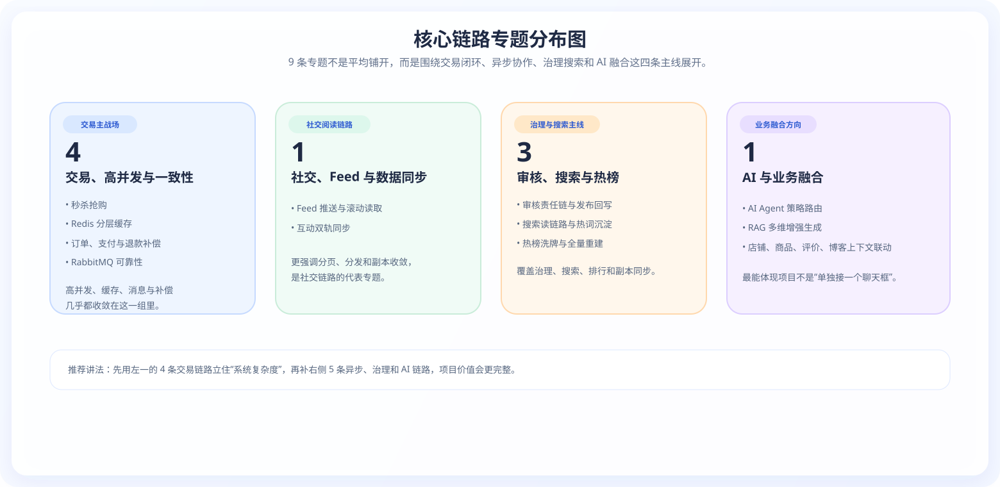

# 核心链路总览

这页是“核心链路深度解析”的总入口。

首次浏览本部分内容时，推荐按照以下顺序阅读，以便更快建立整体理解：

1. 先从 [秒杀抢购全链路](/core-links/秒杀抢购全链路详解)、[订单、支付与退款补偿](/core-links/2.%20下单_统一支付_退款补偿链路) 和 [Redis 分层缓存链路](/core-links/Redis分层缓存链路详解) 这三条链路建立对项目交易闭环和高并发设计的认识
2. 再看 [RabbitMQ 消息可靠性全链路详解](/core-links/RabbitMQ消息可靠性全链路详解)、[审核中心责任链 + 发布审核与搜索 向量同步链路](/core-links/5.%20审核中心责任链%20+%20发布审核与搜索%20向量同步链路) 和 [搜索读链路 + 热词沉淀链路](/core-links/6.%20搜索读链路%20+%20热词沉淀链路)，理解异步解耦、责任链治理和多模块协作
3. 最后看 [Feed 推送与滚动读取 + 互动双轨同步链路](/core-links/4.%20Feed%20推送与滚动读取%20+%20互动双轨同步链路)、[AI Agent 策略路由、RAG 与结构化响应链路](/core-links/8.%20AI%20Agent策略路由与RAG多维增强生成链路) 和 [热榜增量洗牌与全量重建链路](/core-links/7.%20热榜增量洗牌与全量重建链路)，把社交分发、业务增强生成和推荐维护串起来

## 1. 本页最值得优先关注的数据

这一区不是“纯文档目录”，而是整个项目最能体现工程复杂度的专题集合。按当前仓库代码和文档资产统计，这一页背后至少能看到下面这几组密度数据：

| 指标 | 当前数据 | 说明 |
|:---|:---:|:---|
| 链路专题页 | **9 条** | 当前 `core-links` 下已沉淀 9 条主链路专题，覆盖交易、缓存、消息、Feed、审核、搜索、热榜与 AI |
| SVG 链路图 | **49 张** | `docs/diagrams` 目录已经形成了相对完整的链路图、读图和系统图资产 |
| FeignClient | **18 个** | 说明服务之间不是“拆模块但不协作”，而是真正存在较密的跨服务调用 |
| RabbitMQ 监听器 | **30 个** | 订单、库存、补偿、审核、搜索同步、通知推送等都走了异步监听 |
| XXL-JOB 处理器 | **26 个** | 定时校准、重建、补偿和后台运维类任务已经形成独立调度面 |

用于项目讲解时，最有价值的并不是把 9 条链路逐条讲完，而是先借助这些数据说明：

1. 这个项目不是“只有页面，没有链路”的展示型项目。
2. 这个项目不是“只有服务拆分，没有服务协同”的伪微服务项目。
3. 这个项目已经把缓存、消息、调度、搜索、审核、AI 这些能力真正压进了业务链路里。

### 1.1 按主题分布，这 9 条链路分别覆盖什么

  

| 主题 | 数量 | 覆盖内容 |
|:---|:---:|:---|
| 交易、高并发与一致性 | **4** | 秒杀、Redis 分层缓存、订单支付退款、RabbitMQ 可靠性 |
| 社交、Feed 与数据同步 | **1** | Feed 分发、滚动读取、互动双轨同步 |
| 审核、搜索与热榜 | **3** | 审核责任链、搜索读链路、热榜洗牌与重建 |
| AI 与业务融合 | **1** | 策略路由、RAG 增强生成、业务上下文融合 |

## 2. 项目讲解推荐顺序

  

用于项目讲解时，建议按以下 4 步展开，避免从单个实现细节直接切入：

1. 先回到 [系统架构与项目规模](/site-pages/SYSTEM_ARCHITECTURE)，用 1-2 分钟讲清项目边界、服务数量、端侧覆盖和基础设施分工。
2. 再切到 [页面效果图导览](/PAGE_GALLERY) 或 [业务链路视觉走查](/SHOWCASE)，先把用户闭环和页面落点讲出来。
3. 然后在这页只挑 3 条最强链路重点展开，推荐优先讲：[秒杀抢购全链路](/core-links/秒杀抢购全链路详解)、[订单、支付与退款补偿](/core-links/2.%20下单_统一支付_退款补偿链路) 和 [Redis 分层缓存链路](/core-links/Redis分层缓存链路详解)。
4. 最后回到 [技术选型理由](/site-pages/TECH_SELECTION) 和 [难点踩坑与解决方案](/site-pages/PITFALLS)，把“为什么这么做”和“踩过哪些坑”补齐。

## 3. 优先阅读哪些链路

| 阅读目标 | 建议先看 | 原因 |
|:---|:---|:---|
| 想快速建立“这项目到底强在哪”的认知 | [秒杀抢购全链路](/core-links/秒杀抢购全链路详解) | 交易、高并发、缓存、MQ、补偿几乎都在一条链路里 |
| 想讲清楚缓存设计 | [Redis 分层缓存架构](/core-links/Redis分层缓存链路详解) | 最能体现项目性能优化和数据结构设计 |
| 想讲清楚订单与支付闭环 | [订单、支付与退款补偿](/core-links/2.%20下单_统一支付_退款补偿链路) | 状态流转、补偿边界和账务分发最集中 |
| 想讲异步可靠性 | [RabbitMQ 消息可靠机制](/core-links/RabbitMQ消息可靠性全链路详解) | 最适合回答“怎么防丢、防重、怎么补偿”，还能自然带出订单、搜索和审核回写 |
| 想讲社交与推荐 | [Feed 推送与互动同步](/core-links/4.%20Feed%20推送与滚动读取%20+%20互动双轨同步链路) | 能讲清滚动分页、动态分发和双轨同步 |
| 想讲内容治理 | [多维审核链与搜索双写](/core-links/5.%20审核中心责任链%20+%20发布审核与搜索%20向量同步链路) | 审核责任链、回写、ES / Milvus 双写很完整，含金量明显高于单纯 CRUD 审核页 |
| 想讲搜索与热榜 | [LBS 搜索与热词排行](/core-links/6.%20搜索读链路%20+%20热词沉淀链路) / [大盘热榜洗牌与重建](/core-links/7.%20热榜增量洗牌与全量重建链路) | 一个讲读链路，一个讲维护链路 |
| 想讲 AI 落地 | [AI 路由策略、RAG 与结构化响应](/core-links/8.%20AI%20Agent策略路由与RAG多维增强生成链路) | 最能体现 AI 不只是聊天，而是融合业务；页面里已经补了“建库链路 + 问答链路”总图，以及“控制 JSON -> 后端回填真实数据”的结构化响应图 |

## 4. 按含金量推荐顺序查看

### 4.1 第一梯队：最值得优先展开

- [秒杀抢购全链路详解](/core-links/秒杀抢购全链路详解)
- [订单、支付与退款补偿链路](/core-links/2.%20下单_统一支付_退款补偿链路)
- [Redis 分层缓存链路详解](/core-links/Redis分层缓存链路详解)
- [RabbitMQ 消息可靠性全链路详解](/core-links/RabbitMQ消息可靠性全链路详解)
- [审核中心责任链 + 发布审核与搜索 向量同步链路](/core-links/5.%20审核中心责任链%20+%20发布审核与搜索%20向量同步链路)

### 4.2 第二梯队：适合继续往下讲系统协同

- [Feed 推送与滚动读取 + 互动双轨同步链路](/core-links/4.%20Feed%20推送与滚动读取%20+%20互动双轨同步链路)
- [AI Agent 策略路由、RAG 与结构化响应链路](/core-links/8.%20AI%20Agent策略路由与RAG多维增强生成链路)

若入口关键词为 AI / Spring AI / 向量检索，建议完整阅读这一专题。先看新增的核心总图，再看其中拆出的“知识建库链路”“在线问答链路”和“控制 JSON -> 后端回填真实数据”的结构化响应图，会更容易理解 SmartLive 这套实现为什么属于业务数据型 RAG，而不是单纯的聊天外挂。

### 4.3 第三梯队：适合补充读链路与榜单治理

- [搜索读链路 + 热词沉淀链路](/core-links/6.%20搜索读链路%20+%20热词沉淀链路)
- [热榜增量洗牌与全量重建链路](/core-links/7.%20热榜增量洗牌与全量重建链路)

## 5. 30 分钟速读路线

如时间有限，建议按以下路径速读：

1. [秒杀抢购全链路详解](/core-links/秒杀抢购全链路详解)
2. [订单、支付与退款补偿链路](/core-links/2.%20下单_统一支付_退款补偿链路)
3. [Redis 分层缓存链路详解](/core-links/Redis分层缓存链路详解)
4. [RabbitMQ 消息可靠性全链路详解](/core-links/RabbitMQ消息可靠性全链路详解)

## 6. 继续往哪看

- 如需先看系统整体和页面效果：去 [业务链路视觉走查](/SHOWCASE) 或 [页面效果图导览](/PAGE_GALLERY)
- 如需从“为什么这样设计”继续展开：去 [技术选型理由](/site-pages/TECH_SELECTION)
- 如需从“做项目时踩了什么坑”继续展开：去 [难点踩坑与解决方案](/site-pages/PITFALLS)
- 如需直接按问答准备面试：去 [常见问题 FAQ](/site-pages/FAQ)
