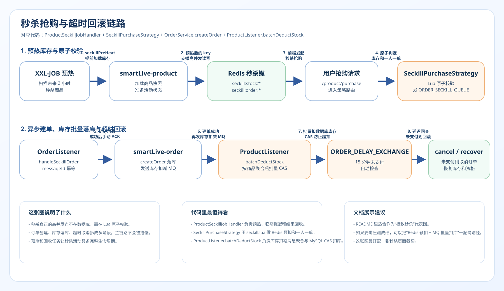
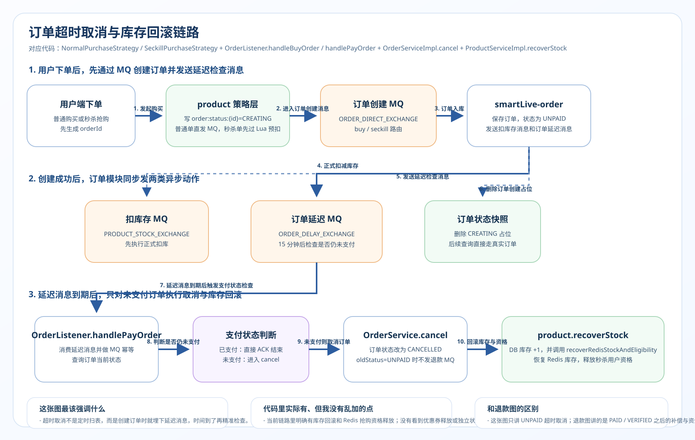

# 秒杀抢购全链路详解

> 本文档是 SmartLive 项目核心链路的深度拆解，适合面试 10 分钟讲解版本。  
> 涵盖：Redis Lua 预扣库存 → 一人一单 → MQ 异步落单 → 订单超时取消 → 退款补偿 → 幂等保障 → 兜底对账。

---

## 一、链路总览图

秒杀抢购主链路：  


秒杀预热与库存校准：  


订单超时取消与库存回滚：  


---

## 二、每一步的技术细节与面试追问

### Step 1：网关层限流

**做了什么：**
- 使用 Spring Cloud Gateway 统一入口
- Sentinel 对秒杀接口配置限流规则（QPS 限制）
- 请求通过后透传 `userId` 到下游服务

**面试追问与回答：**

| 问题 | 回答 |
|:---|:---|
| 为什么限流放在网关而不是服务内部？ | 网关是流量入口，越早拦截无效请求，对下游保护越好。服务内部限流是补充，不是替代。 |
| Sentinel 用的什么算法？ | 令牌桶或滑动窗口，令牌桶适合突发流量，滑动窗口更平滑。 |
| 限流阈值怎么定？ | 根据压测结果确定下游服务能承受的最大 QPS，再在网关层设置略低于这个值的阈值。 |

---

### Step 2：Redis Lua 原子扣库存 + 一人一单

**做了什么：**

使用一段 Lua 脚本在 Redis 中原子完成三个操作：

```lua
-- KEYS[1] = 库存 key, KEYS[2] = 已购用户集合 key
-- ARGV[1] = userId

-- 1. 判断库存是否充足
if tonumber(redis.call('GET', KEYS[1])) <= 0 then
    return -1  -- 库存不足
end

-- 2. 判断用户是否已购买（一人一单）
if redis.call('SISMEMBER', KEYS[2], ARGV[1]) == 1 then
    return -2  -- 重复购买
end

-- 3. 扣库存 + 记录用户
redis.call('DECR', KEYS[1])
redis.call('SADD', KEYS[2], ARGV[1])
return 0  -- 成功
```

**为什么这样设计：**

| 问题 | 回答 |
|:---|:---|
| 为什么用 Redis 而不是直接查 MySQL？ | MySQL 在高并发下扛不住，Redis 单线程 10w+ QPS，能拦截绝大部分无效请求。 |
| 为什么用 Lua 而不是分开执行？ | 分开执行会出现并发问题：线程 A 查了库存 > 0，还没扣减时线程 B 也查到 > 0，导致超卖。Lua 脚本在 Redis 中原子执行，不会被中断。 |
| 为什么用 SISMEMBER 判断一人一单？ | Set 的 SISMEMBER 时间复杂度 O(1)，高效且天然去重。 |
| 如果 Redis 挂了怎么办？ | Redis 做主从 + 哨兵或集群，保证高可用。另外 MySQL 还有一层兜底校验（唯一索引）。 |
| 这里有没有可能少卖？ | 有可能。比如 Lua 扣了库存但 MQ 消息丢失，后续订单没创建。所以需要 XXL-JOB 定时校准 Redis 和 MySQL 库存。 |

---

### Step 3：MQ 异步落单

**做了什么：**
- Lua 执行成功后，发送 MQ 消息到 RabbitMQ（direct 交换机 + 秒杀队列）
- 消息内容包含：`orderId`、`userId`、`productId`、`seckillId`、`quantity`
- 主线程立即返回"抢购成功，等待支付"

**为什么这样设计：**

| 问题 | 回答 |
|:---|:---|
| 为什么不同步写 MySQL？ | 秒杀瞬间可能几十万请求，同步写 MySQL 会导致：① 数据库连接耗尽 ② 响应超时 ③ 用户体验差。异步下单将写库操作平滑到 MQ 消费者端，削峰填谷。 |
| MQ 消息丢失怎么办？ | 三层保障：① 生产者 confirm 确认 ② 消息持久化（durable 队列 + 持久化消息）③ 消费者手动 ACK。 |
| 消费者处理失败怎么办？ | NACK + 有限重试（3 次），重试耗尽后进入死信队列，人工介入或 XXL-JOB 兜底扫描。 |
| RabbitMQ 用的什么交换机？ | direct 交换机，秒杀消息用固定路由键精确投递到指定队列，不需要模糊匹配。 |

---

### Step 4：订单创建与库存扣减消息发送

**做了什么：**

MQ 消费者收到消息后，在一个本地事务中完成：

```
@Transactional
1. 幂等校验：查 MySQL 是否已有同 orderId 的订单
2. 插入订单记录（状态 = UNPAID）
3. 记录订单流水
4. 发送 StockDeductMessage 到商品库存交换机
5. 发送延迟消息到超时取消队列
```

这里要特别注意：

- **订单服务不会在这个事务里直接扣减 MySQL 商品库存**
- 秒杀链路里的数据库扣库动作，是由商品模块的 `ProductListener.batchDeductStock` 消费库存消息后统一聚合执行
- 也就是说：**Redis Lua 负责预扣，OrderService 负责建单并发扣库消息，ProductListener 负责批量 CAS 扣数据库库存**

**面试追问与回答：**

| 问题 | 回答 |
|:---|:---|
| 为什么还要扣 MySQL 库存？Redis 不是已经扣了吗？ | Redis 是"预扣"，目的是快速拦截和限流。MySQL 才是最终数据源，必须保证数据库库存准确。两者要保持最终一致。 |
| 乐观锁的 `stock >= count` 够用吗？ | 对当前秒杀场景够用。因为 Redis 已经过滤了大部分请求，到商品模块批量 CAS 扣库时并发量已经被削平了。如果要更严格，可以再加版本号乐观锁。 |
| 为什么要幂等校验？ | MQ 消息可能被重复消费（网络抖动、消费者重启等），如果不做幂等校验，同一笔订单可能被创建两次。用唯一订单号做幂等 key，保证同一消息只处理一次。 |
| 幂等怎么实现的？ | 两层：① MySQL 订单表对 `orderId` 建唯一索引（最终兜底）② 消费前先查一次 Redis 或 MySQL 是否已有该订单（减少无效事务）。 |

---

### Step 4.5：商品模块批量 CAS 扣库

**做了什么：**

- 商品模块监听 `PRODUCT_STOCK_DEDUCT_QUEUE`
- 先按商品维度聚合同批次 `StockDeductMessage`
- 再调用 `productMapper.deductStock(productId, totalCount)` 做一次性 CAS 扣库
- 如果 CAS 失败，说明数据库库存已经不足，会把关联订单统一发到 `ORDER_CANCEL_QUEUE` 做回滚补偿

**为什么这样设计：**

| 问题 | 回答 |
|:---|:---|
| 为什么不在订单服务里直接扣库存？ | 订单服务负责建单，商品服务负责库存，是更清晰的职责拆分；同时批量聚合后再扣库，也能减少数据库写放大。 |
| 为什么这里是“批量扣库”不是“批量删除库存”？ | 这里的动作是把多个库存扣减消息按商品聚合后，统一执行 `stock = stock - count` 的数据库扣减。真正的“删除 Redis 秒杀库存 key”是在活动结束回收任务里做的，不属于抢购主链路。 |
| 扣库失败怎么办？ | `ProductListener.batchDeductStock` 会把关联订单发送到 `ORDER_CANCEL_QUEUE`，由订单模块统一取消并恢复 Redis 库存与资格。 |

---

### Step 5：延迟队列 —— 超时未支付自动取消

**做了什么：**
- 订单创建成功后，发送一条延迟消息到 RabbitMQ 延迟队列
- 延迟时间 = 15～30 分钟
- 消费者收到延迟消息后检查订单状态：
  - 如果已支付 → 忽略
  - 如果仍未支付 → 执行取消 + 补偿

**实现方式：**

```
方式一：TTL + 死信队列
· 正常队列设置消息 TTL = 30 分钟
· 消息过期后自动路由到死信交换机 → 死信队列
· 死信队列的消费者处理超时取消

方式二：RabbitMQ 延迟消息插件
· 使用 rabbitmq_delayed_message_exchange
· 发送时指定 x-delay 头
· 交换机到期后才投递消息
```

**面试追问与回答：**

| 问题 | 回答 |
|:---|:---|
| 为什么不用定时任务轮询？ | 定时任务有时间间隔，最差情况下订单要多等一个间隔才被取消。延迟队列更精确，到时间就触发。但定时任务作为兜底保留。 |
| TTL + 死信 vs 延迟插件选哪个？ | TTL + 死信是原生方案，不需要额外插件，但有"排头阻塞"问题（前面消息 TTL 长会阻塞后面短的）。延迟插件没有这个问题，但需要安装插件。 |
| 延迟消息丢了怎么办？ | XXL-JOB 定时扫描"超时未支付"订单，作为兜底。比如每 5 分钟扫描一次 `status = UNPAID AND create_time < now() - 30min` 的订单。 |
| 为什么 MQ 和 XXL-JOB 都要？ | MQ 延迟队列是"精准触发"，XXL-JOB 是"兜底扫描"。两者协同：正常情况 MQ 够用，MQ 异常时 XXL-JOB 补上。这是**双保险**策略。 |

---

### Step 6：取消/退款统一补偿逻辑

**做了什么：**

无论是超时取消、主动取消还是退款，都走统一的补偿逻辑：

```
补偿事务（@Transactional）：
1. 检查订单状态是否允许取消/退款
2. 更新订单状态 → CANCELLED / REFUNDED
3. MySQL 恢复库存（stock + 1）
4. Redis INCR 恢复库存
5. Redis SREM 移除已购用户记录
6. 如果已支付 → 钱包退款 + 记录退款流水
7. 如果用了优惠券 → 恢复优惠券
8. 如果已加积分 → 扣减积分
```

**面试追问与回答：**

| 问题 | 回答 |
|:---|:---|
| MySQL 和 Redis 操作怎么保证一致性？ | 采用**最终一致性**。MySQL 事务先提交，然后操作 Redis。如果 Redis 操作失败，通过 MQ 重试或 XXL-JOB 校准来补偿。不追求强一致，追求最终一致。 |
| 退款和取消的区别是什么？ | 取消是未支付状态下的库存回滚；退款是已支付状态下的库存回滚 + 钱款返还。两者共用补偿逻辑，但退款多了钱包操作。 |
| 补偿操作本身失败了怎么办？ | 补偿操作做幂等设计（基于订单状态机，只有特定状态才能执行），可以安全重试。XXL-JOB 兜底扫描异常状态的订单。 |
| 订单状态流转是怎么管理的？ | 类似状态机：`UNPAID → PAID → COMPLETED / CANCELLED / REFUNDED`。每次状态变更都检查原状态是否合法（用 `WHERE status = ?` 乐观锁更新），防止并发问题。 |

---

### Step 7：XXL-JOB 兜底体系

**做了什么：**

| 定时任务 | 频率 | 作用 |
|:---|:---|:---|
| 秒杀预热 | 活动开始前 30 分钟 | 将库存、活动信息加载到 Redis |
| 库存校准 | 每 10 分钟 | 比对 Redis 库存和 MySQL 库存，如有差异则修正 Redis |
| 超时订单兜底 | 每 5 分钟 | 扫描超时未支付订单，触发取消补偿 |
| 数据对账 | 每小时 | Redis 已购用户集合 vs MySQL 订单表，清理"有记录但无订单"的脏数据 |

**面试追问与回答：**

| 问题 | 回答 |
|:---|:---|
| 有 MQ 了为什么还要定时任务？ | MQ 不是 100% 可靠的（消息丢失、消费异常、死信积压），定时任务是第二道防线，保证最终一致性。 |
| 库存校准怎么做？ | 以 MySQL 为准。如果 Redis 库存 < MySQL 库存，说明有"扣了 Redis 但没创建订单"的情况，需要 INCR 补回。反之说明有"创建了订单但 Redis 没扣"，需要 DECR 修正。 |
| 兜底任务会不会和正常业务冲突？ | 会有并发风险。所以兜底操作也做幂等（基于订单状态检查），并且使用分布式锁保证同一笔订单不会被重复处理。 |

---

## 三、整条链路涉及的核心技术点汇总

```
┌─────────────────────────────────────────────────────┐
│                   技术点对照表                        │
├──────────────┬──────────────────────────────────────┤
│ Redis        │ · Lua 原子操作                       │
│              │ · SET / GET / DECR / INCR             │
│              │ · SISMEMBER / SADD / SREM             │
│              │ · 分布式锁                            │
├──────────────┼──────────────────────────────────────┤
│ RabbitMQ     │ · direct 交换机                      │
│              │ · 生产者 confirm                      │
│              │ · 消费者手动 ACK                      │
│              │ · 延迟队列（TTL + 死信 / 插件）       │
│              │ · 死信队列                            │
│              │ · 消息持久化                          │
├──────────────┼──────────────────────────────────────┤
│ MySQL        │ · 事务（@Transactional）              │
│              │ · 乐观锁（stock > 0）                 │
│              │ · 唯一索引（幂等兜底）                 │
│              │ · 状态机流转                          │
├──────────────┼──────────────────────────────────────┤
│ 并发安全     │ · Lua 脚本原子性                      │
│              │ · 分布式锁                            │
│              │ · 一人一单（Set 去重 + 唯一索引）      │
│              │ · 幂等设计                            │
├──────────────┼──────────────────────────────────────┤
│ 可靠性       │ · MQ 三层保障（confirm + 持久化 + ACK）│
│              │ · XXL-JOB 兜底扫描                    │
│              │ · 库存校准                            │
│              │ · 最终一致性                          │
├──────────────┼──────────────────────────────────────┤
│ 性能优化     │ · Redis 预扣（拦截 99% 请求）         │
│              │ · MQ 异步落单（削峰填谷）              │
│              │ · Gateway 限流（保护下游）             │
├──────────────┼──────────────────────────────────────┤
│ 设计模式     │ · 补偿模式（统一回滚）                │
│              │ · 幂等模式（安全重试）                 │
│              │ · 状态机模式（状态流转控制）            │
└──────────────┴──────────────────────────────────────┘
```

---

## 四、面试 10 分钟讲述模板

> **讲述思路：先总后分，先主流程后异常处理。**

### 开场（30 秒）

> "我在项目里实现了一套完整的秒杀抢购链路。主流程是：用户请求先经过网关限流，然后用 Redis Lua 脚本做原子的库存预扣和一人一单校验，通过后发 MQ 异步落单到 MySQL，最后通过延迟队列做超时取消。整条链路的设计目标是：**高并发下不超卖、不重复下单、不丢单、最终一致**。"

### 主流程（3 分钟）

> 按 Step 1 → Step 4 顺序讲，重点突出每一步**为什么这样设计**，而不是描述代码细节。

### 异常处理（3 分钟）

> 讲超时取消（延迟队列 + XXL-JOB 双保险）和退款补偿（统一补偿逻辑）。

### 兜底保障（2 分钟）

> 讲 XXL-JOB 库存校准、订单兜底扫描、数据对账。

### 总结亮点（1.5 分钟）

> "这条链路的核心思想是**分层过滤 + 异步解耦 + 最终一致**：
> - 网关拦截非法请求
> - Redis 拦截无效请求（库存不足 / 已购买）
> - MQ 削峰填谷，保护 MySQL
> - 延迟队列 + XXL-JOB 双保险，保证不丢单
> - 统一补偿逻辑，保证取消/退款的正确性
> - 最终一致性贯穿全链路"

---

## 五、高频追问速查表

| 追问方向 | 关键问题 | 核心回答 |
|:---|:---|:---|
| **超卖** | 怎么防止超卖？ | Redis Lua 原子扣减 + MySQL 乐观锁 `stock > 0` 双层保障 |
| **少卖** | 会不会少卖？ | 有可能（Redis 扣了但 MQ 丢了）。通过 MQ 可靠投递 + XXL-JOB 库存校准解决 |
| **重复下单** | 怎么防止重复下单？ | Redis Set 去重（SISMEMBER）+ MySQL 唯一索引 + 消费者幂等校验 |
| **消息丢失** | MQ 消息丢了怎么办？ | 生产者 confirm + 消息持久化 + 消费者手动 ACK + XXL-JOB 兜底扫描 |
| **重复消费** | 消息被重复消费怎么办？ | 消费者用 orderId 做幂等 key，重复消息直接跳过 |
| **一致性** | Redis 和 MySQL 怎么保持一致？ | 不追求强一致，采用最终一致。MySQL 事务先提交，再操作 Redis，失败通过 MQ 重试或 XXL-JOB 校准 |
| **延迟队列** | 延迟消息丢了怎么办？ | XXL-JOB 每 5 分钟扫描超时订单，兜底取消 |
| **性能** | 能扛多大并发？ | Redis 单机 10w+ QPS，Lua 脚本拦截 99% 请求。实际到 MySQL 的写入量很低，MQ 再做一次削峰。压测下整体支撑万级并发没问题 |
| **分布式锁** | 哪里用了分布式锁？ | 补偿操作 / 库存校准 / 兜底扫描时加分布式锁，防止并发处理同一笔订单 |

---

## 六、扩展：这条链路和八股的关联

```
秒杀链路 ←→ 八股知识点映射

Redis 八股：
  ├── 数据结构（String / Set）
  ├── Lua 脚本原子性
  ├── 分布式锁（Redisson / SETNX）
  └── 缓存与数据库一致性

RabbitMQ 八股：
  ├── 交换机类型（direct / topic / fanout）
  ├── 消息可靠性三板斧
  ├── 重复消费与幂等
  ├── 延迟队列（TTL + DLX / 插件）
  └── 死信队列

MySQL 八股：
  ├── 事务与隔离级别
  ├── 乐观锁 vs 悲观锁
  ├── 唯一索引
  └── MVCC

Java 并发八股：
  ├── 线程安全
  ├── 原子操作
  └── 并发控制

设计思想：
  ├── 分层过滤
  ├── 异步解耦（削峰填谷）
  ├── 最终一致性
  ├── 幂等设计
  ├── 补偿模式
  └── 状态机模式
```

---

> **一句话总结**：秒杀链路的核心就是 **"三层过滤 + 异步落单 + 双保险兜底"**，每一步都有明确的技术选型理由和异常处理方案。把这条链路吃透，面试时 Redis / MQ / MySQL / 幂等 / 最终一致性的问题都能从容应对。
