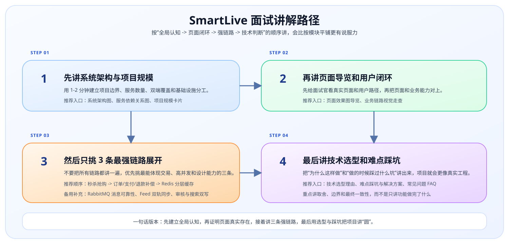

<div class="smartlive-tech-strip">
  <span class="smartlive-tech-chip">JDK 17+</span>
  <span class="smartlive-tech-chip">Spring Boot 3.2.2</span>
  <span class="smartlive-tech-chip">Spring Cloud Alibaba 2023.0.1.0</span>
  <span class="smartlive-tech-chip">MySQL 8</span>
  <span class="smartlive-tech-chip">Redis</span>
  <span class="smartlive-tech-chip">RabbitMQ</span>
  <span class="smartlive-tech-chip">Elasticsearch</span>
  <span class="smartlive-tech-chip">XXL-JOB</span>
  <span class="smartlive-tech-chip">Spring AI</span>
</div>

<nav class="smartlive-section-nav-bar">
  <div class="smartlive-section-nav-bar__label">📍 导航</div>
  <div class="smartlive-section-nav">
    <a href="#home-stats" class="smartlive-section-nav-pill">项目规模</a>
    <a href="#home-architecture" class="smartlive-section-nav-pill">系统架构</a>
    <a href="#home-highlights" class="smartlive-section-nav-pill">项目亮点</a>
    <a href="#home-interview" class="smartlive-section-nav-pill">面试入口</a>
    <a href="#home-read-path" class="smartlive-section-nav-pill">阅读路径</a>
    <a href="#home-start-path" class="smartlive-section-nav-pill">体验路径</a>
    <a href="#home-pitch-path" class="smartlive-section-nav-pill">讲解路径</a>
    <a href="#home-quickstart" class="smartlive-section-nav-pill">极速启动</a>
  </div>
</nav>

## <a id="home-stats"></a>📊 项目规模与关键数据

<div class="smartlive-stats-grid">
<!-- AUTO_SYNC:DOCS_HOME_STATS_CARDS:START -->
  <div class="smartlive-stat-card">
    <div class="smartlive-stat-value">16 个</div>
    <div class="smartlive-stat-label">业务模块</div>
    <div class="smartlive-stat-desc">覆盖交易、社交、搜索、AI、审核、钱包、IM 等核心能力</div>
  </div>
  <div class="smartlive-stat-card">
    <div class="smartlive-stat-value">19 个</div>
    <div class="smartlive-stat-label">服务应用</div>
    <div class="smartlive-stat-desc">16 个业务模块 + auth / gateway / monitor</div>
  </div>
  <div class="smartlive-stat-card">
    <div class="smartlive-stat-value">7万+</div>
    <div class="smartlive-stat-label">Java 代码</div>
    <div class="smartlive-stat-desc">核心业务口径 3万+，当前仓库 Java 总量约 72,000+ 行</div>
  </div>
  <div class="smartlive-stat-card">
    <div class="smartlive-stat-value">53 张</div>
    <div class="smartlive-stat-label">核心表</div>
    <div class="smartlive-stat-desc">业务、治理与调度三类核心表已经形成完整数据模型</div>
  </div>
  <div class="smartlive-stat-card">
    <div class="smartlive-stat-value">3200+</div>
    <div class="smartlive-stat-label">秒杀 QPS</div>
    <div class="smartlive-stat-desc">Lua 预扣库存 + MQ 异步落单 + 延迟补偿兜底</div>
  </div>
  <div class="smartlive-stat-card">
    <div class="smartlive-stat-value">73 / 102 / 11</div>
    <div class="smartlive-stat-label">链路图 / 截图 / 专题页</div>
    <div class="smartlive-stat-desc">项目不仅能跑，还沉淀了完整视觉导览、链路图和专题文档</div>
  </div>
<!-- AUTO_SYNC:DOCS_HOME_STATS_CARDS:END -->
</div>

这套项目不是单个功能样例，而是一整套从用户发现、下单支付、履约评价到社交互动、热榜维护与平台治理的完整业务系统。更多统计口径和服务边界可以继续看 [系统架构与项目规模](/site-pages/SYSTEM_ARCHITECTURE)。

## <a id="home-architecture"></a>🏗️ 系统全景架构

**SmartLive 智评生活** 把本地生活场景中的交易、内容、社交、搜索与治理能力放进同一套微服务体系里，强调真实业务闭环和工程化落地。

<div class="smartlive-figure-frame" align="center">
  
</div>

## <a id="home-highlights"></a>✨ 项目能力亮点

<div class="smartlive-feature-grid">
  <div class="smartlive-feature-card">
    <strong>⚡ 极致性能与交易引擎</strong>
    <span>结合 Redis 分层缓存、ZSet 滚动分页与 Lua 脚本防超卖，保障高并发下的并发安全与关键状态收敛。</span>
  </div>
  <div class="smartlive-feature-card">
    <strong>🔧 多能力协同与扩展性</strong>
    <span>搜索、审核、调度、社交与经营辅助等能力沿着统一服务边界扩展，便于展示模块拆分和工程化协同思路。</span>
  </div>
  <div class="smartlive-feature-card">
    <strong>🛡️ 企业级边界防线与治理</strong>
    <span>覆盖 16 个业务模块与 19 个服务应用，串起 Gateway 鉴权、Netty 推送、责任链审核与调度闭环。</span>
  </div>
  <div class="smartlive-feature-card">
    <strong>🧭 项目驱动复盘资料</strong>
    <span>配套核心链路解析、页面导览与项目驱动学习复盘指南，适合项目讲解、源码阅读与面试展开。</span>
  </div>
</div>

## <a id="home-interview"></a>🎯 面试与项目拆解入口

<div class="smartlive-link-grid">
  <a href="./site-pages/TECH_SELECTION.html" class="smartlive-link-card">
    <span class="smartlive-link-tag">WHY</span>
    <strong>技术选型理由</strong>
    <span>面试被问“为什么选这个不用那个”时最适合展开。</span>
  </a>
  <a href="./site-pages/PITFALLS.html" class="smartlive-link-card">
    <span class="smartlive-link-tag">PITFALLS</span>
    <strong>难点踩坑与解决方案</strong>
    <span>集中讲缓存一致性、秒杀、Feed、热榜、审核治理这些真实工程问题。</span>
  </a>
  <a href="./site-pages/FAQ.html" class="smartlive-link-card">
    <span class="smartlive-link-tag">FAQ</span>
    <strong>常见问题 FAQ</strong>
    <span>13 条高频问答，适合面试前速查，也适合访客快速建立边界认知。</span>
  </a>
  <a href="./core-links/" class="smartlive-link-card">
    <span class="smartlive-link-tag">CHAINS</span>
    <strong>核心链路总览</strong>
    <span>先知道从哪条链路开始看，再逐条深入到源码级实现和设计取舍。</span>
  </a>
</div>

## <a id="home-read-path"></a>🧭 首次浏览推荐路径

首次浏览 SmartLive 时，建议不要在一开始同时展开所有模块、页面和中间件。更顺畅的阅读路径如下：

1. 先看 [开源启动与接入](/OPEN_SOURCE)，建立项目边界、依赖矩阵和启动顺序的整体认知。
2. 再看 [页面效果图导览](/PAGE_GALLERY)，快速知道用户端 App、商家端 Web 和平台管理端 Web 分别覆盖了哪些真实业务页面。
3. 接着看 [业务链路视觉走查](/SHOWCASE)，把截图和缓存、调度、审核、交易等核心链路对上。
4. 最后进入 [核心链路总览](/core-links/)，按主题选择最适合自己的阅读顺序，再深入看源码级实现细节。

## <a id="home-start-path"></a>🚀 最小体验路径

如需先快速感受项目，而不立即补齐全部依赖，推荐按以下路径体验：

<div class="smartlive-path-grid">
  <div class="smartlive-path-card">
    <div class="smartlive-path-no">01</div>
    <strong>页面与链路预览</strong>
    <span>可先阅读 <a href="./PAGE_GALLERY.html">页面效果图导览</a> 和 <a href="./SHOWCASE.html">业务链路视觉走查</a>，建立直观印象。</span>
  </div>
  <div class="smartlive-path-card">
    <div class="smartlive-path-no">02</div>
    <strong>模块边界理解</strong>
    <span>可先阅读 <a href="./OPEN_SOURCE.html">开源启动与接入</a> 和 <a href="./PROJECT_OVERVIEW.html">项目全貌与答辩说明</a>，建立服务边界认知。</span>
  </div>
  <div class="smartlive-path-card">
    <div class="smartlive-path-no">03</div>
    <strong>最小链路启动</strong>
    <span>建议先启动 `auth -> gateway -> system -> user -> shop -> search`，再按需补齐更重的中间件和业务能力。</span>
  </div>
  <div class="smartlive-path-card">
    <div class="smartlive-path-no">04</div>
    <strong>强链路深入</strong>
    <span>建议优先阅读 <a href="./core-links/秒杀抢购全链路详解.html">秒杀</a>、<a href="./core-links/2.%20下单_统一支付_退款补偿链路.html">订单支付</a>、<a href="./core-links/Redis分层缓存链路详解.html">Redis 缓存</a>。</span>
  </div>
</div>

## <a id="home-pitch-path"></a>🗣️ 面试讲解路径

<div align="center">
  
</div>

用于面试讲解时，推荐不要平均展开所有模块，而是按“全局 -> 页面 -> 强链路 -> 设计判断”的顺序组织内容：

1. 先讲 [系统架构与项目规模](/site-pages/SYSTEM_ARCHITECTURE)，快速建立“16 个模块、19 个服务、双端覆盖、多中间件协同”的整体认知。
2. 再讲 [页面效果图导览](/PAGE_GALLERY) 和 [业务链路视觉走查](/SHOWCASE)，让面试官先看到真实页面和用户闭环，而不是只听抽象名词。
3. 然后只挑 3 条最强链路重点展开，建议优先讲：  
   [秒杀抢购全链路](/core-links/秒杀抢购全链路详解) / [订单、支付与退款补偿](/core-links/2.%20下单_统一支付_退款补偿链路) / [Redis 分层缓存链路详解](/core-links/Redis分层缓存链路详解)。
4. 最后再回到 [技术选型理由](/site-pages/TECH_SELECTION) 和 [难点踩坑与解决方案](/site-pages/PITFALLS)，把“为什么这么做、做的时候踩过什么坑”讲出来。

## <a id="home-quickstart"></a>🚀 极速启动与本地体验

如需立即开始本地体验，本节提供两项最常用信息：仓库入口与可直接复制的 `git clone` 命令。后端主仓库负责服务与中间件协同，管理端与用户端仓库可按联调目标补充。

<div class="smartlive-link-grid">
  <a href="https://github.com/mumulinya/smartLive-Cloud.git" class="smartlive-link-card" target="_blank" rel="noreferrer">
    <span class="smartlive-link-tag">BACKEND</span>
    <strong>smartLive-Cloud</strong>
    <span>后端微服务主仓库，可用于建立服务结构、链路和启动顺序的整体认知。</span>
  </a>
  <a href="https://github.com/mumulinya/smartLive-admin.git" class="smartlive-link-card" target="_blank" rel="noreferrer">
    <span class="smartlive-link-tag">ADMIN</span>
    <strong>smartLive-admin</strong>
  <span>商家端 Web 与平台管理后台仓库，适合联调店铺、商品、订单、审核、运营和系统后台页面。</span>
  </a>
  <a href="https://github.com/mumulinya/smartLive-web.git" class="smartlive-link-card" target="_blank" rel="noreferrer">
    <span class="smartlive-link-tag">APP</span>
    <strong>smartLive-web</strong>
    <span>用户端 App 仓库，适合联调登录、发现、下单、评价、社交消息与 AI 页面。</span>
  </a>
</div>

可先克隆所需仓库，再决定本次是仅运行后端，还是同时联调后台与 App：

```bash
# 1. 获取后端源码
git clone https://github.com/mumulinya/smartLive-Cloud.git

# 2. 获取管理端源码（按需）
git clone https://github.com/mumulinya/smartLive-admin.git

# 3. 获取用户端 App 源码（按需）
git clone https://github.com/mumulinya/smartLive-web.git

# 4. 导入 MySQL / Redis / Nacos 配置
# 请参考我们在 /docs/OPEN_SOURCE.md 中提供的初始化脚本

# 5. IDEA 启动核心微服务组件
```
> 👉 详细的 Docker 完整部署与微服务启动顺序，请参阅 **[快速入门指南](/OPEN_SOURCE)**。
