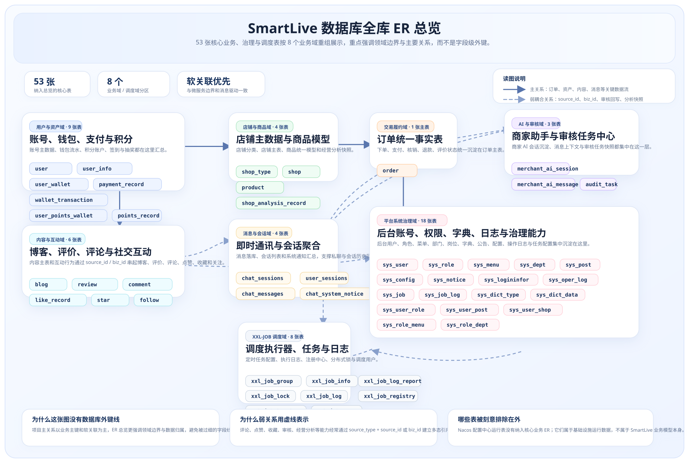
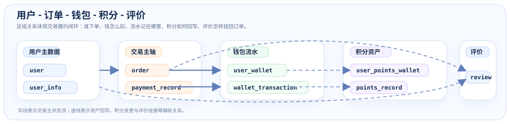
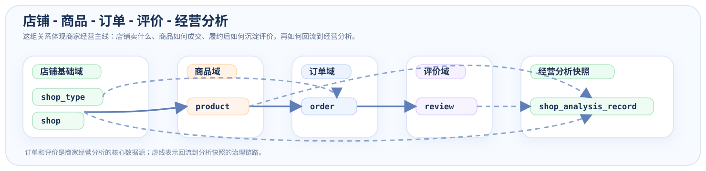
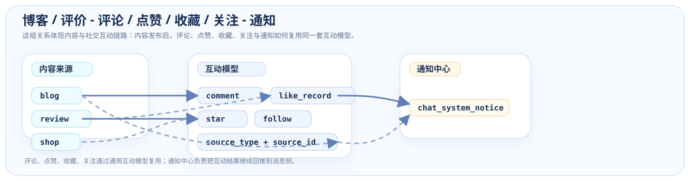
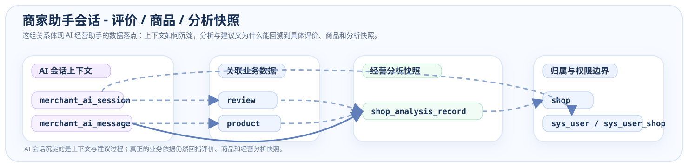

# 数据库与核心表关系概览

> 这页不追求把全库所有表一口气画成 ER 图，而是优先回答两个问题：这个项目的数据到底按哪些业务域拆开的？交易、内容、社交、AI 这些核心能力分别落在哪些表上？

## 0. 全库 ER 总览

下面这张图把当前项目**自有业务表、治理表和调度表**放进了一张总图里，方便先从全局认识“库表是怎么按业务域分组的”。  

- **已纳入这张图的表数：53 张**
  - 业务 / 治理表：`45` 张
  - XXL-JOB 调度表：`8` 张
- **暂不纳入：** `smart-live_config.sql` 这类更偏 Nacos / 配置中心运行数据的表

> 阅读建议：先看分组，再看实线主关系；虚线表示多态引用、治理辅助关系或弱耦合软关联。

  

## 0.5 怎么读这张大图

- **先按颜色分区看业务域**：用户资产、店铺商品、交易履约、内容互动、消息会话、AI 审核、系统治理、调度中心
- **再看实线主关系**：用户、店铺、订单是这张图里最核心的 3 个枢纽
- **最后看虚线关系**：`comment / like_record / star / follow / audit_task` 这类表大量依赖 `source_type + source_id` 或 `biz_type + biz_id` 做软关联

## 1. 为什么要单独看这页

如果只看服务名，你能知道系统拆成了 `user / shop / product / order / interaction / ai` 等服务；  
但真正决定业务能不能跑通的，是这些服务背后的核心数据模型有没有设计清楚。

这页主要解决 4 个问题：

- 这个项目的库表是按什么业务域拆开的
- 订单、钱包、积分、评价、博客、聊天这些能力分别落在哪些表上
- 为什么大多数关系采用“业务主键软关联”，而不是数据库外键强绑定
- 面试时如果被问到“核心表关系怎么设计”，应该先讲哪几组

## 2. 先看规模与范围

按当前 `sql` 目录主脚本统计，项目现在包含：

| 维度 | 当前规模 | 说明 |
|------|------|------|
| 业务 / 治理库脚本 | **12 组** | `ai / audit / blog / chat / interaction / order / points / product / shop / system / user / wallet` |
| 调度库脚本 | **1 组** | `xxl_job.sql` |
| 业务与治理表 | **45 张** | 不含 Nacos 配置库与测试数据脚本 |
| 调度表 | **8 张** | XXL-JOB 调度中心使用 |
| 最核心的业务域 | **6 类** | 用户资产、店铺商品、交易履约、内容互动、消息通知、AI 经营 |

> 这里有意不把 `smart-live_config.sql` 算进“核心业务表规模”，因为它更偏 Nacos/配置中心运行数据，不属于项目业务模型本身。

## 3. 核心业务域怎么拆

### 3.1 用户与个人资产域

| SQL 文件 | 主要表 | 作用 |
|------|------|------|
| `smart-live_user.sql` | `user`、`user_info` | 账号、手机号、昵称、头像、城市、等级、粉丝数等用户主数据 |
| `smart-live_wallet.sql` | `user_wallet`、`payment_record`、`wallet_transaction` | 钱包余额、支付流水、钱包收支明细 |
| `smart-live_points.sql` | `user_points_wallet`、`points_record`、`daily_sign_in`、`points_lottery_prize` | 积分钱包、积分流水、签到记录、抽奖奖品配置 |

这一组表决定了“这个人是谁、他有多少钱、多少积分、最近发生了哪些资产变化”。

### 3.2 店铺与商品域

| SQL 文件 | 主要表 | 作用 |
|------|------|------|
| `smart-live_shop.sql` | `shop`、`shop_type`、`shop_analysis_record` | 店铺基础资料、分类、经营分析快照 |
| `smart-live_product.sql` | `product` | 商品/代金券/团购/秒杀统一商品模型 |

这一组表决定了“卖什么、谁在卖、怎么分类型、经营分析沉淀在哪里”。

### 3.3 交易履约域

| SQL 文件 | 主要表 | 作用 |
|------|------|------|
| `smart-live_order.sql` | `order` | 下单、支付、核销、退款、评价状态的统一订单主表 |
| `smart-live_wallet.sql` | `payment_record`、`wallet_transaction` | 支付成功、退款回退、余额变动的资金流水 |
| `smart-live_points.sql` | `points_record` | 消费送积分、抽奖消耗、签到奖励等积分变化 |

这一组表决定了“用户买了什么、钱是怎么扣的、订单是否核销、积分怎么跟着变化”。

### 3.4 内容互动域

| SQL 文件 | 主要表 | 作用 |
|------|------|------|
| `smart-live_blog.sql` | `blog` | 博客/笔记主表 |
| `smart-live_interaction.sql` | `review`、`comment`、`like_record`、`star`、`follow` | 评价、评论、点赞、收藏、关注 |

这一组表决定了“内容怎么发、怎么被互动、用户之间怎么形成社交关系”。

### 3.5 消息与会话域

| SQL 文件 | 主要表 | 作用 |
|------|------|------|
| `smart-live_chat.sql` | `chat_sessions`、`chat_messages`、`user_sessions`、`chat_system_notice` | 即时通讯、会话聚合、系统通知、消息已读状态 |

这一组表决定了“消息怎么持久化、会话列表怎么聚合、系统通知怎么回放”。

### 3.6 AI 与治理域

| SQL 文件 | 主要表 | 作用 |
|------|------|------|
| `smart-live_ai.sql` | `merchant_ai_session`、`merchant_ai_message` | 商家助手会话与消息沉淀 |
| `smart-live_audit.sql` | `audit_task` | 审核任务中心与快照回看 |
| `smart-live_system.sql` | `sys_user`、`sys_role`、`sys_menu`、`sys_notice` 等 18 张表 | 平台管理后台、权限、字典、日志、配置治理 |

这一组表决定了“商家助手怎么记住上下文、审核中心怎么承接发布治理、后台怎么做权限和系统管理”。

## 4. 最值得讲的核心表关系

> 真正讲项目时，不用一次把 45 张表全讲完。把下面这 4 组关系讲清楚，已经足够体现建模能力。

### 4.1 用户 -> 订单 -> 钱包 -> 积分 -> 评价

  

这组关系回答的是：

- 谁下的单
- 钱从哪里扣
- 支付流水记在哪里
- 消费后积分怎么变
- 完成履约后评价状态怎么回写到订单

这一组是你项目里最适合讲“交易履约闭环”的表关系。

### 4.2 店铺 -> 商品 -> 订单 -> 评价 -> 店铺分析

  

这组关系回答的是：

- 店铺卖哪些商品
- 商品被购买后怎样形成订单
- 订单履约后怎样沉淀评价
- 评价与订单数据如何回流到经营分析快照

如需讲“商家端经营后台为什么不是单纯 CRUD”，这组关系最有说服力。

### 4.3 博客 / 评价 -> 评论 / 点赞 / 收藏 / 关注 -> 通知

  

这组关系回答的是：

- 内容发布后，后续互动怎么沉淀
- 互动记录为什么做成通用表，而不是每种内容单独建一套表
- 评论、点赞、收藏、关注如何继续触发通知与消息回流

### 4.4 商家助手会话 -> 评价 / 商品 / 分析快照

  

这组关系回答的是：

- AI 经营助手的上下文怎么存
- 回复建议、商品营销文案、经营分析结果为什么可以回溯
- 为什么经营分析要有 `shop_analysis_record` 这种快照表，而不是每次现算

## 5. 这个项目为什么多数用“软关联”而不是数据库外键

从 SQL 看，这个项目绝大多数关系是通过：

- `user_id`
- `shop_id`
- `order_id`
- `source_type + source_id`
- `biz_type + biz_id`

这种业务主键在应用层做关联，而不是在数据库里大量建跨域外键。

这样做的原因很明确：

1. **服务边界优先于数据库外键**
   - 微服务拆分后，`user / order / wallet / points / interaction` 各自都有独立职责
   - 如果在数据库层强绑外键，后续拆库、异步化和补偿机制都会被拖慢

2. **跨服务写链路本来就依赖消息与补偿**
   - 当前项目主方案是 `RabbitMQ + Redis 幂等 + ACK/NACK + 延迟/死信 + XXL-JOB`
   - 既然一致性靠业务事件与补偿来兜，数据库层就不应该再假装自己能保证全局强一致

3. **通用互动模型需要弱耦合**
   - `comment / like_record / star / review` 这类表面对的是店铺、博客、评价、商品等多种来源
   - 用 `source_type + source_id` 的多态设计，比给每种来源都建一张独立互动表更灵活

这也是这套项目很适合面试时主动讲的一点：

> 我没有把微服务项目做成“看起来像拆开了，数据库还是一团”的结构，而是让数据模型也尽量贴近服务边界。

## 6. 面试时最值得主动讲的 3 个建模判断

### 6.1 为什么订单只用一张主表承接支付、核销、退款、评价状态

`order` 表里同时放了：

- 支付状态
- 核销状态
- 退款状态
- 评价状态
- 商品来源信息

这样做的好处是：

- 交易履约链路可以围绕一张核心事实表展开
- 订单页、商家订单后台、评价发布页都能回到同一条订单记录
- 补偿、超时取消、退款回退时也更容易统一状态机

### 6.2 为什么商品只有一张 `product` 表

`product` 同时承接：

- 普通售卖
- 秒杀活动
- 代金券
- 团购套餐

不是因为偷懒，而是因为这几个场景共享了大量字段：

- 所属店铺
- 售价与原价
- 有效期
- 库存
- 审核状态
- 使用规则

再通过 `category`、`activity_type`、`validity_type` 等字段把业务差异表达出来，能大幅减少重复建模。

### 6.3 为什么积分和钱包分别做成两套钱包

- 钱包：`user_wallet + wallet_transaction`
- 积分：`user_points_wallet + points_record`

这说明你没有把“积分”当成钱包余额的附属字段，而是把它们当成两套不同资产系统：

- 钱包更偏资金
- 积分更偏运营激励

后续不管接抽奖、签到、返利还是人工调账，都更清晰。

## 7. 推荐阅读顺序

如需继续从“数据模型”往下看，建议这样衔接：

1. 先看 [系统架构与项目规模](/site-pages/SYSTEM_ARCHITECTURE)，理解服务边界和依赖分层
2. 再看 [核心链路总览](/core-links/)，把表关系和业务链路对应起来
3. 最后看 [我的核心设计与实现](/site-pages/CONTRIBUTIONS)，把设计判断和代码实现对上
