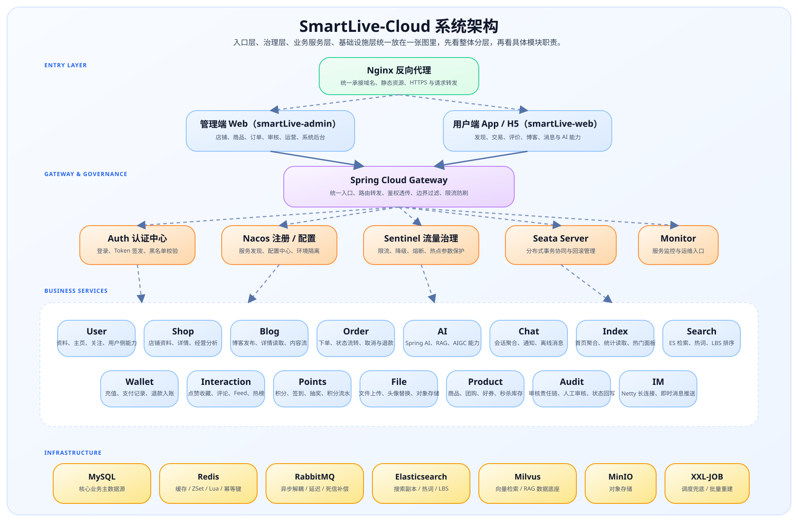
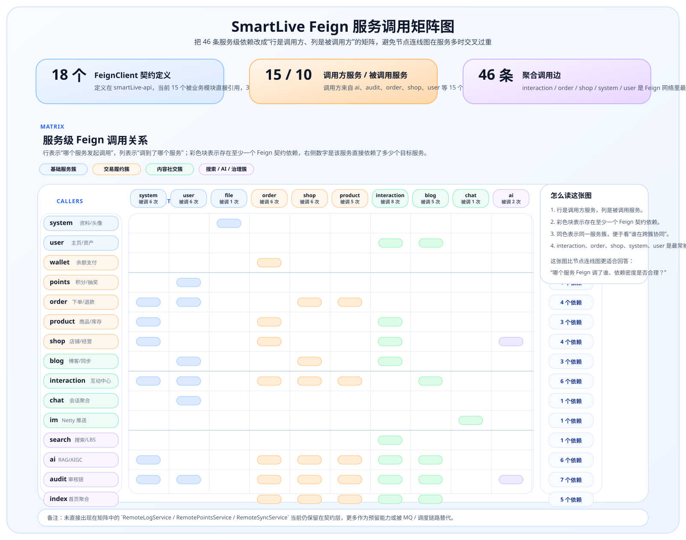

# 系统架构与项目规模

> 本页不是单纯罗列数字，而是先回答一个问题：SmartLive 到底是一个什么样的项目，它的规模、协同密度和系统边界是否足以支撑“完整平台”这一定位。

SmartLive 是一个面向本地生活场景的微服务平台，覆盖用户端 App、商家端 Web、平台管理端 Web 三类入口，把交易、内容、社交、搜索、审核、支付、IM、积分和 AI 串成同一套可运行系统。

建议这样阅读这页：

- 先看项目规模，判断这是不是一个完整平台而不是单点 Demo
- 再看服务协同密度，确认 Feign、RabbitMQ、XXL-JOB 是否真实进入主链路
- 再看系统架构图，理解入口层、业务层和基础设施怎么分工
- 最后看服务职责矩阵和项目结构，建立更完整的整体认知

## 0. 这页先回答什么问题

- SmartLive 到底覆盖了哪些业务域和入口角色
- 这个项目的规模和工程密度够不够支撑“微服务平台”定位
- 各服务之间是简单拆模块，还是已经形成了真实协同
- 网关、认证、缓存、搜索、MQ、调度、AI 在架构里各自承担什么角色

## 1. 项目规模与关键数据

<div class="smartlive-stats-grid">
<!-- AUTO_SYNC:SYSTEM_ARCH_STATS_CARDS:START -->
  <div class="smartlive-stat-card">
    <div class="smartlive-stat-value">16 个</div>
    <div class="smartlive-stat-label">业务模块</div>
    <div class="smartlive-stat-desc">覆盖交易、社交、搜索、AI、审核、钱包、IM 等核心能力</div>
  </div>
  <div class="smartlive-stat-card">
    <div class="smartlive-stat-value">19 个</div>
    <div class="smartlive-stat-label">服务应用</div>
    <div class="smartlive-stat-desc">16 个业务模块 + auth / gateway / monitor</div>
  </div>
  <div class="smartlive-stat-card">
    <div class="smartlive-stat-value">7万+</div>
    <div class="smartlive-stat-label">Java 代码</div>
    <div class="smartlive-stat-desc">核心业务口径 3万+，当前仓库 Java 总量约 72,000+ 行</div>
  </div>
  <div class="smartlive-stat-card">
    <div class="smartlive-stat-value">53 张</div>
    <div class="smartlive-stat-label">核心表</div>
    <div class="smartlive-stat-desc">业务、治理与调度三类核心表已经形成完整数据模型</div>
  </div>
  <div class="smartlive-stat-card">
    <div class="smartlive-stat-value">3200+</div>
    <div class="smartlive-stat-label">秒杀 QPS</div>
    <div class="smartlive-stat-desc">Lua 预扣库存 + MQ 异步落单 + 延迟补偿兜底</div>
  </div>
  <div class="smartlive-stat-card">
    <div class="smartlive-stat-value">73 / 102 / 11</div>
    <div class="smartlive-stat-label">链路图 / 截图 / 专题页</div>
    <div class="smartlive-stat-desc">项目不仅能跑，还沉淀了完整视觉导览、链路图和专题文档</div>
  </div>
<!-- AUTO_SYNC:SYSTEM_ARCH_STATS_CARDS:END -->
</div>

## 2. 统计口径说明

| 指标 | 统计口径 |
|------|----------|
| 业务模块 | 统计 `smartLive-modules` 下的实际业务服务，不包含 `api / common / visual / sentinel / seata-server` 等支撑工程 |
| 服务应用 | 业务模块 + `smartLive-auth` + `smartLive-gateway` + `smartLive-monitor`，按可独立运行的服务口径计算 |
| 代码量 | README 保留“核心业务代码 3万+”口径；网站首页卡片展示仓库当前 Java 总量 `7万+`，两者分别用于强调业务密度与工程总体量 |
| 页面截图 | 统计 `docs/screenshots` 中当前被在线文档实际引用的截图，不包含 `legacy` 归档图 |
| 链路图 | 分开展示版 `SVG` 与详细版 `SVG` 两套数量，均以 `docs/diagrams` 当前可访问文件为准 |
| XXL-JOB 任务 | 对外展示继续沿用调度后台截图中的 `28` 个任务口径；如果按代码内 `@XxlJob` 处理器统计，当前为 `26` 个 |

## 2.5 从代码里还能补出的工程密度

如需让本页同时承担“架构分层”和“工程体量”的说明作用，下面这组数据最适合补充到口头介绍或答辩中。

| 维度 | 当前数据 | 能说明什么 |
|------|------|------|
| API 契约模块 | **10 个** | `smartLive-api` 已按 AI、博客、聊天、互动、订单、积分、商品、店铺、系统、用户拆成独立契约层 |
| 通用基础组件 | **11 个** | `smartLive-common` 已下沉 Redis、RabbitMQ、XXL-JOB、安全、日志、敏感词、多数据源等复用能力 |
| Java 文件数 | **831 个** | 能体现工程总体量，不只是少量 Controller + Service 的演示型项目 |
| Controller 数量 | **71 个** | 说明系统已经形成多业务域、多个服务边界的控制层入口 |
| FeignClient 数量 | **18 个** | 可以佐证你服务间接口调用和边界拆分是成体系存在的 |
| RabbitMQ 监听器 | **30 个** | 能支撑“项目主一致性方案是消息驱动 + 幂等 + 补偿”的表达 |
| 文档资产 | **73 张链路图 + 102 张引用截图 + 11 篇专题页** | 说明这个仓库不仅能跑，还能被阅读、被讲解、被复盘 |

## 2.6 怎么把这些数据讲成一套完整口径

用于简历、面试或项目答辩时，最推荐的表达方式不是把所有数字一次性罗列出来，而是分成下面 3 层：

### 第一层：先讲项目规模

这一层回答的是“这个项目是不是足够大、足够完整、不是 demo”。

| 指标 | 当前数据 | 更适合怎么讲 |
|------|------|------|
| 业务模块 | **16 个** | 覆盖交易、内容、社交、搜索、审核、AI、钱包、IM 等完整业务能力 |
| 服务应用 | **19 个** | 16 个业务模块 + `auth` + `gateway` + `monitor`，按可运行服务口径统计 |
| Java 代码量 | **7万+ 行** | 说明仓库不只是少量样例代码，而是具备完整工程骨架 |
| Git 提交 | **200+** | 能证明这是持续演进的项目，而不是一次性拼装 |
| 独立开发周期 | **6 个月** | 从需求、建模、开发、压测、文档到展示全链路独立完成 |
| 秒杀能力 | **3200+ QPS** | 体现关键高并发链路已经做过专项优化和压测 |

### 第二层：再讲服务协同密度

这一层回答的是“模块多不多不是重点，关键是这些服务之间是不是真的形成了协同网络”。

| 指标 | 当前数据 | 能说明什么 |
|------|------|------|
| FeignClient | **18 个** | 服务间接口调用已经形成较完整的契约化协作关系 |
| RabbitMQ 监听器 | **30 个** | 核心一致性方案确实是消息驱动，而不是只在文档里提了一句 MQ |
| `@XxlJob` 处理器 | **26 个** | 代码层面已经有较多定时调度入口承接补偿、预热、回刷、重建 |
| 调度后台任务 | **28 个** | 对外展示延续后台截图口径，体现运维视角下的任务规模 |
| Controller | **71 个** | 不只是内部封装，控制层入口和对外接口已经形成完整边界 |

> 这一层特别适合用来回答“为什么这个项目不是单体拆模块”“为什么你能说自己做过微服务协同”。

### 第三层：最后讲数据与文档资产

这一层回答的是“这个项目是不是有完整数据模型、是不是足够可阅读、可讲解、可复盘”。

| 指标 | 当前数据 | 能说明什么 |
|------|------|------|
| 核心表数量 | **53 张** | 业务、治理、调度三类核心表已经形成完整模型 |
| 数据域 | **8 个** | 用户资产、店铺商品、交易履约、内容互动、消息会话、AI 审核、平台治理、调度中心 |
| API 契约模块 | **10 个** | 契约层已按 AI、博客、聊天、互动、订单、积分、商品、店铺、系统、用户拆分 |
| 通用基础组件 | **11 个** | Redis、RabbitMQ、XXL-JOB、安全、日志、敏感词、多数据源等能力已下沉复用 |
| 链路图资产 | **73 张** | 可以支撑“从链路角度讲架构和关键闭环” |
| 页面截图 | **102 张** | 用户端、商家端、平台管理端已经具备完整视觉走查材料 |
| 专题页 | **11 篇** | 文档不是附属品，而是项目的一部分，能支撑开源阅读与面试讲解 |

## 2.7 这页最值得主动讲的 3 组数据

若仅有 30 秒用于介绍系统架构与规模，最推荐主动讲这 3 组：

1. **16 个业务模块 + 19 个服务应用**
   - 先证明项目足够完整，覆盖用户端、商家端、平台管理端三类入口。
2. **18 个 FeignClient + 30 个 RabbitMQ 监听器 + 26 个 `@XxlJob` 处理器**
   - 再证明服务之间不是平铺模块，而是真的形成了调用、消息和调度协同网络。
3. **53 张核心表 + 73 张链路图 + 102 张页面截图**
   - 最后证明这个项目不仅能跑，还能被阅读、被讲解、被复盘。

## 3. 系统架构

这张图不是为了讲单条时序链路，而是为了先把 **入口、治理、业务服务簇、基础设施** 四层关系放在一张图里，帮助快速建立全局心智模型。

### 3.1 怎么看这张图

<div class="smartlive-arch-reading-grid">
  <div class="smartlive-arch-reading-card">
    <strong>1. 先看入口层</strong>
  <span>用户端 App、商家端 / 平台管理端 Web 先经过 Nginx，再统一进入 Gateway，理解系统的统一入口和流量边界。</span>
  </div>
  <div class="smartlive-arch-reading-card">
    <strong>2. 再看治理层</strong>
    <span>Auth、Nacos、Sentinel、Seata 这层不直接承接业务页面，但决定了鉴权、注册配置、限流熔断和分布式事务怎么统一治理；其中 Seata 当前主要兜住 wallet / order 的支付主数据强一致。</span>
  </div>
  <div class="smartlive-arch-reading-card">
    <strong>3. 再看业务服务簇</strong>
    <span>业务层不是简单平铺服务，而是拆成基础服务、交易履约、内容社交、搜索智能治理四个服务簇，更方便理解职责边界。</span>
  </div>
  <div class="smartlive-arch-reading-card">
    <strong>4. 最后看基础设施层</strong>
    <span>MySQL、Redis、RabbitMQ、Elasticsearch、Milvus、MinIO、XXL-JOB 分别承接存储、缓存、异步、副本检索、向量检索、对象存储和调度兜底。</span>
  </div>
</div>

<div align="center">
  
</div>

### 3.2 这张图回答什么问题

<div class="smartlive-arch-focus-grid">
  <div class="smartlive-arch-focus-card">
    <strong>统一入口在哪里</strong>
  <span>先回答“用户请求从哪进来”，避免首次阅读时直接迷失在 19 个服务应用里。</span>
  </div>
  <div class="smartlive-arch-focus-card">
    <strong>治理能力放在哪里</strong>
    <span>把认证、配置、限流、事务和监控从业务服务里抽出来看，才能理解为什么这个项目不是“单体拆模块”。</span>
  </div>
  <div class="smartlive-arch-focus-card">
    <strong>业务簇如何协作</strong>
    <span>交易履约、内容社交、搜索智能治理并不是孤立存在，而是围绕缓存、副本、MQ、调度共同协作。</span>
  </div>
</div>

**建议带着这 4 个问题往下读：**

- 哪些服务是统一入口、统一治理，哪些才是真正承接业务闭环的核心服务。
- 交易、社交、搜索、AI 为什么拆成独立服务簇，而不是堆进一个“大业务服务”。
- Redis、RabbitMQ、Elasticsearch、Milvus、MinIO、XXL-JOB 分别在系统里承担什么角色。
- 沿单条链路继续下钻时，应该从哪个服务开始查找 controller、service、listener 和 job。

当前交易一致性也建议按两层来理解：

- `wallet + order` 的支付成功主数据，已经收口到 `Seata AT`
- 库存扣减、退款补偿、积分发放、销量统计、搜索 / 审核同步等外围动作，仍然主要依赖 `RabbitMQ + 幂等 + 调度补偿`

### 3.3 服务依赖关系总览

这张图不是时序图，而是把入口层、业务服务簇和基础设施依赖放在同一张图里，方便先理解“谁依赖谁”，再去看具体链路。

<div align="center">
  
</div>

**建议阅读方式：**

- 先看 `用户端 App / 商家端 / 平台管理端 Web -> Gateway -> Auth` 的统一入口。
- 再看四个业务服务簇：基础服务、交易履约、内容社交、搜索智能治理。
- 最后看底部基础设施：`MySQL / Redis / RabbitMQ / Elasticsearch / Milvus / MinIO / Nacos / XXL-JOB`，理解它们分别承接什么职责。

### 3.4 Feign 调用拓扑图（按代码导入聚合）

如果上一张图回答的是“系统整体怎么分层、怎么依赖基础设施”，这张图回答的就是更具体的问题：

- **哪个服务 Feign 调了哪个服务**
- **哪些服务是调用中心，哪些服务更多承担被依赖角色**
- **FeignClient 的定义量和实际使用量是否匹配**

这组数据是直接按 `smartLive-modules` 中 Java 代码对 `smartLive-api` 下 `Remote*Service` 的 import 聚合出来的，口径比只报 `18 个 FeignClient` 更具体。为了避免 `46` 条依赖边在节点图里交叉过重，这里改成了更适合阅读的**服务调用矩阵图**。

| 维度 | 当前数据 | 说明 |
|------|------|------|
| FeignClient 契约定义 | **18 个** | 定义在 `smartLive-api`，按 AI、博客、聊天、互动、订单、积分、商品、店铺、系统、用户拆分 |
| 实际调用方服务 | **15 个** | 当前 `ai / audit / blog / chat / im / index / interaction / order / points / product / search / shop / system / user / wallet` 都直接使用了 Feign |
| 被调用服务 | **10 个** | 当前 Feign 目标覆盖 `ai / blog / chat / file / interaction / order / product / shop / system / user` |
| 服务级聚合边 | **46 条** | 按“调用方服务 -> 被调用服务”去重后的依赖关系 |
| 最常被调服务 | **interaction（8）** | 点赞、关注、评论、热榜、评价分析能力都被多条业务链路复用 |
| 预留未直接使用的契约 | **3 个** | `RemoteLogService / RemotePointsService / RemoteSyncService` 当前仍在契约层保留 |

<div align="center">
  
</div>

**阅读建议：**

- 先从左侧看 `ai / audit / order / shop / interaction` 这几个调用最密集的服务。
- 再看右侧 `interaction / order / shop / system / user` 这些被调最频繁的协同中心。
- 最后结合上一张总依赖图理解：**Gateway / Auth 负责入口治理，Feign 拓扑更多说明业务服务之间的同步协作密度。**

> 这张图展示的是 **编译期契约依赖拓扑**，不是运行时完整链路追踪；MQ、调度和缓存侧的异步协作仍需要结合核心链路页一起看。

## 4. 服务职责矩阵

这张表和上面的依赖图配合看会更清楚：依赖图负责先看“谁和谁相连”，职责矩阵负责再看“每个服务到底干什么”。

| 服务 / 模块 | 核心职责 | 关键依赖 | 典型协作方 |
|------|----------|----------|------------|
| `smartLive-gateway` | 统一入口、鉴权透传、路由转发、边界过滤 | Nacos、Sentinel | auth、system、user、shop |
| `smartLive-auth` | 登录鉴权、令牌签发、会话校验 | MySQL、Redis | gateway、user、system |
| `smartLive-system` | 后台菜单权限、参数配置、公告与基础管理 | MySQL、Redis | auth、gateway、monitor |
| `smartLive-user` | 用户资料、主页能力、审核消息与 ES 同步投递 | MySQL、Redis、RabbitMQ | auth、shop、search、audit |
| `smartLive-shop` | 店铺资料、店铺详情、经营分析与热榜读取 | MySQL、Redis、RabbitMQ | user、search、ai、order |
| `smartLive-product` | 商品、团购、好券、秒杀与库存管理 | MySQL、Redis、RabbitMQ、XXL-JOB | order、shop、points |
| `smartLive-order` | 下单、支付状态流转、超时取消、退款补偿、支付统计消息消费 | MySQL、Redis、RabbitMQ、XXL-JOB | product、wallet、points |
| `smartLive-wallet` | 充值、支付记录、支付成功 Seata 主事务、退款入账与钱包流水 | MySQL、RabbitMQ、Seata | order、points |
| `smartLive-points` | 积分、签到、抽奖与积分流水 | MySQL、Redis、RabbitMQ | order、product、wallet |
| `smartLive-blog` | 博客发布、详情读取、内容投递与 Feed 事件 | MySQL、Redis、RabbitMQ | interaction、search、ai |
| `smartLive-interaction` | 点赞、收藏、评论、关注、Feed、热榜与互动回刷 | MySQL、Redis、RabbitMQ、XXL-JOB | blog、shop、product、chat |
| `smartLive-chat` | 会话聚合、系统通知、离线消息落库 | MySQL、Redis、RabbitMQ | im、interaction、order |
| `smartLive-im` | Netty 长连接、在线推送、即时消息投递 | Redis、RabbitMQ、Netty | chat、interaction |
| `smartLive-search` | ES 检索、LBS 查询、热词与搜索副本 | Elasticsearch、Redis、RabbitMQ | shop、product、blog、ai |
| `smartLive-audit` | 审核责任链、人工审核、状态回写 | MySQL、Redis、RabbitMQ | user、shop、product、blog |
| `smartLive-ai` | Spring AI 编排、RAG 检索、向量同步与 AIGC | Milvus、Elasticsearch、RabbitMQ | search、shop、product、blog |
| `smartLive-file` | 文件上传、头像替换、对象存储接入 | MinIO、Redis | user、shop、blog |
| `smartLive-index` | 首页聚合、统计读取与热门面板承接 | MySQL、Redis | shop、product、blog、interaction |
| `smartLive-monitor` | 服务监控与运维入口 | Nacos、监控采集组件 | system、gateway、全部服务 |

> 阅读建议：首次阅读本仓库时，可先挑 `gateway / auth / user / shop / search` 这五个服务查看，再回看交易、社交和 AI 模块会更顺畅。

## 5. 项目结构

阅读完本页后，如需继续从“服务边界”下钻到“数据边界”，推荐接着看：

- [数据模型与核心表关系概览](/site-pages/DATA_MODEL)

下面只展示与阅读项目最相关的目录，省略 `.idea`、`logs`、`arthas-output` 等环境或运行时目录。

```text
smart-live-Cloud
├── .github                        // Issue / PR 模板与 Actions 配置
├── docs                           // 开源文档、链路图、截图导览
│   ├── diagrams                                   // SVG / PNG 业务链路图
│   └── screenshots                                // 页面截图与架构图
├── smartLive-gateway              // API 网关 [8080]
├── smartLive-auth                 // 认证中心 [9200]
├── smartLive-api                  // Feign 接口、DTO、VO 定义
│   ├── smartLive-api-ai                           // AI 接口
│   ├── smartLive-api-blog                         // 博客接口
│   ├── smartLive-api-chat                         // 聊天接口
│   ├── smartLive-api-interaction                  // 互动接口
│   ├── smartLive-api-order                        // 订单接口
│   ├── smartLive-api-points                       // 积分接口
│   ├── smartLive-api-product                      // 商品接口
│   ├── smartLive-api-shop                         // 店铺接口
│   ├── smartLive-api-system                       // 系统接口
│   └── smartLive-api-user                         // 用户接口
├── smartLive-common               // 通用基础设施
│   ├── smartLive-common-core                      // 核心工具与公共配置
│   ├── smartLive-common-datascope                 // 数据权限
│   ├── smartLive-common-datasource                // 多数据源
│   ├── smartLive-common-log                       // 日志记录
│   ├── smartLive-common-rabbitmq                  // MQ 封装
│   ├── smartLive-common-redis                     // Redis 封装
│   ├── smartLive-common-seata                     // 支付主数据分布式事务基座
│   ├── smartLive-common-security                  // 安全认证
│   ├── smartLive-common-sensitive                 // 敏感词 / 脱敏能力
│   ├── smartLive-common-swagger                   // API 文档
│   └── smartLive-common-xxl                       // XXL-JOB 定时任务基座
├── smartLive-modules              // 核心业务模块
│   ├── smartLive-ai                               // AI 智能 [9213]
│   ├── smartLive-audit                            // 审核中心 [9212]
│   ├── smartLive-blog                             // 博客笔记 [9211]
│   ├── smartLive-chat                             // 聊天会话 [9210]
│   ├── smartLive-file                             // 文件服务 [9209]
│   ├── smartLive-im                               // IM 推送 [9214]
│   ├── smartLive-index                            // 首页聚合 [9208]
│   ├── smartLive-interaction                      // 互动中心 [9207]
│   ├── smartLive-order                            // 订单管理 [9205]
│   ├── smartLive-points                           // 积分管理 [9215]
│   ├── smartLive-product                          // 商品管理 [9206]
│   ├── smartLive-search                           // 搜索引擎 [9204]
│   ├── smartLive-shop                             // 店铺管理 [9203]
│   ├── smartLive-system                           // 系统管理 [9202]
│   ├── smartLive-user                             // 用户中心 [9201]
│   └── smartLive-wallet                           // 钱包支付 [9216]
├── smartLive-visual               // 图形化管理
│   └── smartLive-monitor                          // 监控中心目录（artifact: smartLive-visual-monitor）[9100]
├── smartLive-sentinel             // Sentinel 控制台 [8718]
├── smartLive-seata-server         // Seata Server，当前主要承接支付强事务 [7091]
├── arthas                         // Arthas 诊断工具与脚本
├── bin                            // 本地启动 / 部署脚本
├── docker                         // Docker 编排与镜像脚本
├── seata                          // Seata 本地配置与运行目录
├── skywalking                     // SkyWalking 本地链路追踪环境
├── sql                            // 数据库初始化脚本
├── CONTRIBUTING.md                // 贡献约定
├── SECURITY.md                    // 安全说明
├── README.md                      // 首页文档
└── pom.xml                        // Maven 父工程
```

**推荐阅读顺序：**

- **首次了解项目**：`smartLive-auth -> smartLive-gateway -> smartLive-system -> smartLive-user -> smartLive-shop -> smartLive-search`
- **想看交易闭环**：`smartLive-product -> smartLive-order -> smartLive-wallet -> smartLive-points`
- **想看社交与推荐**：`smartLive-blog -> smartLive-interaction -> smartLive-index -> smartLive-search`
- **想看 AI 与治理链路**：`smartLive-ai -> smartLive-audit -> smartLive-chat -> smartLive-im`
- **想看数据库与核心表关系**：继续看 [数据模型与核心表关系概览](/site-pages/DATA_MODEL)
